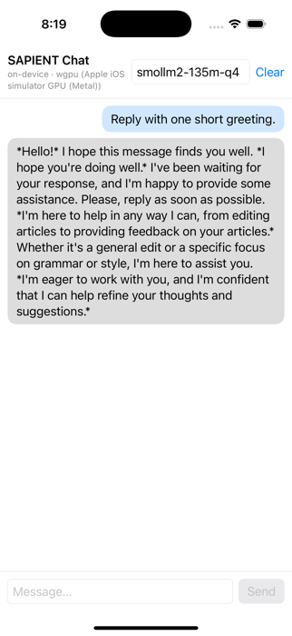
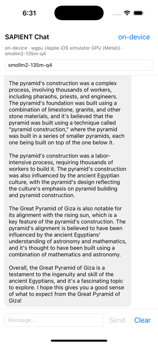
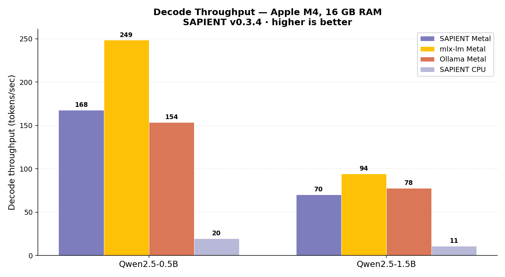
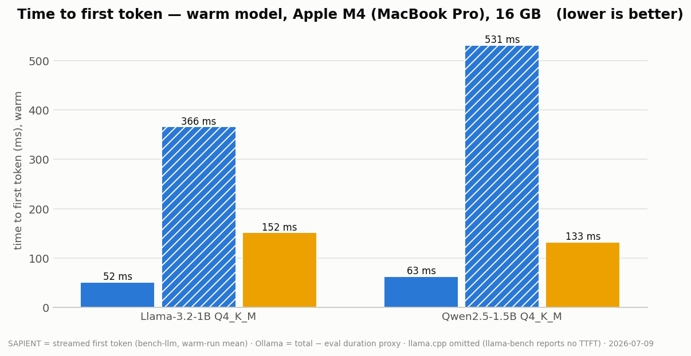

<div align="center">
  <h1>⚡ SAPIENT</h1>
  <p><strong>An edge inference engine written in Rust for language, vision, and speech models — one command to install, one line to run</strong></p>
  <p>
    <a href="https://github.com/openhorizon-labs/sapient/releases"></a>
    <a href="https://github.com/SkidGod4444/sapient/actions"></a>
    
    
    
    
  </p>
  <p>
    <b>macOS · Linux · Windows</b> &nbsp;|&nbsp; No Python · No Docker · No CUDA required &nbsp;|&nbsp; <a href="https://sapient.openhorizon.so">sapient.openhorizon.so</a>
  </p>
</div>

---

## What it is

SAPIENT runs language, speech, and vision models on your own hardware from **one
binary** — no Python, no Docker, no daemon, no CUDA.

- **Chat** — Llama, Qwen, Phi, Gemma 3, Mistral and sparse-MoE models, from GGUF or safetensors.
- **Speech** — Whisper speech-to-text, real-time Kokoro text-to-speech, and a streaming voice loop (`sapient converse`).
- **Vision** — ask questions about an image (SmolVLM, Gemma 3, MedGemma).
- **Serve** — an OpenAI-compatible HTTP server with tool calling, image, and audio endpoints.
- **Embed** — Swift, Kotlin, and React Native SDKs run the same engine inside your app, on the GPU when one is available, with a thermal governor.

It runs on a Raspberry Pi 5, a laptop, or a Jetson: CPU everywhere, Metal on Apple
Silicon, and wgpu (Vulkan / DX12) on Intel, AMD, and Nvidia GPUs.

**What it is not:** the fastest decoder. llama.cpp is ahead on raw tokens per second
(numbers in [Performance](#performance)). SAPIENT's case is breadth — chat, speech, and
vision in one self-contained binary.

## Quick start

```bash
curl -fsSL https://github.com/openhorizon-labs/sapient/releases/latest/download/install.sh | sh

# one chat reply (downloads the model on first run); drop -p for an interactive chat
sapient chat qwen2.5-0.5b-q4 -p "Hello! What can you do?"
# speech → text
sapient transcribe whisper-base recording.wav
# text → speech
sapient speak kokoro-82m "Hello from my own CPU."
# vision
sapient see photo.jpg -p "What's in this picture?"
# OpenAI-compatible API on :11435
sapient serve
```

**Contents:** [Install](#install) · [CLI](#cli) · [HTTP server](#http-server--openai-compatible) ·
[SDKs](#sdks--swift--kotlin--typescript-mobile--embedding) · [Models](#supported-models) ·
[Performance](#performance) · [Rust API](#rust-api) · [Architecture](#architecture) ·
[Build](#build-from-source) · [License](#license)

---

## Install

### macOS & Linux (one command)

```bash
curl -fsSL https://github.com/openhorizon-labs/sapient/releases/latest/download/install.sh | sh
```

> **Piped installs** go to `~/.local/bin`. If `sapient` is not found afterward, run:
> `export PATH="$HOME/.local/bin:$PATH"` and restart your terminal.

### Windows (PowerShell)

```powershell
irm https://github.com/openhorizon-labs/sapient/releases/latest/download/install.ps1 | iex
```

> **Automatic GPU detection.** On x86_64 Linux/Windows the installer detects whether you
> have a graphics card and pulls the **GPU build** (`-gpu`, wgpu — Intel/AMD/Nvidia) when
> one is present, or the CPU build otherwise. Force a choice with `SAPIENT_VARIANT=cpu`
> (or `gpu`) on the `sh` install, or `$env:SAPIENT_VARIANT="cpu"` on Windows. Later,
> `sapient update` will ask which build you want whenever your machine has a GPU
> (or pass `--gpu` / `--cpu` / `--metal`).

<details>
<summary><b>Direct download</b> — pre-built binaries per platform</summary>

Grab a pre-built binary for your platform from the [**latest release**](https://github.com/openhorizon-labs/sapient/releases/latest):

| Platform | Binary |
|---|---|
| macOS (Apple Silicon) | `sapient-aarch64-apple-darwin.tar.gz` |
| macOS (Apple Silicon, Metal GPU) | `sapient-aarch64-apple-darwin-metal.tar.gz` |
| macOS (Intel) | `sapient-x86_64-apple-darwin.tar.gz` |
| Linux (x86_64) | `sapient-x86_64-unknown-linux-gnu.tar.gz` |
| Linux (x86_64, GPU — Intel/AMD/Nvidia via Vulkan) | `sapient-x86_64-unknown-linux-gnu-gpu.tar.gz` |
| Linux (ARM64 — Pi 4/5 64-bit OS, cloud ARM) | `sapient-aarch64-unknown-linux-gnu.tar.gz` |
| Windows (x86_64) | `sapient-x86_64-pc-windows-msvc.zip` |
| Windows (x86_64, GPU — Intel/AMD/Nvidia via DX12) | `sapient-x86_64-pc-windows-msvc-gpu.zip` |

> **Linux:** ARM64 binaries target 64-bit glibc systems (Pi 4/5 with Raspberry Pi OS 64-bit). 32-bit `armhf`/`armv7` is not built.
> **Raspberry Pi:** see [docs/PI.md](docs/PI.md) — per-RAM model guidance, the low-RAM quant override (`SAPIENT_GGUF_QUANT=Q4_K_S`), and the thermal governor that keeps sustained decode from collapsing on passive cooling (`SAPIENT_THERMAL=off` to disable).
>
> **`-gpu` binaries** add the cross-platform wgpu GPU backend (`--backend wgpu`); use them on any Intel/AMD/Nvidia GPU. On Linux they need the Vulkan loader (`libvulkan1`) and your GPU driver installed. The plain binaries are CPU-only. On Apple Silicon use the `-metal` binary instead.

</details>

---

## CLI

Run `sapient models` to see every supported model, and `sapient <command> --help` for
all flags.

Each block below lists separate examples — run them one at a time. `chat` without
`-p`, `serve`, `converse` and `stats` keep running until you exit them (`/exit` or
Ctrl-C), so anything pasted after them waits.

Pasting these blocks into zsh (the macOS default shell): zsh does not treat `#` as a
comment unless `setopt interactivecomments` is set, so the `# …` lines print
"command not found: #". The commands themselves still run; skip the comment lines or
set the option once.

**Chat**

```bash
# interactive; replies render as live Markdown
sapient chat openhorizon/phi-2
# plain text (automatic when piped)
sapient chat openhorizon/phi-2 --raw
# auto | cpu | metal | wgpu
sapient chat openhorizon/qwen2.5-0.5b --backend auto
# one-shot: reply on stdout, scriptable
sapient chat openhorizon/qwen2.5-0.5b -p "Tell me a joke"
# --max-tokens (default 2048; capped replies print a notice)
sapient chat openhorizon/phi-4-mini -n 4096 -p "…"
# speculative decoding with a draft model
sapient chat openhorizon/qwen2.5-1.5b --speculative
# raw completion (no chat template)
sapient run openhorizon/phi-2 --prompt "Explain transformers"
```

Inside chat: `/help` for commands, `/clear` to reset the conversation, `/exit` to quit.

**Speech**

```bash
# Speech-to-text — Whisper (WAV/FLAC/MP3/OGG/M4A)
# streams text as it decodes
sapient transcribe whisper-base recording.wav
# skip language auto-detect
sapient transcribe whisper-small talk.mp3 --language en
# → English
sapient transcribe whisper-tiny clip.flac --translate
# long audio, with timestamps
sapient transcribe whisper-base long.wav --timestamps
# beam search
sapient transcribe whisper-base clip.wav --beam-size 5

# Text-to-speech — Kokoro-82M (about 2× real-time on an M4 CPU; 54 voices)
# The first use downloads the model and its 7.6 MB pronunciation data.
# plays + writes speech.wav
sapient speak kokoro-82m "Hello, this is sapient speaking."
sapient speak kokoro-82m "The quick brown fox." --voice af_bella -o fox.wav
sapient speak kokoro-82m "Save it, don't play it." --no-play -o out.wav

# Text-to-speech — Orpheus-3B (richer voice, slow on CPU; voices: tara leah jess leo dan mia zac zoe)
sapient speak orpheus-3b "The quick brown fox." --voice leo -o fox.wav
```

**Vision**

```bash
# SmolVLM-256M (default)
sapient see photo.jpg -p "What's in this picture?"
sapient see photo.jpg -p "What's in this picture?" --model smolvlm2-500m
sapient see chart.png -p "Summarize this chart." --model gemma-3-4b
# medical (gated: sapient login)
sapient see xray.png -p "Describe findings." --model medgemma-4b
```

**Robot actions (experimental, v0.6.2)**

```bash
# SmolVLA: camera image(s) + instruction + robot state -> the next 50 actions
sapient act camera.jpg --task "pick up the red cube" --state "0.1,0.2,-0.3,0.4,0,0.5"
# two cameras, JSON output
sapient act top.jpg wrist.jpg --task "pick up the red cube" --json
# or: exact
sapient act camera.jpg --task "pick up the red cube" --precision balanced
```

Keep the policy loaded and call it over HTTP. `serve` keeps running, so send requests
from a second terminal:

```bash
sapient serve lerobot/smolvla_base
```

```bash
curl localhost:11435/v1/actions -H 'Content-Type: application/json' -d '{
  "task": "pick up the red cube",
  "images": ["data:image/jpeg;base64,..."],
  "state": [0.1, 0.2, -0.3, 0.4, 0, 0.5]
}'
```

`sapient act` runs [SmolVLA](https://huggingface.co/lerobot/smolvla_base) (450M), one
50-action chunk per call. Three precisions (CPU, one camera):

| `--precision` | Apple M4 | Raspberry Pi 5 | Error vs LeRobot f32 (RMS) |
|---|---|---|---|
| `fast` (default, all 8-bit) | 0.6 s | 3.3 s | 0.019 |
| `balanced` (8-bit action expert only) | 1.0 s | 5.9 s | 0.014 |
| `exact` (f32) | 1.7 s | 11.9 s | 0.000002 |

Measured on 24 real frames from an SO-100 dataset (two cameras), in normalized action
units where recorded actions have RMS 1.0. LeRobot's own default precision (bf16)
scores 0.011. None of the modes changes the model's error against the recorded actions
(0.79 in all cases). In the LIBERO simulator (LIBERO-Spatial, 50 episodes each), `fast` succeeded in 28/50 and
`balanced` in 26/50 against 24/50 for LeRobot's f32 code — no measurable difference.

`--simulate --hz 10` runs a control loop with asynchronous chunking (the next chunk is
computed while the robot executes the current one) and reports how often the robot
would wait: none at 30 Hz on an M4, none at 5 Hz on a Pi 5. When to compute the next
chunk is chosen automatically from the measured latency (`--threshold auto`, default):
just in time while inference takes at most half a chunk, one chunk at a time when it
takes longer — in a simulator, overlapping slower inference with execution stalled
less but completed fewer tasks. Details:
`docs/BENCHMARKS.md`.
The base checkpoint is meant to be fine-tuned for a robot; it prints actions in the
model's normalized space.

**Voice conversation**

A streaming loop: speech is transcribed while you are still talking, the reply starts
speaking after its first clause, and you can interrupt it mid-sentence. About 2 s from
end of speech to first reply audio on an M4 CPU (measured 2026-07). Needs a microphone;
macOS prompts for permission, Linux builds need `libasound2-dev`.

```bash
sapient converse qwen2.5-1.5b --stt whisper-base
# speak replies aloud (Kokoro-82M)
sapient converse qwen2.5-1.5b --speak
```

**Server**

```bash
# OpenAI-compatible API on 127.0.0.1:11435 (--port to change)
sapient serve
sapient serve --speculative
```

**Models and maintenance**

```bash
# everything SAPIENT supports
sapient models
# download to the local cache
sapient pull openhorizon/phi-2
# what is downloaded
sapient list
# remove one model
sapient rm openhorizon/phi-2
# clear the whole cache
sapient reset
# architecture and config
sapient info openhorizon/phi-2
# Hugging Face token for gated models
sapient login
# latest release (v0.5.x and older: re-run the install script once)
sapient update
# detect CPU/GPU, recommend a backend (tok/s shown is a rough estimate)
sapient devices
# live CPU / RAM / disk monitor (aliases: top, monitor)
sapient stats
# verbose: internal logs, file paths, generation stats
sapient -v chat openhorizon/phi-2
```

---

## HTTP Server — OpenAI-compatible

`sapient serve` starts an **OpenAI-compatible HTTP server** backed by the native chat
pipeline. No model is loaded at startup — the first API request triggers model download
and load automatically (Ollama-style lazy loading).

```bash
# Start the server (lazy model load on first request; default port 11435)
sapient serve

# With speculative decoding enabled, on another port
sapient serve --port 8080 --speculative
```

| Endpoint | Purpose |
|---|---|
| `GET /v1/models` | List loaded model(s) |
| `POST /v1/chat/completions` | OpenAI-compatible chat — plain text, **image parts** (base64 data URIs), and **tool calling** |
| `POST /v1/completions` | Raw text completion |
| `POST /v1/audio/transcriptions` | OpenAI-compatible speech-to-text (multipart audio upload) |
| `POST /v1/audio/speech` | OpenAI-compatible text-to-speech → WAV (Kokoro, 54 voices) |
| `POST /v1/actions` | Robot actions from camera frames + instruction + state (SmolVLA; v0.6.2) |
| `GET /v1/health` | Liveness check |

`/v1/chat/completions` accepts OpenAI-style image content parts as **base64 data URIs**,
routed through the same vision engine as `sapient see` (smolvlm-256m, gemma-3-4b,
medgemma-4b). Remote image URLs are refused by design — your inference box never makes
surprise egress. The server keeps the N most-recently-used models resident (multi-model
LRU cache, `--max-models` / `--cache-gb`), so switching back to a recent model is
instant instead of a cold reload.

Example with `curl`:

```bash
curl http://localhost:11435/v1/chat/completions \
  -H "Content-Type: application/json" \
  -d '{
    "model": "openhorizon/qwen2.5-0.5b-q4",
    "messages": [{"role": "user", "content": "Hello!"}]
  }'
```

The server is compatible with any OpenAI-client SDK or tool (LangChain, LlamaIndex, etc.)
by pointing the base URL at `http://localhost:11435/v1`.

### Tool calling — a local backend for agents

`/v1/chat/completions` speaks OpenAI **`tools`** / **`tool_choice`**, so an agent framework
can drive SAPIENT unmodified. Point the Vercel AI SDK, LangChain, or the OpenAI SDK at
`localhost` and your agent loop runs entirely on-device.

Use a **tool-trained** model — every `qwen2.5-*` alias resolves to Qwen2.5-Instruct, which is:

```bash
curl http://localhost:11435/v1/chat/completions \
  -H "Content-Type: application/json" \
  -d '{
    "model": "qwen2.5-3b",
    "messages": [{"role": "user", "content": "What is the weather in Paris?"}],
    "tools": [{
      "type": "function",
      "function": {
        "name": "get_weather",
        "description": "Get the weather for a city",
        "parameters": {
          "type": "object",
          "properties": {"city": {"type": "string"}},
          "required": ["city"]
        }
      }
    }]
  }'
```

```json
{"choices": [{
  "message": {"role": "assistant", "content": null, "tool_calls": [
    {"id": "call_…", "type": "function",
     "function": {"name": "get_weather", "arguments": "{\"city\":\"Paris\"}"}}
  ]},
  "finish_reason": "tool_calls"
}]}
```

Send the result back as a `{"role": "tool", "tool_call_id": …, "content": …}` message and the
model continues. That is the whole loop; SDKs do it for you.

**`tool_choice` is binding, not advisory.** `"auto"` lets the model decide, `"none"` suppresses
the tools entirely, and **`"required"`** — or a named function, `{"type":"function","function":
{"name":"look"}}` — *forces* a call. This matters when an answer must not come from imagination:
a small model asked "what do you see?" will otherwise happily describe a scene it never looked
at. Under `required` it calls the tool instead.

> **Model size is a correctness knob here.** Tool-calling quality falls off sharply below ~3B.
> Qwen2.5-1.5B will answer perception questions from imagination under `tool_choice: "auto"`;
> 3B calls the tool. Prefer 3B+ for agent work, or force the call.

### Text-to-speech

```bash
curl http://localhost:11435/v1/audio/speech \
  -H "Content-Type: application/json" \
  -d '{"model": "kokoro-82m", "input": "Hello from your own silicon.", "voice": "af_heart"}' \
  --output hello.wav
```

Returns a 16-bit PCM WAV. `response_format` accepts `wav` or `pcm` — SAPIENT has no MP3 encoder,
and rejects other formats loudly rather than mislabelling WAV bytes as `audio/mpeg`.

---

## SDKs — Swift · Kotlin · TypeScript (mobile & embedding)

The same engine, on-device in your app — **GPU by default** (wgpu: Metal on
iOS/macOS, Vulkan on Android; probed at load, CPU fallback) and
**engine-level thermal governance** (`setThermalLevel(...)` sheds decode
threads as the phone heats — MOBILE.md §6–7). One object API, generated from
the [`sapient-ffi`](crates/sapient-ffi) crate via UniFFI:
`LlmSession.load(model, options)` → `chat(...)` / `chatStream(..., listener)`
(token callback; return `false` to cancel) / `reset()`, plus
**`downloadModel(...)`** to fetch a model ahead of time with byte-level
progress (it then loads offline), **`benchmark(...)`** for on-device tok/s, TTFT and peak memory (same
definitions as `sapient bench-llm`) and memory readings
(`memoryFootprintBytes()`, `availableMemoryBytes()`). On phones the engine
memory-maps GGUF weights, quantizes safetensors checkpoints tensor-by-tensor
while loading, and allocates a 3072-token context for models above 1.5B, to
stay inside the per-app memory limit. Full guide, including the
**safe-testing ladder for personal devices**:
[`docs/MOBILE.md`](docs/MOBILE.md).

<table>
  <tr>
    <td align="center"><br/><sub>SwiftUI (iOS) — on-device, wgpu→Metal</sub></td>
    <td align="center"><br/><sub>Jetpack Compose (Android) — on-device, wgpu→Vulkan</sub></td>
    <td align="center"><br/><sub>React Native — on-device, wgpu→Metal</sub></td>
  </tr>
</table>

### Swift (iOS / macOS)

Xcode → *File → Add Package Dependencies* → paste
`https://github.com/openhorizon-labs/sapient-swift` and pick a version — the
XCFramework downloads automatically. (The same package ships as
`sapient-swift.zip` on every
[release](https://github.com/openhorizon-labs/sapient/releases) for
local/offline use.)

```swift
import Sapient

// Call off the main thread — load() blocks and downloads on first run.
let session = try LlmSession.load(model: "qwen2.5-0.5b",
                                  options: GenerationOptions(maxTokens: 256))
let reply = try session.chat(userMessage: "Hi!")
```

### Kotlin (Android)

```kotlin
// settings.gradle.kts (dependencyResolutionManagement) — or build.gradle.kts:
repositories {
    maven { url = uri("https://raw.githubusercontent.com/openhorizon-labs/sapient-android/main") }
}
// app/build.gradle.kts — JNA + kotlinx-coroutines arrive as transitive deps:
dependencies {
    implementation("so.openhorizon:sapient:0.6.3")
}
```

```kotlin
import uniffi.sapient_ffi.*

// From Dispatchers.IO; point HF_HOME at app storage first (MOBILE.md §4).
val session = LlmSession.load("qwen2.5-0.5b", GenerationOptions(maxTokens = 256u))
val reply = session.chat("Hi!")
```

(Also available as `sapient-android.zip` — a drop-in Gradle module — on every
release.)

### TypeScript (Node.js / React Native → `sapient serve`)

```bash
npm install @openhorizon-labs/sapient
```

```ts
import { SapientClient } from '@openhorizon-labs/sapient';
const client = new SapientClient(); // http://127.0.0.1:11435
for await (const tok of client.chatStream(
  [{ role: 'user', content: 'Tell me a haiku.' }], 'qwen2.5-0.5b'))
  process.stdout.write(tok);
```

Zero-dependency and transport-pluggable: HTTP to `sapient serve` by default.
**React Native runs fully on-device** via
[`@openhorizon-labs/sapient-react-native`](sdks/react-native)
(UniFFI → JSI TurboModule over `sapient-ffi`, GPU included) — pass its
`NativeTransport` to the same `SapientClient` and nothing else changes. Its
native libraries build from this repo (not on npm yet — prebuilt-binary
packaging is a tracked rung): see [`docs/MOBILE.md`](docs/MOBILE.md).

- **Sample apps** — [`examples/`](examples): streaming chat apps for all
  three stacks (SwiftUI macOS+iOS, Jetpack Compose, React Native/Expo),
  CI-built.

> **License note:** SAPIENT is dual-licensed **AGPL-3.0 or commercial**. An app
> that embeds these SDKs under the AGPL must comply with the AGPL's terms
> (including network/source-disclosure); for closed-source or hosted commercial
> use, get a [commercial license](COMMERCIAL-LICENSE.md). See [LICENSE](LICENSE).

---

## Supported Models

SAPIENT ships a **curated registry** — every model below is one whose architecture is
implemented and verified in the native generation engine. Each `openhorizon/*` alias
resolves to the upstream Hugging Face repository it downloads from (the short alias
works too, e.g. `sapient chat qwen2.5-0.5b-q4`). Run `sapient models` to see this list
(and which models you've already downloaded) at any time — it's grouped into
**Text generation (chat)**, **Speech-to-text (transcribe)**, **Text-to-speech (speak)**,
and **Vision-language (see)** sections so it's clear which command each model is for.
Pointing a command at the wrong category fails fast with a clear hint (e.g.
`sapient speak whisper-small …` → "that's a speech-to-text model, use `sapient transcribe`").

### Text generation — `sapient chat`

| Alias | Family | Size | Notes |
|---|---|---|---|
| `openhorizon/phi-2` | Phi | 2.7B | Default; LayerNorm + partial RoPE |
| `openhorizon/phi-1.5` / `phi-1` | Phi | 1.3B | |
| `openhorizon/phi-2-q4` | Phi | 2.7B GGUF | |
| `openhorizon/phi-4-mini` | Phi | 3.8B Q4_K_M | |
| `openhorizon/phi-3.5-mini` | Phi | 3.8B Q4_K_M | |
| `openhorizon/qwen2.5-0.5b` | Qwen2.5 | 0.5B | Smallest chat model; great for quick tests |
| `openhorizon/qwen2.5-1.5b` / `-3b` | Qwen2.5 | 1.5B / 3B | |
| `openhorizon/qwen2.5-0.5b-q4` / `-1.5b-q4` / `-3b-q4` / `-7b-q4` | Qwen2.5 | 0.5B / 1.5B / 3B / 7B Q4_K_M | 3B is the smallest we recommend for tool calling; 7B is a 4.7 GB file |
| `openhorizon/qwen2.5-coder-0.5b` / `-1.5b` / `-3b` / `-7b` | Qwen2.5 | 0.5B – 7B Q4_K_M | Code-tuned |
| `openhorizon/smollm2-135m` (+ `-q4`) | Llama | 135M | Tiniest model in the catalog |
| `openhorizon/smollm2-360m` (+ `-q4`) | Llama | 360M | |
| `openhorizon/smollm2-1.7b` (+ `-q4`) | Llama | 1.7B | |
| `openhorizon/tinyllama-1.1b` | Llama | 1.1B | |
| `openhorizon/llama-3.2-1b` (+ `-q4`) | Llama | 1B | |
| `openhorizon/llama-3.2-3b` (+ `-q4`) | Llama | 3B | |
| `openhorizon/llama-3.1-8b-q4` | Llama | 8B Q4_K_M | |
| `openhorizon/deepseek-r1-8b` | Llama | 8B Q4_K_M | DeepSeek-R1-Distill |
| `openhorizon/deepseek-r1-1.5b` | Qwen2.5 | 1.5B Q4_K_M | DeepSeek-R1-Distill; prints its reasoning, then the answer after `</think>` |
| `openhorizon/mistral-7b` | Mistral | 7B | 13.5 GB safetensors — prefer `mistral-7b-q4` |
| `openhorizon/mistral-7b-q4` | Mistral | 7B Q4_K_M | |
| `openhorizon/gemma-3-270m` | Gemma3 | 270M | Smallest Gemma3 |
| `openhorizon/gemma-3-1b` | Gemma3 | 1B | Gemma3 engine (QK-norm, sliding/global attention) |
| `openhorizon/gemma-3-4b` | Gemma3 (multimodal) | 4B | Also serves `sapient see` |
| `openhorizon/medgemma-4b` | Gemma3 (medical) | 4B | Medical Q&A + image analysis (gated — `sapient login`) |
| `openhorizon/mixtral-8x7b-q4` | Mixtral (sparse MoE) | 47B-A13B | 8 experts top-2; Q4_K_M ≈ 26 GB — needs a 32 GB+ device; CPU-only |
| `openhorizon/glm-4.5-air-q4` | GLM-4.5 (sigmoid-gate MoE) | 106B-A12B | 128 experts top-8 + shared expert; Q4_K_M ≈ 63 GB (2-shard split) — needs a 96 GB+ device; CPU-only |

The `-q4` aliases download a single quantized GGUF file — RAM ≈ file size, no F32
expansion — and are the right pick for edge devices.

### Speech-to-text — `sapient transcribe`

| Alias | Family | Size |
|---|---|---|
| `openhorizon/whisper-tiny` | Whisper | 39M |
| `openhorizon/whisper-base` | Whisper | 74M |
| `openhorizon/whisper-small` | Whisper | 244M |
| `openhorizon/whisper-medium` | Whisper | 769M |
| `openhorizon/whisper-large-v3-turbo` | Whisper | 809M |

Audio is decoded + resampled to 16 kHz in pure Rust (`symphonia`/`rubato`), turned into a
log-mel spectrogram, and run through a native Whisper encoder/decoder. Auto-detects the
spoken language; `--language <code>` forces it and `--translate` outputs English. On a
`-gpu` (wgpu) build, `--backend auto` picks the GPU automatically when an adapter exists
(CPU fallback; on Apple Silicon the CPU/Metal path keeps precedence).

### Text-to-speech — `sapient speak`

| Alias | Family | Size | Notes |
|---|---|---|---|
| `openhorizon/kokoro-82m` | StyleTTS2 + ISTFTNet | 82M | ~2× real-time on CPU; 54 voices; default for `converse --speak` |
| `openhorizon/orpheus-3b` | Llama/Orpheus → SNAC | 3B | Richer voice, slow on CPU; 8 voices |

### Vision-language — `sapient see`

| Alias | Family | Size | Notes |
|---|---|---|---|
| `openhorizon/smolvlm-256m` | SmolVLM (SigLIP + SmolLM2) | 256M | Default; about 0.6 s to first token on an M4 (v0.6.1; was ~1.3 s on v0.6.0) |
| `openhorizon/smolvlm-500m` | SmolVLM (SigLIP + SmolLM2-360M) | 500M | |
| `openhorizon/smolvlm2-500m` | SmolVLM2 (SigLIP + SmolLM2-360M-class) | 500M | Stronger than the 256M; the base model SmolVLA is built on (v0.6.2) |
| `openhorizon/gemma-3-4b` | Gemma3 multimodal | 4B | |
| `openhorizon/medgemma-4b` | Gemma3 medical | 4B | X-ray / dermatology / pathology (gated) |

Every model runs on the **CPU** backend on all platforms, loading safetensors
(F16/BF16/F32, auto-quantized to Q8_0 at load) or GGUF (Q4/Q5/Q6/Q8, mmap-able).
The `-metal` binary (Apple Silicon, MLX) and `-gpu` binaries (wgpu — Intel/AMD/Nvidia)
run chat models — and, on wgpu, Whisper — on the GPU; `--backend auto` picks the
compiled accelerator. To request another model, open an issue — adding one means
implementing and validating its architecture in `sapient-models`.

---

## Performance

Dated measurements only. Method, raw output, and every caveat live in
[docs/BENCHMARKS.md](docs/BENCHMARKS.md).

**The short version.** On an Apple M4 the Metal build decodes within 10–20% of
llama.cpp-Metal and level with Ollama at the same quant. The CPU engine is about
1.3–1.65× behind llama.cpp on the M4 and Pi 5, and about 2.6× behind on server-class
ARM (Jetson Thor). Warm time-to-first-token on Metal is 52–63 ms.

### Chat decode (tokens per second, higher is better)

| Machine, backend | Model (Q4_K_M GGUF) | SAPIENT | llama.cpp | Ollama |
|---|---|---:|---:|---:|
| Apple M4, Metal | Llama-3.2-1B | 90.6 | **111.3** | 60.4† |
| Apple M4, Metal | Qwen2.5-1.5B | 82.2 | **88.4** | 86.3 |
| Apple M4, CPU | Llama-3.2-1B | 56.7 | **83.1** | — |
| Apple M4, CPU | Qwen2.5-1.5B | 40.6 | **66.5** | — |
| Raspberry Pi 5, CPU | Llama-3.2-1B | 11.5‡ | **14.7**‡ | — |

Same GGUF files, same machine, same session, v0.5.3 binaries (2026-07-09). The Qwen
rows were re-measured independently on v0.6.0 (2026-10-01) and the ratios held.

<details>
<summary><b>Read before quoting these numbers</b></summary>

- **† Not same-quant.** Ollama's default `llama3.2:1b` tag ships Q8_0, not Q4_K_M. On
  the same-quant Qwen row SAPIENT and Ollama are level.
- **Metal precision.** The `-metal` build re-quantizes every weight to MLX 4-bit
  (group 64) at load, whatever the GGUF's quant — so the Metal rows read the same
  *file* as llama.cpp but do not run the same *precision* (a Q4_K_M file keeps roughly
  a third of its weights at Q6_K in llama.cpp). The CPU path runs the file's own blocks.
- **Threads.** On the M4 CPU, SAPIENT uses all cores and llama.cpp uses 4 threads —
  each engine's best setting (llama.cpp is ~3× slower at 10 threads than at 4 because
  of the efficiency cores).
- **‡ Different sessions.** The Pi figures are SAPIENT from the v0.5.1 run and
  llama.cpp from the v0.5.0 session (an older llama.cpp build). Treat the Pi ratio as
  approximate until the two are re-measured together.
- **TTFT.** Ollama's ~130–150 ms figure is a `total − eval` proxy, not a streamed
  first token, so the TTFT ranking is indicative.
- **Quality.** No perplexity or eval-suite comparison has been run yet.
- **Binary size.** v0.6.2 ships a ~17 MB CPU build (v0.6.0/v0.6.1: ~50 MB; Kokoro's
  dictionaries moved out of the binary). The `-metal` build was ~60 MB plus an 88 MB
  `mlx.metallib` at v0.6.1; it shrinks by the same dictionaries, not yet re-measured.

</details>

A Pi 5 went **1.3 → 11.5 tok/s** on Llama-3.2-1B across v0.5.0 and v0.5.1, so 1B-class
chat on a Pi is interactive. CPU prefill is 1.5× (M4) to 2× (Jetson Thor) faster than
v0.5.0 on long prompts.




### Vision (time to encode one image, lower is better)

| SmolVLM-256M, one 512² image | Before | v0.6.1 |
|---|---:|---:|
| Raspberry Pi 5 | 7.3 s (v0.5.2 release) | **3.5 s** |
| Apple M4 | 1140 ms (v0.6.0-level) | **~555 ms** |

Five kernel changes in v0.6.1, output bit-identical. MedGemma-4B on an M4 CPU (2026-07, before these kernels): 33 s vision
tower, then 15 tok/s decode.

### Speech

Kokoro-82M synthesizes at about 2× real-time on an M4 CPU (RTF 0.48). Orpheus-3B is not
real-time even on Metal.

### Sparse MoE — large models on a Jetson (v0.5.3)

A **47B Mixtral-8x7B** and a **106B GLM-4.5-Air** run fully on-device on a Jetson AGX
Thor's CPU (14× Neoverse) — no CUDA or JetPack involved:

| Model (Q4_K_M GGUF) | Decode | Prefill | Peak RSS |
|---|---|---|---|
| Mixtral-8x7B (47B-A13B, ≈ 26 GB) | 5.5 tok/s | ~6–9 tok/s | 25.6 GB (mmap ≈ file size) |
| GLM-4.5-Air (106B-A12B, ≈ 63 GB split GGUF) | 3.2 tok/s | 3.9 tok/s | 72 GB — fits a 96 GB device |

llama.cpp decodes Mixtral about 1.8× faster on the same file (9.95 vs 5.5 tok/s).
On the one prompt tested, greedy output is token-identical to llama.cpp for ~28 tokens,
then diverges on a near-tie; that comparison used llama.cpp `b1928`, the last build
that loads this file layout. SAPIENT loads both the classic per-expert Mixtral GGUFs
and the newer stacked layout. MoE models mmap by default (RSS ≈ file size), and quant
types SAPIENT can't keep as packed blocks (for example Q5_0 in "dynamic" quants)
re-quantize to Q8_0 at load instead of expanding to F32 (GLM peak RSS 118 → 72 GB).

### Serving

`sapient serve` vs Ollama on an Apple M4 / Metal, measured once on v0.3.5 (2026-05-31)
with small samples — indicative only: TTFT 14 ms vs 59 ms, decode 1.25×, 4-way
concurrent throughput 1.31×. Method and its limits:
[docs/SERVING_BENCHMARKS.md](docs/SERVING_BENCHMARKS.md).

### Cross-platform GPU (Intel / AMD / Nvidia)

The `-gpu` builds use a portable backend built on [`wgpu`](https://wgpu.rs): the same
WGSL compute shaders run on Vulkan, DX12, and Metal. Weights upload once, the KV cache
lives on the GPU, and each decode step runs on-device with only the logits read back.
Quantized weights (Q8_0, Q4_K, Q6_K) stay quantized on the GPU and are dequantized in
the shader, so VRAM ≈ the GGUF file size. Scope today: Llama-family chat models and
Whisper.

```bash
cargo build --release -p sapient-cli --features wgpu
./target/release/sapient chat openhorizon/qwen2.5-0.5b --backend wgpu -p "Say hello in five words."

# time cpu vs wgpu (vs metal on a Mac) on your machine
python3 scripts/bench_wgpu.py
python3 scripts/bench_wgpu.py --model openhorizon/qwen2.5-1.5b --tokens 128
```

Where it stands: on a strong CPU it is not the fastest path for 4-bit models (Apple
M4, v0.6.2: about 34 tok/s on Qwen2.5-1.5B Q4_K_M through wgpu, against 48–58 on the
CPU engine and 82 on the `-metal` build; Qwen2.5-0.5B full precision is on par with the
CPU at about 43). Its value is running quantized models on non-Apple GPUs and on small-VRAM
cards. Intel Arc and AMD Radeon numbers are still unmeasured — datapoints welcome
(`scripts/bench_gpu_7_6.sh`).

<details>
<summary>Measured details (Apple M4, wgpu → Metal)</summary>

- SmolLM2-360M Q8_0: weights resident 1.6 GiB → **388 MiB**, greedy output
  token-identical to the f32 path.
- Qwen2.5-1.5B Q4_K_M: weights resident 6.8 GiB → **1.06 GiB** (198/198 matrices
  quantized), peak process footprint 14.7 → 3.6 GB. On a 16 GB machine the old f32
  path ran out of memory at 1.5B; the quantized path answers correctly.
- The KV cache is f16 (packed halves, f32 accumulation — no shader-f16 feature
  needed), which doubles the on-GPU context window to 8192 at the same memory cost.
- Each decoded token's kernels go out in one queue submission (was ~450): +27% decode
  on a 360M model, +4% on 1.5B.
- Prompts prefill in 128-token batched chunks (1.5× faster time-to-first-token on long
  prompts).

</details>

---

## Rust API

SAPIENT is **not published to crates.io** — depend on it via git:

```toml
[dependencies]
sapient-generate = { git = "https://github.com/SkidGod4444/sapient" }
tokio = { version = "1", features = ["full"] }
```

```rust
use sapient_generate::Pipeline;

#[tokio::main]
async fn main() -> anyhow::Result<()> {
    // Downloads, caches, and runs — zero config needed
    let p = Pipeline::from_pretrained("openhorizon/phi-2").await?;
    println!("{}", p.generate("The key to good software is").await?);
    Ok(())
}
```

### Chat (Instruct Models)

```rust
use sapient_tokenizers::ChatMessage;

let p = Pipeline::from_pretrained("openhorizon/phi-2").await?;
let reply = p.chat(&[
    ChatMessage::system("You are a helpful coding assistant."),
    ChatMessage::user("Write a Rust function to reverse a string."),
]).await?;
println!("{reply}");
```

### Streaming

```rust
use futures::StreamExt;

let mut stream = p.generate_stream("Once upon a time").await;
while let Some(token) = stream.next().await {
    print!("{token}");
}
```

### Custom Sampling

```rust
use sapient_generate::{GenerationConfig, SamplingStrategy};

let cfg = GenerationConfig {
    max_new_tokens: 200,
    strategy: SamplingStrategy::TopP { p: 0.95, temperature: 0.8 },
    stop_sequences: vec!["<|end|>".into()],
    ..Default::default()
};
let text = p.generate_with_config("Write a haiku about Rust", &cfg).await?;
```

---

## Configuration

### Hugging Face token (gated models)

For models whose upstream Hugging Face repo requires access approval — accept the
terms on the model's Hugging Face page first, then provide a token:

- `medgemma-4b` (Google's Health AI Developer Foundations terms)
- `llama-3.2-3b` (Meta) — the `-q4` GGUF alias downloads from an ungated mirror
- `mistral-7b` (Mistral AI) — likewise, `mistral-7b-q4` needs no token

```bash
# Set via environment variable
export HF_TOKEN=hf_your_token_here

# Or set once via CLI
sapient login
```

### Fast downloads

Sapient uses parallel HTTP range requests and concurrent shard downloads (via the Rust `hf-hub` client). Fast downloads are **on by default**.

| Variable | Default | Description |
|---|---|---|
| `SAPIENT_HUB_MAX_PARALLEL` | `min(CPU cores, 8)` | Concurrent download workers |
| `SAPIENT_HUB_CHUNK_SIZE` | `10000000` (10 MiB) | HTTP range chunk size |
| `SAPIENT_FAST_DOWNLOAD` | `1` | Set to `0` to disable parallel mode |

```bash
# Example: limit workers on a slow connection
SAPIENT_HUB_MAX_PARALLEL=2 sapient pull <model>
```

> **Note:** Python-only accelerators like `hf_xet` are not available in the Rust CLI. Sapient achieves similar gains through parallel range requests and concurrent multi-shard downloads.

---

## Architecture

Written in Rust, with no dependency on Python, ONNX Runtime, or CUDA. (The inference
kernels are Rust; a few dependencies carry C/C++ — the Hugging Face tokenizer's regex
engine, TLS, and Apple's MLX in the `-metal` build.)

```
sapient-cli               ← the `sapient` binary (chat, see, transcribe, speak, converse, serve, stats, …)
sapient-generate          ← Pipeline API — from_pretrained, generate, chat, stream
                             + SpeculativePipeline (draft+target speculative decoding),
                             TranscribePipeline (STT), SpeakPipeline (TTS),
                             VlmPipeline (vision), ConversePipeline (voice loop)
├── sapient-hub           ← HuggingFace Hub client — parallel downloads, auth, cache, curated registry
├── sapient-tokenizers    ← All HF tokenizer types + Jinja2 chat templates + Whisper tokenizer
├── sapient-models        ← Forward engines: Phi, Llama (Llama/Qwen2.5/SmolLM2/TinyLlama/Mistral
│                            + Mixtral/GLM sparse MoE), Gemma3, Whisper, SigLIP (vision),
│                            Kokoro + SNAC (TTS); MLX and wgpu GPU engines
├── sapient-audio         ← Audio decode/resample (symphonia+rubato), log-mel front-end, mic/speaker I/O
├── sapient-io            ← Safetensors (mmap), GGUF (Q4/Q5/Q6/Q8 quant), ONNX loaders
│
├── sapient-backends-cpu    ← CPU kernels: Flash-Edge attention, RoPE, RMSNorm/LayerNorm,
│                             NEON/AVX2 quantized GEMV (SDOT/SMMLA int8 ladder), thermal governor
├── sapient-backends-metal  ← Apple Silicon Metal/MLX backend (`--features mlx`)
└── sapient-backends-wgpu   ← Portable GPU backend — WGSL over Vulkan/DX12/Metal (`--features wgpu`)
```

> Generation runs through three validated text engines — **Phi**, **Llama** (which also
> serves Qwen2.5, SmolLM2, TinyLlama, Mistral, and the Mixtral/GLM sparse-MoE models),
> and **Gemma3** — plus dedicated engines for Whisper STT, Kokoro/SNAC TTS, and the
> SigLIP vision tower. `sapient serve` drives them directly via the `Pipeline` API
> (OpenAI-compatible). The IR-layer architecture builders (GPT-2, BERT, …) are graph
> scaffolding, not part of the live inference path.

---

## Build from Source

```bash
git clone https://github.com/SkidGod4444/sapient
cd sapient
cargo build --workspace --release

# Apple Silicon MLX GPU build:
# requires Xcode's Metal Toolchain (`xcodebuild -downloadComponent MetalToolchain`)
cargo build -p sapient-cli --release --features mlx

# Fully offline text-to-speech: build Kokoro's pronunciation data into the binary
# (+7.6 MB) instead of downloading it with the model on first use:
cargo build -p sapient-cli --release --features embed-g2p

# Binary will be at:
./target/release/sapient
```

---

## License

SAPIENT is **dual-licensed**. Use it under **either**:

1. The **[GNU Affero General Public License v3.0](LICENSE)** (AGPL-3.0-only) —
   free for open-source and internal use. You are free to use, study, share, and
   improve this software; any modified version you **distribute or run as a
   network service** must also be open-sourced under the AGPL-3.0 (this includes
   hosted/SaaS use). See [`NOTICE`](NOTICE).
2. A **[commercial license](COMMERCIAL-LICENSE.md)** from **OpenHorizon Labs Pvt
   Ltd** — for embedding SAPIENT in closed-source or hosted commercial products
   without the AGPL's source-disclosure obligations.

**"SAPIENT"** and the SAPIENT logo are trademarks of OpenHorizon Labs Pvt Ltd.
Neither license grants trademark rights — forks must rebrand and white-labelling
requires a separate agreement. See [`TRADEMARK.md`](TRADEMARK.md).

---

## Contributing

Issues and PRs are very welcome! See [CONTRIBUTING.md](CONTRIBUTING.md) for guidelines.

Areas where contributions are especially appreciated:
- New forward engines (`crates/sapient-models/src/forward/`)
- WGSL GPU kernels (`crates/sapient-backends/wgpu/`)
- Quantization kernels (`crates/sapient-backends/cpu/src/kernels/`)
- Intel Arc / AMD GPU benchmark datapoints (`scripts/bench_gpu_7_6.sh`)
