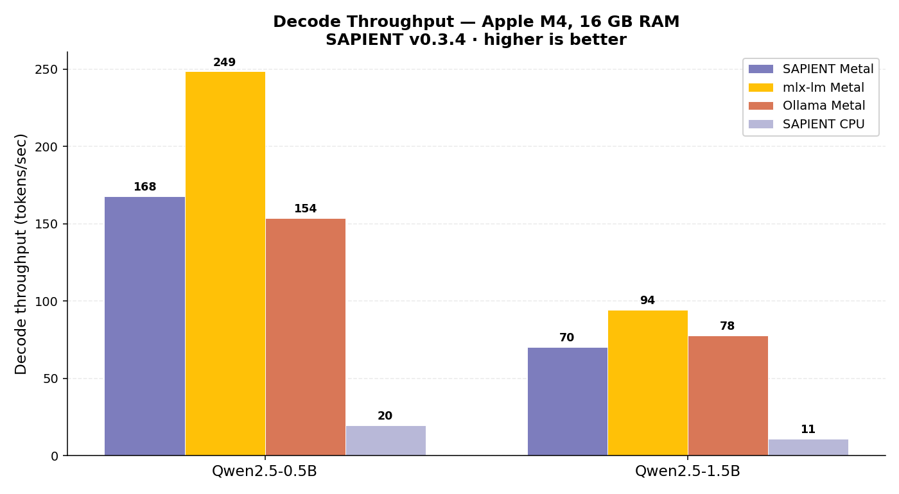
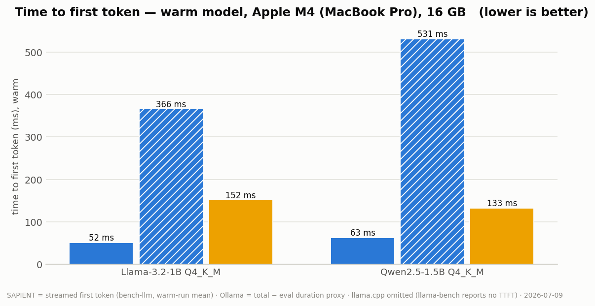
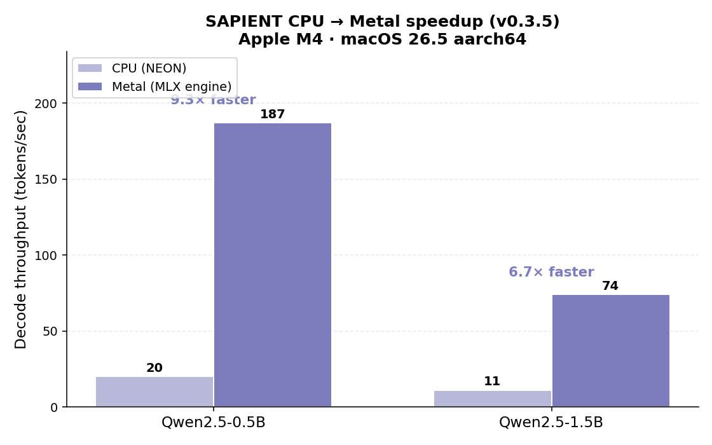

# SAPIENT Benchmarks — Metal, CPU, vs mlx-lm & Ollama

> Generated: 2026-05-31 · Hardware: **Apple M4 · 16 GB RAM · macOS 26.5 aarch64**
> SAPIENT **v0.3.5** · mlx-lm 0.31.2 · Ollama 0.12.x

> This page covers single-request **engine** throughput. For the **HTTP serving**
> comparison (`sapient serve` vs Ollama vs vLLM — TTFT, concurrency, model
> switch-back, prefix caching) see [SERVING_BENCHMARKS.md](SERVING_BENCHMARKS.md).

---

## Vision-language on-device (first measurements, Apple M4 CPU)

`sapient see` per-stage timings (real chest X-ray, 3-sentence answer, greedy;
`⏱` line printed by the CLI). MedGemma reads a radiograph **fully offline on a
MacBook** — slow first token today, honest numbers below:

| Model | vision tower | prefill | decode | peak RSS |
|---|---|---|---|---|
| MedGemma-4B (896², 280-tok prompt) | 33.0 s | 9.9 s | **15.0 tok/s** | 7.8 GB |
| Gemma-3-4B (same protocol) | ~33 s | 10.1 s | 15.0 tok/s | — |
| SmolVLM-256M (512², 87-tok prompt) | 3.0 s | 0.3 s | **~100 tok/s** | — |

The vision-tower cost was **68.7 s at first light → 33.0 s** after three same-day
kernel changes: row-block-parallel f32 SGEMM in `matmul_nt` (the tower had been
running one single-threaded GEMM per linear), online-Q8_0 for eligible tower
linears (Gemma3's 4304-wide fc2 stays f32 — 4304 % 32 ≠ 0), and **dense GEMM
attention** for the non-causal tower (`Q·Kᵀ`/`S·V` through blocked SGEMM instead
of the flash row-loop, which is shaped for long-KV decode). Remaining levers:
a blocked W8A8 GEMM for m≫1 activations (the W8A8 path is per-row today) and
resolution options. Decode at 15 tok/s makes the *reading* fast — it's the
*looking* that needs the next rung.

## Head-to-head vs llama.cpp & Ollama (v0.5.0, 2026-07-03)

Same GGUF **files** (Q4_K_M, byte-identical where both engines read GGUF), same
machines, decode tok/s (llama.cpp = `llama-bench` tg128; SAPIENT/Ollama =
streamed 128-token generation; Ollama uses its own Q4_K_M download).

**Apple M4 (MacBook Pro, 16 GB):**

| Engine | Qwen2.5-1.5B | Llama-3.2-1B | notes |
|---|---|---|---|
| **SAPIENT `-metal` (MLX)** | 73.8 | **103.2** | TTFT 38 / 27 ms |
| llama.cpp (Metal) | **79.1** | 101.3 | |
| Ollama (Metal) | 75.8 | 62.3 | |
| llama.cpp (CPU, 4 threads) | 62.5 | 78.7 | |
| SAPIENT (CPU) | 34.1 | 42.7 | |
| SAPIENT (wgpu→Metal) | 14.5 | 24.0 | use `-metal` on Apple |

**Raspberry Pi 5 (16 GB):**

| Engine | Qwen2.5-1.5B | Llama-3.2-1B |
|---|---|---|
| llama.cpp (CPU) | **12.2** | **14.7** |
| SAPIENT (CPU, official release binary) | 6.6 | 8.2 |

**Jetson AGX Thor (14-core Grace + Thor GPU):**

| Engine | Qwen2.5-1.5B |
|---|---|
| llama.cpp (CPU, 14 threads) | **85.3** |
| SAPIENT (CPU) | 22.4 |
| SAPIENT (wgpu, Vulkan) | 9.7 |

**Follow-up experiment (post-v0.5.0):** a 4-row multi-row SDOT GEMV (activation
registers shared across 4 weight rows, per-row results bit-identical) gained
**+5% on the Pi** (llama-1B 8.2→8.6, qwen-1.5B 6.6→6.9) and ~0% on M4 — which
localizes llama.cpp's remaining CPU edge in (a) **load-time weight repacking**
(4–8 rows interleaved into one contiguous stream per task, vs our four parallel
row streams per task thrashing the prefetchers) and (b) **i8mm/SMMLA** on
v8.6+ cores (M4/Grace; 2× int8 MACs per instruction, requires the interleaved
layout). The first repack rung has since landed: **Q4_K_R4** — a load-time permutation
interleaving groups of 4 rows' super-blocks so the SDOT kernel walks one
contiguous stream per task (`DType::Q4_K_R4`, pure-CPU engines, heap tensors
only, embedding excluded, `SAPIENT_NO_REPACK=1` to disable). Bit-identical
logits (engine-gated). Measured cumulative vs v0.5.0: **Pi 5 llama-1B 8.2→9.2
tok/s (+12%), qwen-1.5B 6.6→7.5 (+14%); M4 +5–6%** — the llama.cpp CPU gap
narrows from 1.79× to 1.60×. The **Q6_K** rung was then built and measured: with the existing f32-activation
Q6_K kernel, the interleaved layout is **neutral on both Pi and M4** (A/B/A
within ±2% noise) — so `Q6_K_R4` ships as tested, opt-in groundwork
(`SAPIENT_REPACK_Q6K=1`) rather than a default. The measured conclusion — Q6_K's cost is
the u8→f32 widening arithmetic — was then confirmed by building the **W6A8 SDOT
Q6_K kernel** (int8 activations, −32 folded into the integer dot, one `sdot`
per 16-element scale group):

| Decode tok/s (128-tok greedy) | Pi 5 | M4 CPU |
|---|---|---|
| Llama-3.2-1B: v0.5.0 → +R4 → **+W6A8** | 8.2 → 9.2 → **11.5 (+40%)** | 42.7 → 44.8 → **58.1** (65.7 with Q6K-R4) |
| Qwen2.5-1.5B: v0.5.0 → +R4 → **+W6A8** | 6.6 → 7.5 → **9.1 (+38%)** | 34.1 → 36.3 → **51.8 (+52%)** |

**The llama.cpp CPU gap is now ~1.2–1.35×** (was 1.8–3.8× at v0.5.0). W6A8
accuracy is the same class as the accepted Q4_K W4A8 path (per-32-block int8
activations; greedy outputs verified). Q6_K-R4 remains opt-in: it adds +13% on
M4/llama-1B but is slightly negative on the Pi — `SAPIENT_REPACK_Q6K=1` to
enable. The **i8mm/SMMLA rung** then landed for prefill:
`smmla`'s 2×2 int8 tile needs two distinct activation rows, so it cannot help
m=1 decode (half the lanes waste) — but for CPU **prefill** (m ≥ 2) one `smmla`
replaces four `sdot`s and each R4 weight group is read once per PAIR of prompt
tokens. Measured (600-token prompt, qwen-1.5B, warm model): **M4 17.6→13.6 s
(1.29×)**, **Thor 40.5→24.0 s (1.68× cumulative vs v0.5.0)**; Thor decode also
+24% cumulative (22.4→27.7 tok/s). Pi 5 (Cortex-A76, no i8mm) is unaffected.
The **Q6_K-x2 rung** followed (same SMMLA treatment for Q6_K, plus Q6_K repack
now defaulting ON where i8mm exists — the x2 kernel consumes the R4 layout):
prefill **M4 13.6→11.7 s** and **Thor 24.0→20.1 s** — cumulative prefill vs
v0.5.0: **M4 1.50×, Thor 2.01×**. Decode is neutral on all machines.

**Thermal discipline note (M-series):** back-to-back CPU benches on a MacBook
progressively throttle — mid-session readings on the M4 varied 42.9→69.5 tok/s
for the *same binary* by thermal state (and one apparent "+13%" and one
apparent "−9%" were both thermal-order artifacts that A/B/A runs dispelled).
M4 numbers here are cool-machine readings; Pi/Thor runs are short and
consistent. Cool-machine decode reference (128-tok greedy): **llama-1B 69.5
tok/s (1.13× behind llama.cpp), qwen-1.5B ~51 (1.22×)**.

Remaining parity items: deeper output tiling for prefill (llama.cpp pp512
remains well ahead), and Q8_K-style precomputed activation block-sums.

**The honest read:**
- On **Apple Metal** SAPIENT is competitive with llama.cpp (−7% on qwen-1.5B,
  +2% on llama-1B) and **1.66× Ollama** on the 1B — with better TTFT.
- On **CPU**, llama.cpp decodes ~1.8–3.8× faster than SAPIENT everywhere
  (Pi, M4, Grace). The ratio is consistent across machines → kernel-level gap
  (tiled GEMV, K-quant micro-kernels, weight repacking), now the top CPU work
  item. SAPIENT's own CPU path did jump up to 6.4× this release (embedding
  fix), but llama.cpp remains ahead.
- The **wgpu path's value is capability, not crown**: the only engine running
  fully-quantized models on any GPU vendor from one binary (VRAM ≈ file size,
  Jetson with zero CUDA). On machines with strong CPUs it is not the fastest
  option, and on Apple the `-metal` build is the right choice.
- Thor-class Grace CPUs are decode monsters; the "Jetson via Vulkan" thesis
  (7b) is about weak-CPU Jetsons (Orin Nano class) — still unmeasured. The
  llama.cpp-CUDA gate comparison also remains open (no CUDA toolkit on the
  test device).

## TL;DR

The v0.3.5 `MlxForwardEngine` puts SAPIENT's GPU path **ahead of Ollama on 0.5B
decode, with the lowest time-to-first-token of any engine on 0.5B**, and within
**1.3–1.5× of mlx-lm** (the Apple-native reference) — from a single daemon-free 22 MB
Rust binary.

| Axis | SAPIENT Metal | Ollama | mlx-lm | Verdict |
|---|---|---|---|---|
| Decode tok/s — 0.5B | **187** | 154 | 249 | beats Ollama |
| Decode tok/s — 1.5B | 74 | 78 | 94 | competitive |
| **TTFT — 0.5B** | **21 ms** | 28 ms | 39 ms | **best of all three** |
| **TTFT — 1.5B** | 70 ms | 64 ms | 264 ms | beats mlx-lm 3.8× |
| CPU → Metal decode | **6.7–9.4×** | — | — | same binary |
| Binary size | **22 MB** | 28 MB | Python venv | smallest |
| Daemon | **none** | required | none | — |





**The honest story:** mlx-lm is still the fastest on raw decode — it loads
pre-quantized 4-bit weights straight to the GPU. But SAPIENT now matches the *class*
of Apple-native performance from portable Rust + GGUF, **wins on TTFT for small
models**, and beats Ollama's small-model decode. Remaining gap: peak RAM (SAPIENT
dequantizes GGUF → MLX-Q4 at load and keeps the embedding table in F32).

---

## What changed in v0.3.4 → v0.3.5

Two fixes, both large:

1. **RoPE axis (v0.3.4).** `mlx_rs::fast::rope` treats dimension −2 as the
   sequence-position axis; the engine was feeding it `[1, seq, n_heads, head_dim]`
   (−2 = `n_heads`), scrambling positions across heads. Every model collapsed to one
   repeated token. Transposing to `[1, n_heads, seq, head_dim]` before RoPE (as
   mlx-lm does) restored coherent output.

2. **Engine reuse + native SDPA (v0.3.5).** The streaming path was *rebuilding and
   re-quantizing the whole model on every generation* — that reload dominated TTFT
   (3 s on 1.5B). The pipeline now holds the engine in an `Arc<Mutex<…>>` and reuses
   it, dropping TTFT **30–44×** (1.5B: 3144 ms → 70 ms). With RoPE fixed, MLX's fused
   SDPA also turns out to handle grouped-query attention correctly — the earlier
   "SDPA mishandles GQA" was the RoPE bug — so the manual per-head matmul loop was
   replaced with the fused kernel (+12% decode on 0.5B).

The actual prefill forward was never the bottleneck: profiled at **64 ms** for a
58-token prompt on 1.5B. The 3 s was pure model-reload overhead.

---

## CPU → Metal speedup

Same binary, same GGUF weights, just `--backend metal`:



| Model | CPU (NEON) | Metal (MLX) | Speedup |
|---|---|---|---|
| Qwen2.5-0.5B Q4 | 20 tok/s | **187 tok/s** | **9.4×** |
| Qwen2.5-1.5B Q4 | 11 tok/s | **74 tok/s** | **6.7×** |

---

## Full comparison

Decode throughput is measured **decode-only** — `generated_tokens ÷ (total_time −
TTFT)`. TTFT is **steady-state** (warm engine, run 1 discarded). Prompt: a 58-token
request for a 200-word backprop explanation; 200 tokens generated.

### Qwen2.5-0.5B (4-bit)

| Engine | Backend | Decode tok/s | TTFT | Peak RAM |
|---|---|---|---|---|
| mlx-lm | Metal | **248.6** | 39 ms | **0.33 GB** |
| **SAPIENT** | **Metal** | **187** | **21 ms** ✦ | 1.23 GB |
| Ollama | Metal | 153.7 | 28 ms | — (daemon) |
| SAPIENT | CPU | 20 | 184 ms | 1.49 GB |

### Qwen2.5-1.5B (4-bit)

| Engine | Backend | Decode tok/s | TTFT | Peak RAM |
|---|---|---|---|---|
| mlx-lm | Metal | **94.2** | 264 ms | **0.95 GB** |
| Ollama | Metal | 77.9 | 64 ms | — (daemon) |
| **SAPIENT** | **Metal** | 74 | 70 ms | 0.45 GB |
| SAPIENT | CPU | 11 | 535 ms | 3.29 GB |

> ✦ SAPIENT has the lowest TTFT of any engine measured on the 0.5B model.

```
Decode tok/s — Qwen2.5-0.5B           TTFT (ms) — Qwen2.5-0.5B (lower better)
  mlx-lm   █████████████████████ 249    SAPIENT  ████████        21  ← lowest
  SAPIENT  ███████████████░░░░░░ 187    Ollama   ███████████     28
  Ollama   █████████████░░░░░░░░ 154    mlx-lm   ███████████████ 39
  CPU      ██░░░░░░░░░░░░░░░░░░░  20

Decode tok/s — Qwen2.5-1.5B           TTFT (ms) — Qwen2.5-1.5B (lower better)
  mlx-lm   █████████████████████ 94     Ollama   ████             64
  Ollama   █████████████████░░░░ 78     SAPIENT  █████            70
  SAPIENT  ████████████████░░░░░ 74     mlx-lm   █████████████████████████ 264
  CPU      ██░░░░░░░░░░░░░░░░░░░  11
```

---

## Remaining gap: peak RAM

SAPIENT's peak RSS is higher than mlx-lm's because it dequantizes GGUF K-quants to
F32 to feed `mlx_rs::ops::quantize`, and keeps the token-embedding / `lm_head` matrix
in F32. mlx-lm memory-maps native 4-bit safetensors and never holds an F32 copy.
Storing the embedding as MLX-Q4 and quantizing weights without the F32 intermediate
would close most of the gap — it's the top open item on the [roadmap](../ROADMAP.md).

(TTFT and prefill, listed as gaps in the v0.3.4 report, are resolved in v0.3.5.)

---

## wgpu backend: Q8_0 GPU-resident weights (Phase 7.1)

The cross-platform wgpu path now keeps Q8_0 weights **quantized on the GPU** (raw
ggml blocks as packed int8 + scales, dequantized in-shader) instead of expanding to
f32 on upload. Measured with `scripts/bench_wgpu.py` + `/usr/bin/time -l`,
SmolLM2-360M-Instruct **Q8_0 GGUF**, Apple M4 (wgpu→Metal), 64 tokens, same model /
same quant / same hardware for both builds:

| Metric | f32 upload (before) | Q8_0 resident (after) |
|---|---|---|
| Weights resident on GPU | ~1.6 GiB | **388 MiB** (≈ GGUF file size; 225/225 matrices Q8_0, tied lm_head shares the embed buffer) |
| Peak RSS (one-shot chat) | 2.65 GB | **1.27 GB** |
| Peak memory footprint | 3.86 GB | **1.72 GB** |
| Decode | 20.5 tok/s | **21.4 tok/s** |
| TTFT | 51 ms | **46 ms** |

Greedy decode output is **token-identical** to the f32 path (same dequant values,
different reduction order). On UMA Apple silicon decode is dispatch-bound for a
model this small, so throughput moves little; the ≥2× decode target of Phase 7
is expected from discrete cards (Arc/AMD/Nvidia), where the 3.6× smaller weight
reads directly cut the memory-bandwidth bottleneck — those runs are still open
(Phase 7.6).

### Q4_K + Q6_K — Qwen2.5-1.5B Q4_K_M, Apple M4 16 GB, wgpu→Metal

Raw 144-byte Q4_K super-blocks upload verbatim (word-aligned, zero repack); Q6_K
blocks (210 bytes) are padded to 212 (memcpy only). Both decode in-shader. With
Q6_K covering v_proj + lm_head, a Q4_K_M GGUF loads **fully quantized**
(198/198 matrices).

| Metric | f32 upload (before) | Q4_K resident | + Q6_K (full coverage) |
|---|---|---|---|
| Weights resident on GPU | 6778 MiB | 2367 MiB | **1062 MiB** (≈ GGUF file size) |
| Peak memory footprint | 14.66 GB | 5.36 GB | **3.59 GB** |
| Peak RSS (one-shot chat) | 8.41 GB | 4.82 GB | **3.60 GB** |
| Greedy output | *broken* — immediate EOS, empty reply (memory exhaustion on 16 GB) | correct ("Paris"), matches CPU | correct ("Paris"), matches CPU |
| Decode | — (unusable) | 11.3 tok/s (≈ CPU 11.4) | **13.2 tok/s (1.13× CPU)** |
| TTFT | — | 81 ms | **77 ms** (CPU 86 ms) |

Two takeaways: quantized-resident weights are what make the wgpu path **fit and
function at all** for 1.5B-class models on 16 GB machines, and with the lm_head
read cut 6.5× (933 MB f32 → 196 MB Q6_K per token) the portable GPU path now
**beats the heavily NEON-optimized M4 CPU** on the same binary. Discrete-card
numbers (Arc/AMD/Nvidia, where the bandwidth win is larger) are still open —
Phase 7.6.

### Per-token command batching (Phase 7.4)

Each decode token's ~450 kernels (16/layer × 28 layers on a 1.5B) used to pay one
queue submission each; they now record into a single command encoder and submit
once per token. Back-to-back on the same warm machine (M4, wgpu→Metal, 64 tokens):

| Model | before | after |
|---|---|---|
| SmolLM2-360M Q8_0 | 23.1 tok/s, TTFT 40.5 ms | **29.3 tok/s (+27%), TTFT 35.0 ms** |
| Qwen2.5-1.5B Q4_K_M | 12.0 tok/s, TTFT 86 ms | **12.5 tok/s (+4%), TTFT 80 ms** |

Fixed submission overhead matters most when the per-kernel GPU work is small —
hence the bigger win on the smaller model. The batch flushes once per token:
accumulating a whole prompt's passes into one encoder stalls Metal.

### Cross-vendor numbers (Phase 7.6): Nvidia ✅ (Jetson AGX Thor, Vulkan)

First non-Apple datapoint, measured 2026-07-03 on a **Jetson AGX Thor DevKit**
(14-core ARM CPU, NVIDIA Thor iGPU, 122 GB LPDDR5X, driver 595.78, Vulkan) —
notable in itself: this is GPU LLM inference on a Jetson **without CUDA or any
JetPack SDK integration**, just the Vulkan driver (the Phase 7b story).

**Correctness first**: the entire quantized WGSL stack ran on Vulkan unmodified,
first try — `WgpuForwardEngine ready … 1062 MiB resident (198/198 matrices
quantized) (NVIDIA Thor (Vulkan))`, byte-identical greedy answer to Metal/CPU.

Decode, 64 tokens (same binary class, same models, same machine):

| Model | CPU (14-core) | wgpu **quantized-resident** (PR) | wgpu **f32-upload** (main) |
|---|---|---|---|
| Qwen2.5-1.5B Q4_K_M | 2.2 tok/s, TTFT 475 ms | 9.8–10.0 tok/s, TTFT ~96 ms (**4.5× CPU**) | **19.6 tok/s**, TTFT 49 ms (8.9× CPU) |
| SmolLM2-360M Q8_0 | 17.2 tok/s | 29.4 tok/s (1.71× CPU) | 32.5 tok/s |
| Weights resident (1.5B) | — | **1062 MiB** | 6778 MiB |

**Honest finding — the dequant kernels are ALU-bound on Nvidia.** The f32 path's
19.6 tok/s sits almost exactly on the Thor's ~273 GB/s bandwidth roofline
(6.2 GB of weights per token), while the quantized path reads 6× less data yet
decodes at half the speed: on this GPU the per-weight bit-unpacking (worst in
Q4_K/Q6_K; Q8_0 is nearly free at 0.9× f32) dominates. Metal hides this
(quantized ≈ f32 ± a few % on M4); Vulkan/Nvidia does not. Consequences:
- Phase 7's "≥2× the f32 path" bar is **not met on Thor-class hardware** — there
  the quantized path's value is the 6.4× memory cut (fitting models on
  small-VRAM cards, leaving RAM free), not raw speed.
- The identified follow-up is a **vectorized / multi-row dequant GEMM** (each
  weight block decoded once and reused across rows, wider u32 processing) — it
  was already the top P5-remaining item after 7.5, and the Thor data raises its
  priority.
- Mid-range Arc/AMD cards (8–16 GB VRAM, where the f32 1.5B footprint is
  painful and bandwidth is scarcer) remain the open measurement — the original
  target of the "done when" criteria.

Still wanted — **Intel Arc / AMD Radeon**:

```bash
# Linux (needs Rust, python3, libvulkan1 + your GPU driver):
git clone https://github.com/SkidGod4444/sapient && cd sapient
git checkout feat/wgpu-q8-resident   # until the Phase 7 PR merges
scripts/bench_gpu_7_6.sh             # writes bench-7_6-<gpu>.txt — attach it to PR #17
```

Windows (DX12): build with `cargo build --release -p sapient-cli --features wgpu`,
then run `python3 scripts/bench_wgpu.py --backends cpu,wgpu --model openhorizon/qwen2.5-1.5b-q4`
and `--model openhorizon/smollm2-360m-q4`, plus one `sapient.exe --verbose serve --backend wgpu`
request to capture the `WgpuForwardEngine ready` line (VRAM + quantized-matrix count).

Phase 7's acceptance bar on this hardware: ≥2× the f32-path decode on the same
card, and 1.5B Q4 above 15 tok/s on a mid-range Arc/AMD.

### Vectorized dequant (unpack4x8 + dot)

All six quantized matmul shaders now decode weights with hardware byte unpacks
(`unpack4x8snorm/unorm`, normalization constants folded into the block scales)
and reduce with `dot()` — one unpack per 4 weights instead of per-byte
shift/mask chains. **M4/Metal: 1.5B decode 12.8 → 14.3 tok/s (+12%)**; Jetson
Thor: neutral. The Thor neutrality *refines* the ALU-bound finding: with
dequant arithmetic now near-free, m=1 decode there is limited by the GEMV
**workgroup shape** (256 lanes per single output element at k≈1536 → ~1 word
per lane, then an 8-round barrier reduction per element; the f32 kernel hides
that latency behind 4× the memory traffic). The remaining Nvidia decode work is
a shape rework — fewer lanes per output / several outputs per workgroup — not
further instruction tuning.

### Multi-row dequant GEMM (prefill matmuls)

For `m > 1` each workgroup now dequantizes a weight row **once** and applies it
to 8 x-rows (MT=8), instead of the single-row GEMV re-reading and re-decoding
every weight `m` times per chunk. Decode (`m = 1`) keeps the untouched GEMV
kernels. Cold 1101-token prefill (server start incl. model load, Qwen2.5-1.5B
Q4_K_M, greedy):

| Device | GEMV prefill (before) | MT-8 GEMM (after) |
|---|---|---|
| Jetson AGX Thor (Vulkan) | 485 s | **57.4 s (~8.5×)** |
| Apple M4 (Metal) | 59.8 s | **37.9 s (1.58×)** |

The Thor's ~8.5× is the full MT amortization factor — direct confirmation that
GEMV prefill was dequant-ALU-bound on Nvidia (the finding above). Decode is
unchanged on both platforms (same kernels at m = 1). Note the ALU-bound *decode*
gap on Nvidia remains open — at m = 1 there are no rows to amortize across; that
needs cheaper per-weight unpacking in the GEMV kernels themselves.

### Batched prefill (Phase 7.5)

Prompts now prefill in 128-token chunks (`forward_chunk`) instead of one
sequential forward per token. Cold end-to-end (fresh server, model load
included), Qwen2.5-1.5B Q4_K_M, ~1100-token prompt, greedy, M4/Metal:

| | per-token prefill | chunked prefill |
|---|---|---|
| Time to first token | 87.9 s | **58.5 s (1.5×)** |
| Reply | "fox" (correct) | "fox" (identical) |

Known limitation: the matmul kernels are still GEMV-shaped (one workgroup per
output element), so chunking improves occupancy and pass count but does not yet
amortise weight reads across the chunk — a multi-row/tiled GEMM is the follow-up
that makes prefill weight traffic scale with 1/chunk.

### f16 KV cache (Phase 7.3)

K/V now store as f16 halves packed two-per-u32 word (core WGSL — no shader-f16
device feature, runs on every adapter), written by a `kv_append` conversion
kernel; attention accumulation stays f32. Half the per-position bytes lifts the
wgpu context cap **4096 → 8192** at identical memory cost: Qwen2.5-1.5B loads
with `ctx 8192 (KV f16)`, same 1062 MiB of resident weights and same greedy
output. Short-context decode is unchanged within run-to-run noise (measured
back-to-back against the f32-cache build); the benefit is context capacity and
long-context attention bandwidth. Logit deviation vs an f32 cache is bounded by
f16 rounding (~5e-4 relative), gated by `wgpu_f16_kv_cache_matches_f32_kv_cache`.

---

## Binary & deployment

| Metric | SAPIENT | Ollama | mlx-lm |
|---|---|---|---|
| Distribution | single 22 MB binary | 28 MB + daemon | Python + venv |
| Daemon required | **No** | `ollama serve` | No (library) |
| Runtime deps | none (static) | none | Python 3.9+, MLX |
| Works on Linux / ARM SBC | **Yes** (CPU/NEON) | Yes | No (Apple only) |
| GPU backend | Metal (`--features mlx`) | Metal | Metal |

SAPIENT is the only one of the three that is a single dependency-free binary *and*
runs the same code on a Raspberry Pi (CPU/NEON) and an M-series Mac (Metal).

---

## Reproducibility

```bash
# 1. Build the Metal binary and colocate the shader library
cargo build --release -p sapient-cli --features mlx
cp "$(find target/release -name 'mlx.metallib' | head -1)" target/release/

# 2. SAPIENT — CPU and Metal, decode-only throughput + steady TTFT
PROMPT="Write a detailed 200-word explanation of how neural networks learn through backpropagation, including the role of gradients and the chain rule."
for backend in cpu metal; do
  ./target/release/sapient bench-llm openhorizon/qwen2.5-0.5b-q4 \
    --prompt "$PROMPT" --max-tokens 200 --runs 4 --backend $backend --json \
    > results/sapient_${backend}_0.5b.json
done

# 3. mlx-lm reference (pip install mlx-lm)
python3 -m mlx_lm generate \
  --model mlx-community/Qwen2.5-0.5B-Instruct-4bit \
  --prompt "$PROMPT" --max-tokens 200

# 4. Ollama reference (ollama serve &; ollama pull qwen2.5:0.5b)
curl -s http://localhost:11434/api/generate \
  -d '{"model":"qwen2.5:0.5b","prompt":"'"$PROMPT"'","options":{"num_predict":200},"stream":false}' \
  | python3 -c "import json,sys; d=json.load(sys.stdin,strict=False); print(d['eval_count']/(d['eval_duration']/1e9),'tok/s')"

# 5. Regenerate the charts in this report
python3 scripts/gen-benchmark-charts.py
```

The raw per-run JSON for this report lives in `results/v033/`.

---

## Guidance by use case

**M-series Mac, want max decode:** mlx-lm edges SAPIENT on raw decode. Reach for
SAPIENT when you also want the lowest TTFT, a daemon-free single binary, or plan to
ship the *same* tool to non-Apple hardware.

**Raspberry Pi / ARM SBC / constrained edge:** SAPIENT, clearly — 22 MB static
binary, NEON kernels, mmap for bigger-than-RAM models, no Python, no daemon.

**CI / scripting / embedded automation:** SAPIENT's direct-process model (no server
lifecycle) is the simplest to wire up — and now responds in ~20 ms on small models.

**Apple Silicon, latency-sensitive small models:** SAPIENT Metal has the best TTFT
measured here and beats Ollama on 0.5B decode — a strong single-binary GPU option.

---

> *Real measurements taken 2026-05-31 on Apple M4, 16 GB RAM, macOS 26.5 aarch64.*
> *We publish the engines that beat us openly — credibility outlasts cherry-picking.*
