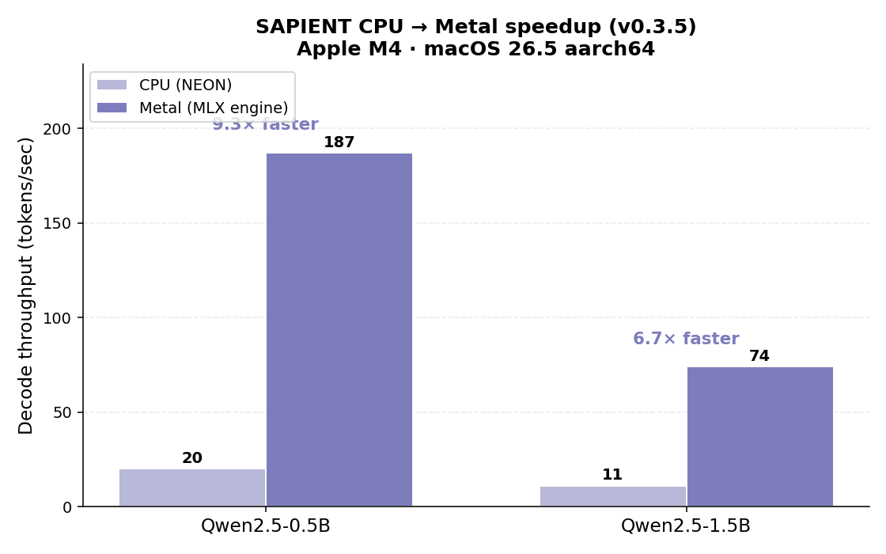

# SAPIENT Benchmarks — Metal, CPU, vs llama.cpp & Ollama

> First generated 2026-05-31 (v0.3.5); each section carries its own measurement
> date — latest full refresh 2026-07-09 (v0.5.3); **independent M4 reproduction
> 2026-10-01 (v0.6.0)** directly below. Sections are a dated log, newest first:
> older sections are kept as the record of what was measured then and are NOT
> updated when later work changes the picture — check each section's date.

> This page covers single-request **engine** throughput. For the **HTTP serving**
> comparison (`sapient serve` vs Ollama vs vLLM — TTFT, concurrency, model
> switch-back, prefix caching) see [SERVING_BENCHMARKS.md](SERVING_BENCHMARKS.md).

---

## Binary size (2026-10-02)

| CPU build, Apple Silicon | Size |
|---|---:|
| v0.6.1 release | 52.5 MB |
| main, default (Kokoro dictionaries downloaded with the model) | **16.7 MB** |
| main, `--features embed-g2p` (dictionaries built in, gzip) | 24.6 MB |

35.5 MB of the old binary was pronunciation data for Kokoro text-to-speech. Speech
output is byte-identical before and after on three voices. Other platforms and the
`-metal` / `-gpu` variants are not re-measured yet.

---

## How SAPIENT numbers are measured (read this first)

**From 2026-10 on:** `sapient bench-llm <alias | file.gguf> --json` reports
**decode-only** throughput — greedy, exact token count,
`(tokens − 1) / (t_last_token − t_first_token)` — with `--warmup` runs (default 1)
excluded from every mean, TTFT = prompt prefill + first token, and peak RSS from
`getrusage` (the process high-water mark). The JSON carries a `method` string,
the per-run rows, and the warm-up rows; commit it under `docs/assets/` next to
any number you publish.

**Every SAPIENT `bench-llm` figure dated before 2026-10** (the v0.5.3 and earlier
tables below) was produced by the old tool, which computed
`re-tokenized reply length ÷ total time including TTFT`, averaged **all** runs
(no warm-up discard), and reported end-of-run RSS as "peak". That *understates*
SAPIENT's decode rate relative to llama.cpp's `llama-bench` tg (pure decode): for
the 128-token v0.5.3 runs, by roughly 3–4% on Metal (TTFT ~0.05 s) and 15–20% on
CPU (TTFT 0.37–0.53 s of a ~2.5–3 s run) — conservative, but not the "decode-only,
run 1 discarded" method some older text describes. The old numbers are left as
measured; they are not relabelled.

Other definitions in use, by section: the wgpu and Pi tables use
`scripts/bench_wgpu.py` (streamed chunks over the decode window via `sapient
serve`); the MoE tables use `tests/moe_bench.rs` (pure decode, `VmHWM`).

**Standing caveats for every comparison on this page**

- **Threads (M4 CPU):** llama.cpp runs `-t 4` (its best setting — it measures ~3×
  slower at 10 threads because of the efficiency cores); SAPIENT runs all 10 cores.
  Each engine is at its best configuration, not at matched thread counts.
- **Metal precision:** the `-metal` build re-quantizes every weight to MLX 4-bit
  (group 64) at load regardless of the GGUF's quant (`mlx_engine.rs`). "Same GGUF
  file" on Metal therefore means same file, **not** same precision: llama.cpp and
  Ollama run the file's own Q4_K/Q6_K (or Q8_0) blocks. Greedy output on Metal
  diverges from the CPU path within ~13 tokens on the same file (both coherent).
- **Quality:** no perplexity or eval-suite comparison exists yet. "Token-identical"
  statements refer to a single prompt's greedy prefix.
- **Raw data:** only `assets/bench_2026-10-01/` holds per-run output. Earlier
  sections have summary numbers only.

---

## M4 reproduction on v0.6.0 (2026-10-01)

> Hardware: **Apple M4 (MacBook Pro) · 16 GB.** SAPIENT **v0.6.0** release binaries
> (CPU build + `-metal`) · **llama.cpp b9860** · **Ollama 0.12.6** — the same
> llama.cpp/Ollama versions as the v0.5.3 refresh. All engines read the same GGUF
> files (Ollama's blobs). Other desktop apps were running, so absolutes sit a
> little under a cool idle machine. Method + verbatim output:
> [`assets/bench_2026-10-01/`](assets/bench_2026-10-01/README.md).

| Decode tok/s (3 rounds) | SAPIENT | llama.cpp | Ollama | v0.5.3 table (SAPIENT vs llama.cpp) |
|---|---:|---:|---:|---|
| Qwen2.5-1.5B Q4_K_M — CPU | 41.6 / 44.2 / 44.7 | **60.4 / 63.5 / 63.4** | — | 40.6 vs 66.5 |
| Qwen2.5-1.5B Q4_K_M — Metal | 72.3 / 74.7 / 76.0 | **78.9 / 77.4 / 74.9** | 73–78 | 82.2 vs 88.4 |
| Llama-3.2-1B **Q8_0** — CPU | 47.6 / 50.8 / 43.9 | **54.3 / 53.6 / 54.2** | — | (not measured at this quant) |
| Llama-3.2-1B **Q8_0** — Metal | **92.5 / 95.1 / 103.8**§ | 63.2 / 63.5 / 64.3 | 63–65 | (not measured at this quant) |

§ Not a same-precision win: SAPIENT-Metal runs this Q8_0 file as MLX 4-bit while
llama.cpp and Ollama run it at 8-bit.

**What this run establishes**
- The v0.5.3 Qwen ratios reproduce: CPU **1.43×** behind llama.cpp (table says
  1.64×), Metal **0.96×** of llama.cpp (table says 0.93×).
- On a same-file, same-quant basis SAPIENT-Metal and Ollama are level on Qwen-1.5B.
  The "1.5× Ollama on the 1B" result in the v0.5.3 section is a 4-bit-vs-Q8_0
  comparison (see §) and should not be read as an engine-speed win.
- Not re-measured here: Llama-3.2-1B Q4_K_M (file not on the machine), TTFT, and
  every Pi / Thor number.

---

## Vision tower — SmolVLM-256M image encode (2026-10-02)

> `sapient see <image> --model smolvlm-256m`, one 512² image (1024 patches,
> SigLIP-B/16, 12 layers, BF16 weights → online Q8_0, W8A8 SDOT path). Timing is
> the CLI's `vision` stage; the per-stage split is `SAPIENT_VISION_TIMING=1`.
> Same image and prompt every run; reply text checked byte-identical before/after.

| Vision encode | before | after | change |
|---|---:|---:|---:|
| Apple M4, 10 threads | 1140 ms | **~555 ms** | −51% |
| Apple M4, 4 threads (`RAYON_NUM_THREADS=4`) | 1410 ms | **~750 ms** | −47% |
| Raspberry Pi 5 (4× Cortex-A76) | 7.2–7.4 s (v0.5.2 release) | **3.5–3.6 s** (3 runs: 3509–3603 ms) | −51% |

"Before" on the M4 is main at v0.6.0-level kernels (the 3.0 s in the
vision-language table further down predates the blocked W8A8 GEMM). "Before" on
the Pi is the installed v0.5.2 release binary; "after" is this branch
cross-compiled (`--no-default-features`, `target-cpu=cortex-a76`). Pi prefill for
the 79-token prompt also dropped 0.58 → 0.27 s.

Five changes, all bit-identical (reply text, `vlm_e2e`, `vlm_geometry_probe` and
three new bit-identity tests all pass):

1. **Parallel element-wise map** (`unary_f32` ≥ 65k elements): the tower's GELU was
   one single-threaded pass over 3M elements per layer — 255 → 40 ms.
2. **Head split/merge fast path** (`permute` `[0,2,1,3]`): whole `head_dim` runs
   copied instead of a per-element recursive walk — q/k/v stage 262 → 141 ms. The
   LLM engines share this helper, so short-prompt prefill also dropped (110 → ~75 ms
   for 77 tokens).
3. **Four-activation-row SDOT tile** (`dot_q8_0_row_sdot_x4`): each Q8_0 weight
   block is loaded once for four patch rows, the four block dots reduce together
   and combine with the scales as a vector; weight scales are widened once per
   weight row.
4. **Activation panels in the blocked W8A8 GEMM** — the Pi finding. The old loop
   swept all 1024 patch rows (0.8–3 MB of int8) per weight row. That fits an
   M-series L2 but not a Cortex-A76's 512 KB, and on the Pi the tower's linears
   sat on the memory-bandwidth roofline (~2.4 GB of traffic per linear per layer).
   Processing 32 KB activation panels against each task's weight rows took the Pi
   from 5.5 → 4.3 s (fc2 1300 → ~560 ms). Panel sweep on the Pi: 8–128 KB within
   ~2%, 512 KB +7%, no panelling +28% (`SAPIENT_Q8_PANEL_KB` overrides).

5. **Tiled tower attention.** The dense attention built a full `seq × seq` score
   matrix per head (4 MB at 1024 patches) and streamed it three times. It now
   works in tiles of query rows — score block, softmax and `S·V` while the block
   is cache-resident — with (head, tile) pairs in parallel. Pi attention
   1560 → ~850 ms (tower 4.26 → 3.5 s); M4 160 → ~122 ms. Tile sweep on the Pi
   (attention ms): 16 KB 3542 · 64 KB 1078 · **256 KB 846** · 1 MB 987 ·
   untiled 1051 — small tiles lose to SGEMM re-packing K/V per call
   (`SAPIENT_ATTN_TILE_KB` overrides).

Stage split after (ms):

| | norm | q/k/v | attention | out_proj | fc1 | GELU | fc2 |
|---|---:|---:|---:|---:|---:|---:|---:|
| M4, 10 threads | 26 | 100 | 122 | 34 | 122 | 40 | 92 |
| Pi 5 | 69 | ~670 | ~850 | ~230 | **~910** | ~180 | ~530 |

On the Pi the four Q8_0 linears are now ~2.3 s of the 3.5 s.

**Measured, not adopted:** a 4-wide NEON polynomial `exp` for the attention
softmax (~150M exponentials per image) cut attention 765 → 546 ms single-thread
but only ~5% of the tower at 10 threads, is not bit-identical, and flipped a
greedy near-tie in the reply. It stays scalar until a quality gate exists.

**Headroom:** the tower is ~107 G multiply-accumulates per image. Single-thread the
M4 now runs it at ~40 G/s, a fraction of what `sdot` can do in principle — the
per-32-block f32 scale combine is the same tail the Q8_K activation format removed
from the K-quant kernels. That, plus better multi-thread scaling (1 → 10 threads is
only ~4×), is the next rung.

### SmolVLM2-500M (2026-10-02, Apple M4 CPU)

`sapient see --model smolvlm2-500m`, same image and harness
(`scripts/bench_loop.py --vlm-model smolvlm2-500m`, 10 runs after one warm-up;
`benchmarks/2026-10-02-m4-smolvlm2-500m.json`):

| | F32 checkpoint as shipped | + Q8_0 at load |
|---|---:|---:|
| Image encode | 693–712 ms | **567 ms** (p50; min 548, max 675) |
| Prefill, 77–79 tokens | 328–332 ms | **~115 ms** |
| Peak RSS | 4.29 GB | 4.18 GB |

Replies are byte-identical before and after on three test images, and both vision
gates pass. Peak RSS barely moves because the F32 checkpoint is fully loaded before
it is quantized. Not measured on a Pi.

---

## v0.5.3 head-to-head refresh (Apple M4, 2026-07-09)

> Hardware: **Apple M4 (MacBook Pro) · 16 GB · macOS 26.5 aarch64.** SAPIENT
> **v0.5.3** release-profile builds (`-metal` MLX + CPU) · **llama.cpp b9860**
> (Homebrew) · **Ollama 0.12.6**. Same Q4_K_M GGUF files (unsloth Llama-3.2-1B,
> Qwen Qwen2.5-1.5B), all engines measured in the **same session**, interleaved
> with rests (cool-machine protocol; SAPIENT's CPU runs came *before*
> llama.cpp's, so run order did not favor llama.cpp). Method: decode tok/s over
> 128 generated tokens — llama.cpp = `llama-bench` tg128 (`-r 3`); SAPIENT =
> `bench-llm` streamed generation (mean of 3 runs, tokens ÷ total time incl.
> TTFT — the pre-2026-10 tool, see the method section above); Ollama =
> `/api/generate` `eval_count/eval_duration` (mean of 3). Raw summary:
> [`assets/bench_v053.json`](assets/bench_v053.json); charts regenerated with
> `scripts/gen-benchmark-charts.py`.

| Decode tok/s | SAPIENT `-metal` | llama.cpp (Metal) | Ollama (Metal) | SAPIENT (CPU) | llama.cpp (CPU, 4t) |
|---|---:|---:|---:|---:|---:|
| Llama-3.2-1B Q4_K_M | 90.6 | **111.3** | 60.4† | 56.7 | 83.1 |
| Qwen2.5-1.5B Q4_K_M | 82.2 | **88.4** | 86.3 | 40.6 | 66.5 |

† Ollama's default `llama3.2:1b` tag ships **Q8_0**, not Q4_K_M (its registry's
choice — noted rather than hidden; the same-quant tag failed to download during
this session).

| Warm TTFT (ms) | SAPIENT `-metal` | SAPIENT (CPU) | Ollama |
|---|---:|---:|---:|
| Llama-3.2-1B Q4_K_M | **52** | 366 | 152 |
| Qwen2.5-1.5B Q4_K_M | **63** | 531 | 133 |

(TTFT measured with a ~24-token prompt, warm model; Ollama TTFT is the
`total − eval` duration proxy; llama.cpp omitted — `llama-bench` reports no
TTFT.)

**The honest read, July 2026:**
- **llama.cpp is a moving target and moved.** b9860 measures faster than the
  build used in the v0.5.0/v0.5.1 sections below on the same files (Metal 1B
  101.3 → 111.3; CPU-4t 1B 78.7 → 83.1, 1.5B 62.5 → 66.5).
- **Metal:** SAPIENT sits within **0.81–0.93×** of llama.cpp-Metal and roughly
  ties Ollama on the 1.5B. The 1.5× over Ollama on the 1B is against its Q8_0
  default tag while SAPIENT-Metal runs 4-bit — not a like-for-like result. Warm
  TTFT is 52–63 ms; Ollama's ~130–150 ms is a `total − eval` proxy that includes
  its prompt-eval overhead, so the TTFT ranking is indicative, not exact.
- **CPU:** the gap vs llama.cpp is **1.47× (1B) / 1.64× (1.5B)** this session —
  wider than the v0.5.1 cool-machine reference readings (1.13–1.35×) because
  llama.cpp improved and because sustained same-session benching runs warmer
  than the isolated cool-machine readings documented in the thermal note below.
  Both realities are recorded; the same-session table is the apples-to-apples
  one.

---

## Vision-language on-device (first measurements, Apple M4 CPU)

`sapient see` per-stage timings (real chest X-ray, 3-sentence answer, greedy;
`⏱` line printed by the CLI). MedGemma reads a radiograph **fully offline on a
MacBook** — slow first token today, honest numbers below:

| Model | vision tower | prefill | decode | peak RSS |
|---|---|---|---|---|
| MedGemma-4B (896², 280-tok prompt) | 33.0 s | 9.9 s | **15.0 tok/s** | 7.8 GB |
| Gemma-3-4B (same protocol) | ~33 s | 10.1 s | 15.0 tok/s | — |
| SmolVLM-256M (512², 87-tok prompt) | 3.0 s | 0.3 s | **~100 tok/s** | — |

The vision-tower cost was **68.7 s at first light → 33.0 s** after three same-day
kernel changes: row-block-parallel f32 SGEMM in `matmul_nt` (the tower had been
running one single-threaded GEMM per linear), online-Q8_0 for eligible tower
linears (Gemma3's 4304-wide fc2 stays f32 — 4304 % 32 ≠ 0), and **dense GEMM
attention** for the non-causal tower (`Q·Kᵀ`/`S·V` through blocked SGEMM instead
of the flash row-loop, which is shaped for long-KV decode). Remaining levers:
a blocked W8A8 GEMM for m≫1 activations (the W8A8 path is per-row today) and
resolution options. Decode at 15 tok/s makes the *reading* fast — it's the
*looking* that needs the next rung.

## Sparse MoE — Mixtral-8x7B on a Jetson (v0.5.x, CPU path, no CUDA)

> Hardware: **NVIDIA Jetson AGX Thor · 14× Arm Neoverse · 122 GB · aarch64 Linux**.
> Same GGUF file (`mixtral-8x7b-instruct-v0.1.Q4_K_M`, 24.6 GB), matched **14
> threads**, greedy/temp-0. SAPIENT = pure-Rust CPU engine; llama.cpp = build
> `b1928` (see the compatibility note). Measured 2026-07-05.

A **47-billion-parameter** model (8 experts, top-2 → ~13 B active) running fully
on-device in pure Rust with **zero CUDA/JetPack** — cross-shipped one binary over
ssh. This is the "big models on small devices" thesis, demonstrated.

| Metric | SAPIENT | llama.cpp | Notes |
|---|---|---:|---|
| **Decode** | 5.49 tok/s | **9.95** | llama.cpp 1.8× (see decomposition) |
| **Prefill** | ~6–9 tok/s | ~15 | |
| **Peak RSS** | **25.6 GB** (mmap) | ~25 GB | ≈ file size; MoE now mmaps by default |
| **Quality** | coherent, correct | coherent, correct | **greedy token-identical for ~28 tokens**, then one f32-order flip |

**Zero quality loss vs llama.cpp.** Same prompt, temp 0, both engines produce the
*identical* tokens for ~28 steps ("The Roman Empire, one of the most powerful and
influential civilizations in world history, began its journey as a small
settlement on the Italian Peninsula…"), then differ by one near-tie word (SAPIENT
"in", llama.cpp "around") — *late* divergence from f32 reduction order, not an
early routing/math bug. Both decode the same Q4_K/Q6_K blocks: **no quality is
traded** at a given quant.

**Compatibility win.** *Current* llama.cpp **cannot load** the classic per-expert
Mixtral GGUFs (TheBloke, MaziyarPanahi — the ones most people have): it dropped
the per-expert tensor layout for stacked `*_exps` and errors with `missing tensor
'blk.0.ffn_down_exps.weight'`. SAPIENT loads **both** layouts. (The llama.cpp
number above therefore uses an older per-expert-capable build, `b1928`, on the
exact same file — the honest same-file comparison.)

### Where the 1.8× goes — and why it isn't MoE

An honest decomposition, using a **dense control** (Qwen2.5-1.5B Q4_K_M, same
Q4_K + Q6_K quant profile, cached on the same box):

| | SAPIENT | llama.cpp | gap |
|---|---:|---:|---:|
| Mixtral (MoE) decode | 5.49 | 9.95 | **1.8×** |
| Qwen dense decode, 14 threads | 26.68 | 84.45 | **3.16×** |
| Qwen dense decode, **1 thread** | 3.60 | 6.97 | **1.94×** (kernel) |
| Multicore scaling 1→14 | 7.4× (53%) | 12.1× (86%) | **1.6×** (threading) |

(Build note: the Mixtral row uses llama.cpp `b1928` — January 2024, the last build
that loads this per-expert file — while the Qwen rows use a current build. Part of
the smaller MoE gap may simply be the older llama.cpp; the conclusion below is
therefore suggestive, not proven.)

The **dense gap (3.16×) is larger than the MoE gap (1.8×)** — so MoE is *not* the
bottleneck; it's SAPIENT's relatively strong case, and a fused-MoE kernel would
buy nothing. The real gap decomposes into **~1.94× single-core kernel quality**
(llama.cpp uses Arm's hand-tuned **KleidiAI** microkernels) **× ~1.6× multicore
scaling** (SAPIENT's per-GEMV rayon fork/join vs a persistent threadpool).

Two things ruled out by measurement: **SVE is a dead end here** — Thor's SVE
vector length is **128-bit (= NEON width)**, so porting kernels to SVE gains
nothing (llama.cpp's per-core edge is kernel *engineering* at the same width, not
a wider ISA); and **task granularity is already optimal** (a `SAPIENT_GEMV_TPC`
sweep showed the default 4-tasks/core beats 2 and 1). Closing the gap is therefore
real, deep work — KleidiAI-class NEON microkernels + a lower-overhead decode
threadpool — not a config knob. Tracked as its own project (see ROADMAP).
SAPIENT's decode moves ~26 GB/s of weight traffic vs Thor's ~200 GB/s roofline,
so the headroom is real; the question is engineering effort vs a dedicated Arm
kernel library.

*Reproduce:* `RAYON_NUM_THREADS=14 cargo test -p sapient-generate --test moe_bench
--release -- --ignored --nocapture` (SAPIENT, separates prefill/decode/peak-RSS;
`MOE_BENCH_MODEL` to swap models) · `llama-bench -m <gguf> -t 14 -p 512 -n 128`.

### GLM-4.5-Air — a 106B sigmoid-gate MoE on the same Jetson

> Same box (Thor, 14 threads). `openhorizon/glm-4.5-air-q4` — Q4_K_M, a **2-shard
> split ≈ 63 GB**. Measured 2026-07-06.

The DeepSeek-V3-style sibling of Mixtral: sigmoid gate + aux-loss-free correction
bias + a shared expert + partial RoPE, 128 experts top-8. **Decode-verified
coherent on Thor** ("The Roman Empire, one of history's most influential
civilizations, emerged from the Roman Republic in 27 BCE when Octavian was granted
the title Augustus…"). A **106-billion-parameter model, pure Rust, zero CUDA.**

| | decode | prefill | peak RSS | note |
|---|---:|---:|---:|---|
| byte-copy split | 0.34 tok/s | — | 119 GB | experts pinned in heap → thrash |
| zero-copy split | 2.45 tok/s | 0.80 | 118.6 GB | per-expert **mmap views** → 7× decode |
| **+ Q5_0→Q8_0 at load** | **3.23 tok/s** | **3.94** | **72 GB** | Q5_0 no longer F32-expanded |

Two levers, both about keeping weights out of pinned/expanded heap:

1. **Zero-copy stacked-expert split** — the naïve version copied every expert out of
   the mmap into non-evictable heap (~57 GB pinned) → thrash at 119/122 GB. Sharing
   the stacked buffer via byte-offset `Tensor::from_buffer` views keeps experts as
   evictable page-cache (7× decode over the copy).
2. **Q5_0→Q8_0 at load** — unsloth's dynamic quant stores 24 `ffn_down_exps` as
   **Q5_0**, which SAPIENT couldn't keep as blocks, so the loader F32-expanded them
   (738M params → 2.95 GB each = **70 GB heap**). Re-quantizing to Q8_0 at load
   (near-lossless, 8⊇5 bits, ~1.06 B/weight) cut that to ~19 GB → **peak RSS 118 → 72
   GB, heap 66 → 18 GB**, and the memory relief lifted **decode +32% / prefill 5×**.
   Now fits a 96 GB box; output byte-identical.

Also new for GLM: **split-GGUF loading** (shard-set download + merge), head_dim from
`key_length` (128 ≠ hidden/heads), and the MTP-layer cap. The real Thor run caught
**five** bugs no synthetic test could (split-routing gate, GGUF head_dim, MTP cap,
heap-copy RSS, Q5_0 F32-expansion). Remaining ~18 GB heap = the Q8_0-converted experts;
a first-class Q5_0 mmap kernel would zero it (future).

## Head-to-head vs llama.cpp & Ollama (v0.5.0, 2026-07-03)

Same GGUF **files** (Q4_K_M, byte-identical where both engines read GGUF), same
machines, decode tok/s (llama.cpp = `llama-bench` tg128; SAPIENT/Ollama =
streamed 128-token generation; Ollama uses its own Q4_K_M download).

**Apple M4 (MacBook Pro, 16 GB):**

| Engine | Qwen2.5-1.5B | Llama-3.2-1B | notes |
|---|---|---|---|
| **SAPIENT `-metal` (MLX)** | 73.8 | **103.2** | TTFT 38 / 27 ms |
| llama.cpp (Metal) | **79.1** | 101.3 | |
| Ollama (Metal) | 75.8 | 62.3 | |
| llama.cpp (CPU, 4 threads) | 62.5 | 78.7 | |
| SAPIENT (CPU) | 34.1 | 42.7 | |
| SAPIENT (wgpu→Metal) | 14.5 | 24.0 | use `-metal` on Apple |

**Raspberry Pi 5 (16 GB):**

| Engine | Qwen2.5-1.5B | Llama-3.2-1B |
|---|---|---|
| llama.cpp (CPU) | **12.2** | **14.7** |
| SAPIENT (CPU, official release binary) | 6.6 | 8.2 |

**Jetson AGX Thor (14-core Grace + Thor GPU):**

| Engine | Qwen2.5-1.5B |
|---|---|
| llama.cpp (CPU, 14 threads) | **85.3** |
| SAPIENT (CPU) | 22.4 |
| SAPIENT (wgpu, Vulkan) | 9.7 |

**Follow-up experiment (post-v0.5.0):** a 4-row multi-row SDOT GEMV (activation
registers shared across 4 weight rows, per-row results bit-identical) gained
**+5% on the Pi** (llama-1B 8.2→8.6, qwen-1.5B 6.6→6.9) and ~0% on M4 — which
localizes llama.cpp's remaining CPU edge in (a) **load-time weight repacking**
(4–8 rows interleaved into one contiguous stream per task, vs our four parallel
row streams per task thrashing the prefetchers) and (b) **i8mm/SMMLA** on
v8.6+ cores (M4/Grace; 2× int8 MACs per instruction, requires the interleaved
layout). The first repack rung has since landed: **Q4_K_R4** — a load-time permutation
interleaving groups of 4 rows' super-blocks so the SDOT kernel walks one
contiguous stream per task (`DType::Q4_K_R4`, pure-CPU engines, heap tensors
only, embedding excluded, `SAPIENT_NO_REPACK=1` to disable). Bit-identical
logits (engine-gated). Measured cumulative vs v0.5.0: **Pi 5 llama-1B 8.2→9.2
tok/s (+12%), qwen-1.5B 6.6→7.5 (+14%); M4 +5–6%** — the llama.cpp CPU gap
narrows from 1.79× to 1.60×. The **Q6_K** rung was then built and measured: with the existing f32-activation
Q6_K kernel, the interleaved layout is **neutral on both Pi and M4** (A/B/A
within ±2% noise) — so `Q6_K_R4` ships as tested, opt-in groundwork
(`SAPIENT_REPACK_Q6K=1`) rather than a default. The measured conclusion — Q6_K's cost is
the u8→f32 widening arithmetic — was then confirmed by building the **W6A8 SDOT
Q6_K kernel** (int8 activations, −32 folded into the integer dot, one `sdot`
per 16-element scale group):

| Decode tok/s (128-tok greedy) | Pi 5 | M4 CPU |
|---|---|---|
| Llama-3.2-1B: v0.5.0 → +R4 → **+W6A8** | 8.2 → 9.2 → **11.5 (+40%)** | 42.7 → 44.8 → **58.1** (65.7 with Q6K-R4) |
| Qwen2.5-1.5B: v0.5.0 → +R4 → **+W6A8** | 6.6 → 7.5 → **9.1 (+38%)** | 34.1 → 36.3 → **51.8 (+52%)** |

**The llama.cpp CPU gap is now ~1.2–1.35×** (was 1.8–3.8× at v0.5.0). W6A8
accuracy is the same class as the accepted Q4_K W4A8 path (per-32-block int8
activations; greedy outputs verified). Q6_K-R4 remains opt-in: it adds +13% on
M4/llama-1B but is slightly negative on the Pi — `SAPIENT_REPACK_Q6K=1` to
enable. The **i8mm/SMMLA rung** then landed for prefill:
`smmla`'s 2×2 int8 tile needs two distinct activation rows, so it cannot help
m=1 decode (half the lanes waste) — but for CPU **prefill** (m ≥ 2) one `smmla`
replaces four `sdot`s and each R4 weight group is read once per PAIR of prompt
tokens. Measured (600-token prompt, qwen-1.5B, warm model): **M4 17.6→13.6 s
(1.29×)**, **Thor 40.5→24.0 s (1.68× cumulative vs v0.5.0)**; Thor decode also
+24% cumulative (22.4→27.7 tok/s). Pi 5 (Cortex-A76, no i8mm) is unaffected.
The **Q6_K-x2 rung** followed (same SMMLA treatment for Q6_K, plus Q6_K repack
now defaulting ON where i8mm exists — the x2 kernel consumes the R4 layout):
prefill **M4 13.6→11.7 s** and **Thor 24.0→20.1 s** — cumulative prefill vs
v0.5.0: **M4 1.50×, Thor 2.01×**. Decode is neutral on all machines.

**Thermal discipline note (M-series):** back-to-back CPU benches on a MacBook
progressively throttle — mid-session readings on the M4 varied 42.9→69.5 tok/s
for the *same binary* by thermal state (and one apparent "+13%" and one
apparent "−9%" were both thermal-order artifacts that A/B/A runs dispelled).
M4 numbers here are cool-machine readings; Pi/Thor runs are short and
consistent. Cool-machine decode reference (128-tok greedy): **llama-1B 69.5
tok/s (1.13× behind llama.cpp), qwen-1.5B ~51 (1.22×)**.

**Q8_K-style precomputed activation block-sums landed** (2026-07-10,
`feat/cpu-parity-2`): the per-32-block Σx that the Q4_K W4A8 kernels need for
the `dmin·mn` term is now computed once per activation row at quantization
time (`i8_block_sums`) instead of re-reduced with `vaddlvq_s8` inside every
weight row/group. Bit-identical output (same integer sums; all four kernel
bit-identity gates + the engine repack gate unchanged). Measured, interleaved
A/B/B/A on M4 CPU decode: llama-1B 61.2 → 61.8 tok/s (+0.9%), qwen-1.5B
43.5 → 44.1 (+1.2%) — small because the R4 4-row kernels already amortized
the reduction 4×; the single-row/remainder paths gain the most.

**Decode threadpool landed — guided spin/park pool, four design iterations,
each measured** (2026-07-10, `feat/cpu-parity-2`): a persistent worker pool
(`spinpool.rs`) replaces the per-GEMV rayon fork/join (~230 barriers per
decoded token). The design arc, all A/B-measured on real decode:
**v1** per-chunk dynamic claiming — M4 +5% (qwen), but 2× REGRESSION on
14-core Thor (claim/completion RMW traffic on hot lines + scattered
per-thread chunk order) and a seqlock ordering bug that segfaulted (odd bump
must precede the active drain — stress-test pinned). **v2** static contiguous
shares — fixed Thor (2× → −8%) but equal shares wait for the slowest E-core
on M4 (45 → 31 tok/s). **v3** guided blocks (~3/participant off one counter)
— Thor +8%, M4 still down (the lm_head's block≈8 gave E-cores 8× longer
straggler tails). **v4** topology-aware block size (1 on P/E-heterogeneous
macOS, guided on homogeneous server ARM): **M4 llama-1B +7.7% (62.9 vs
58.4), M4 qwen +0.9%, Thor 14-core qwen +5.3% (24.7 vs 23.4), Pi 5 −4%
(9.9 vs 10.3 — at ~100 ms/token there is no fork/join tax to reclaim on 4
cores).** Also measured en route: hot spinning is anti-productive on Apple
Silicon (serial-phase power/scheduler interference; optimum ≈ 4k-iteration
spin then park), and both worker AND publisher threads need QoS pinning on
macOS. Default (measurement-driven): ON for macOS and Linux/aarch64 ≥ 8
threads; opt-in elsewhere (`SAPIENT_SPINPOOL=1/0` overrides; thermally
governed decode always uses rayon).

**Prefill tiling investigated — two falsifications that narrowed the real
gap** (2026-07-10, `feat/prefill-tiling`; baseline: SAPIENT qwen-1.5B prefill
≈ 103 tok/s on 10 M4 threads vs llama.cpp pp512 113.7 tok/s on FOUR threads —
a ≥2× per-thread gap). (1) **Cache-blocking the m ≥ 2 SMMLA paths over
128-row activation panels: NO-GO.** The activation matrix (3–4 MB at ~2k
tokens) already sits in LLC on every tested machine, so the per-group
activation re-stream never hit DRAM — while panelling made the WEIGHTS
stream ceil(m/128)× instead of once (the 4-row group is L1-resident across
all m in the original order). Measured: Thor +7% TTFT, M4 even. Reverted;
a panel-boundary bit-identity matmul gate stays. (2) **A deeper x4 SMMLA
register tile (weight nibbles unpacked once per two activation pairs):
NO-GO.** M4 −5% — 16 activation TRN vectors + 8 weight vectors + accumulators
spill past the 32-register budget, and the unpack ALU was already hidden
behind smmla latency; Thor exactly neutral. Reverted (bit-identity was
verified before measuring).

**What's actually left of the pp512 gap:** the per-32-block f32 scale-combine
tail. Our K-quant activations carry per-32 scales (chosen for Q8_0 outlier
safety), forcing ~6 f32 ops per 64-weight group per output — comparable to
the 4-smmla integer core itself. llama.cpp's **Q8_K** activation format uses
one scale per 256-element super-block + precomputed bsums, applies weight
sub-scales in the INTEGER domain, and pays one f32 multiply per super-block —
~8× less f32 tail. Adopting Q8_K-style activations for the K-quant matmuls is
the identified next rung: an accuracy-class change (per-256 vs per-32
activation quantization — llama.cpp-precedented industry-wide), new
int-domain kernels, and greedy-output verification on real models.

**Q8_K activation format landed for the Q4_K_R4 paths** (2026-07-10,
`feat/q8k-activations`, `SAPIENT_Q8K_ACT` gate): activations carry ONE f32
scale per 256-element super-block + per-32 sums (llama.cpp `block_q8_K`);
the kernels accumulate the 6-bit weight sub-scales in the INTEGER domain and
pay one f32 fma per super-block. Every kernel bit-identity-gated against a
scalar oracle that itself sits within 3% of BOTH the f32 reference and the
accepted per-32 W4A8 path; real-model greedy verification passed (llama-1B:
coherent, ~15-token verbatim prefix, near-tie divergence — the accepted MoE-
precedent class). Measured (same binary, env A/B, order-swapped):

| Q8_K vs per-32 | decode | prefill TTFT (2.2k tok) |
|---|---:|---:|
| M4 qwen-1.5B | **+6.3%** (47.5→50.5) | +1–3% |
| M4 llama-1B | **+4.9%** (64.5→67.7) | — |
| **Thor 14-core qwen** | **+22.7%** (24.2→29.7) | **−12.7%** (30.9→26.9 s) |

The narrow in-order-ish Neoverse pipe is where the f32 tail hurt most —
+23% decode is the largest single-rung Thor win of the parity project (gap
vs llama.cpp there: 3.16× at v0.5.0 → ~2.8× now on this model). On M4 the
SMMLA prefill barely moves because this port still does the sub-scale
combine with scalar lane-extraction — vectorizing that combine (llama.cpp
does) is the follow-up, as is the Q6_K Q8_K variant (Q6_K is ~⅓ of a
Q4_K_M model and still pays the per-32 f32 tail).

**Pi 5 measured (+3.9%, 10.3 → 10.7 tok/s llama-1B decode) — a win on every
platform, so Q8_K activations are DEFAULT ON for the Q4_K_R4 paths**
(`SAPIENT_Q8K_ACT=0` reverts).

**Q6_K joined the Q8_K format** (2026-07-10, `feat/q6k-q8k` — same
`SAPIENT_Q8K_ACT` gate, so the flag now covers both K-quants): Q6_K's per-16
i8 scales made its f32 tail TWICE Q4_K's (three multiplies + fma per 16
elements); the integer-domain combine cuts it 16×. Four kernels (scalar
oracle, single-row NEON, R4 4-row, SMMLA×2), each bit-identity-gated;
repack invariance holds on both Q6_K paths; greedy output on Q6_K-heavy
llama-1B is byte-identical to the Q4_K-only Q8_K run. Measured off→on
(COMBINED Q4_K+Q6_K format, same binary, order-swapped):

| combined Q8_K vs per-32 | decode | prefill TTFT (2.2k tok) |
|---|---:|---:|
| **Thor 14-core qwen** | **+44.5%** (22.7→32.8) | **−16.3%** (30.7→25.7 s) |
| M4 qwen-1.5B | **+12.5%** (40.6→45.7) | **−11.8%** (29.0→25.5 s) |
| Pi 5 llama-1B | **+6.8%** (10.3→11.0) | — |

(The M4 llama leg of this session was thermally corrupted mid-run and is
excluded; the Q4_K-only morning reading (+4.9%) stands.) The Q6_K increment
over the Q4_K-only rung: Thor decode +22.7 → +44.5, M4 qwen +6.3 → +12.5,
Pi +3.9 → +6.8 — and it finally moved M4 prefill (+1–3% → −11.8%), because
Q6_K's per-16→per-256 reduction is twice as deep as Q4_K's. **Thor's dense
decode gap vs llama.cpp: 3.16× (v0.5.0) → ~2.6×**; cumulative today
(block-sums + spin pool + Q8_K both quants): Thor 22.4 → 32.8 tok/s (+46%).

**Vectorized SMMLA sub-scale combine: measured NEUTRAL, reverted**
(2026-07-11, `feat/smmla-vec-combine`): keeping the smmla accumulators in
int32x4 vectors (`vmlaq_s32` against per-row scale vectors, one lane
extraction per super-block instead of per group) was built for both x2 Q8_K
kernels, stayed bit-identical through every gate — and measured Thor prefill
−0.7% (noise) with M4 inside thermal drift. Post-Q8_K, the residual
extraction + scalar-multiply cost per group is already insignificant against
the 8 smmlas + nibble-unpack. Reverted; this record is the result. **That
closes the named rungs of the CPU-parity ladder** — the residual Thor gap
(~2.6×) is llama.cpp's single-core kernel engineering (KleidiAI-class), an
open-ended project rather than a rung; the graph-level single-region decode
pass remains conditional on per-op publish cost ever surfacing.

Remaining parity items: deeper output tiling for prefill (llama.cpp pp512
remains well ahead), and the Linux-side threadpool validation above.

**The honest read (as of v0.5.0, 2026-07-03 — superseded for CPU by the later
entries above: the M4/Pi gap is now ~1.3–1.65×, Thor ~2.6×):**
- On **Apple Metal** SAPIENT is competitive with llama.cpp (−7% on qwen-1.5B,
  +2% on llama-1B) and **1.66× Ollama** on the 1B (Ollama's 1B tag is Q8_0 —
  not same-quant) — with better TTFT.
- On **CPU** (v0.5.0), llama.cpp decoded ~1.8–3.8× faster than SAPIENT everywhere
  (Pi, M4, Grace). The ratio is consistent across machines → kernel-level gap
  (tiled GEMV, K-quant micro-kernels, weight repacking), now the top CPU work
  item. SAPIENT's own CPU path did jump up to 6.4× this release (embedding
  fix), but llama.cpp remains ahead.
- The **wgpu path's value is capability, not crown**: one binary that keeps
  Q8_0/Q4_K/Q6_K weights quantized on any GPU vendor (VRAM ≈ file size, Jetson
  without CUDA). llama.cpp's Vulkan backend also dequantizes K-quants in-shader,
  so this is parity in capability, not a unique feature. On machines with strong CPUs it is not the fastest
  option, and on Apple the `-metal` build is the right choice.
- Thor-class Grace CPUs are decode monsters; the "Jetson via Vulkan" thesis
  (7b) is about weak-CPU Jetsons (Orin Nano class) — still unmeasured. The
  llama.cpp-CUDA gate comparison also remains open (no CUDA toolkit on the
  test device).

## v0.3.5 report (historical — 2026-05-31)

> Everything from here to "wgpu backend" is the original v0.3.5 report, kept as a
> record. Its CPU numbers (11–20 tok/s) predate the embedding-gather fix and the
> kernel ladder (CPU is now 40–57 tok/s on the same machine), and the "22 MB
> binary" figure is the v0.3.5 size — v0.6.0 ships ~50 MB (CPU) and ~60 MB + an
> 88 MB `mlx.metallib` (`-metal`). Do not quote this section as current.

The v0.3.5 `MlxForwardEngine` puts SAPIENT's GPU path **ahead of Ollama on 0.5B
decode, with the lowest time-to-first-token of any engine on 0.5B**, and within
**1.3–1.5× of mlx-lm** (the Apple-native reference) — from a single daemon-free 22 MB
Rust binary.

| Axis | SAPIENT Metal | Ollama | mlx-lm | Verdict |
|---|---|---|---|---|
| Decode tok/s — 0.5B | **187** | 154 | 249 | beats Ollama |
| Decode tok/s — 1.5B | 74 | 78 | 94 | competitive |
| **TTFT — 0.5B** | **21 ms** | 28 ms | 39 ms | **best of all three** |
| **TTFT — 1.5B** | 70 ms | 64 ms | 264 ms | beats mlx-lm 3.8× |
| CPU → Metal decode | **6.7–9.4×** | — | — | same binary |
| Binary size | **22 MB** | 28 MB | Python venv | smallest |
| Daemon | **none** | required | none | — |


**The honest story:** mlx-lm is still the fastest on raw decode — it loads
pre-quantized 4-bit weights straight to the GPU. But SAPIENT now matches the *class*
of Apple-native performance from portable Rust + GGUF, **wins on TTFT for small
models**, and beats Ollama's small-model decode. Remaining gap: peak RAM (SAPIENT
dequantizes GGUF → MLX-Q4 at load and keeps the embedding table in F32).

---

## What changed in v0.3.4 → v0.3.5

Two fixes, both large:

1. **RoPE axis (v0.3.4).** `mlx_rs::fast::rope` treats dimension −2 as the
   sequence-position axis; the engine was feeding it `[1, seq, n_heads, head_dim]`
   (−2 = `n_heads`), scrambling positions across heads. Every model collapsed to one
   repeated token. Transposing to `[1, n_heads, seq, head_dim]` before RoPE (as
   mlx-lm does) restored coherent output.

2. **Engine reuse + native SDPA (v0.3.5).** The streaming path was *rebuilding and
   re-quantizing the whole model on every generation* — that reload dominated TTFT
   (3 s on 1.5B). The pipeline now holds the engine in an `Arc<Mutex<…>>` and reuses
   it, dropping TTFT **30–44×** (1.5B: 3144 ms → 70 ms). With RoPE fixed, MLX's fused
   SDPA also turns out to handle grouped-query attention correctly — the earlier
   "SDPA mishandles GQA" was the RoPE bug — so the manual per-head matmul loop was
   replaced with the fused kernel (+12% decode on 0.5B).

The actual prefill forward was never the bottleneck: profiled at **64 ms** for a
58-token prompt on 1.5B. The 3 s was pure model-reload overhead.

---

## CPU → Metal speedup

Same binary, same GGUF weights, just `--backend metal`:



| Model | CPU (NEON) | Metal (MLX) | Speedup |
|---|---|---|---|
| Qwen2.5-0.5B Q4 | 20 tok/s | **187 tok/s** | **9.4×** |
| Qwen2.5-1.5B Q4 | 11 tok/s | **74 tok/s** | **6.7×** |

---

## Full comparison

Decode throughput was described at the time as **decode-only** — `generated_tokens ÷ (total_time −
TTFT)` (the `bench-llm` tool of that era computed tokens ÷ total time; see the
method section at the top). TTFT is **steady-state** (warm engine, run 1 discarded). Prompt: a 58-token
request for a 200-word backprop explanation; 200 tokens generated.

### Qwen2.5-0.5B (4-bit)

| Engine | Backend | Decode tok/s | TTFT | Peak RAM |
|---|---|---|---|---|
| mlx-lm | Metal | **248.6** | 39 ms | **0.33 GB** |
| **SAPIENT** | **Metal** | **187** | **21 ms** ✦ | 1.23 GB |
| Ollama | Metal | 153.7 | 28 ms | — (daemon) |
| SAPIENT | CPU | 20 | 184 ms | 1.49 GB |

### Qwen2.5-1.5B (4-bit)

| Engine | Backend | Decode tok/s | TTFT | Peak RAM |
|---|---|---|---|---|
| mlx-lm | Metal | **94.2** | 264 ms | **0.95 GB** |
| Ollama | Metal | 77.9 | 64 ms | — (daemon) |
| **SAPIENT** | **Metal** | 74 | 70 ms | 0.45 GB |
| SAPIENT | CPU | 11 | 535 ms | 3.29 GB |

> ✦ SAPIENT has the lowest TTFT of any engine measured on the 0.5B model.

```
Decode tok/s — Qwen2.5-0.5B           TTFT (ms) — Qwen2.5-0.5B (lower better)
  mlx-lm   █████████████████████ 249    SAPIENT  ████████        21  ← lowest
  SAPIENT  ███████████████░░░░░░ 187    Ollama   ███████████     28
  Ollama   █████████████░░░░░░░░ 154    mlx-lm   ███████████████ 39
  CPU      ██░░░░░░░░░░░░░░░░░░░  20

Decode tok/s — Qwen2.5-1.5B           TTFT (ms) — Qwen2.5-1.5B (lower better)
  mlx-lm   █████████████████████ 94     Ollama   ████             64
  Ollama   █████████████████░░░░ 78     SAPIENT  █████            70
  SAPIENT  ████████████████░░░░░ 74     mlx-lm   █████████████████████████ 264
  CPU      ██░░░░░░░░░░░░░░░░░░░  11
```

---

## Remaining gap: peak RAM

SAPIENT's peak RSS is higher than mlx-lm's because it dequantizes GGUF K-quants to
F32 to feed `mlx_rs::ops::quantize`, and keeps the token-embedding / `lm_head` matrix
in F32. mlx-lm memory-maps native 4-bit safetensors and never holds an F32 copy.
Storing the embedding as MLX-Q4 and quantizing weights without the F32 intermediate
would close most of the gap — it's the top open item on the [roadmap](../ROADMAP.md).

(TTFT and prefill, listed as gaps in the v0.3.4 report, are resolved in v0.3.5.)

---

## wgpu backend: Q8_0 GPU-resident weights (Phase 7.1)

The cross-platform wgpu path now keeps Q8_0 weights **quantized on the GPU** (raw
ggml blocks as packed int8 + scales, dequantized in-shader) instead of expanding to
f32 on upload. Measured with `scripts/bench_wgpu.py` + `/usr/bin/time -l`,
SmolLM2-360M-Instruct **Q8_0 GGUF**, Apple M4 (wgpu→Metal), 64 tokens, same model /
same quant / same hardware for both builds:

| Metric | f32 upload (before) | Q8_0 resident (after) |
|---|---|---|
| Weights resident on GPU | ~1.6 GiB | **388 MiB** (≈ GGUF file size; 225/225 matrices Q8_0, tied lm_head shares the embed buffer) |
| Peak RSS (one-shot chat) | 2.65 GB | **1.27 GB** |
| Peak memory footprint | 3.86 GB | **1.72 GB** |
| Decode | 20.5 tok/s | **21.4 tok/s** |
| TTFT | 51 ms | **46 ms** |

Greedy decode output is **token-identical** to the f32 path (same dequant values,
different reduction order). On UMA Apple silicon decode is dispatch-bound for a
model this small, so throughput moves little; the ≥2× decode target of Phase 7
is expected from discrete cards (Arc/AMD/Nvidia), where the 3.6× smaller weight
reads directly cut the memory-bandwidth bottleneck — those runs are still open
(Phase 7.6).

### Q4_K + Q6_K — Qwen2.5-1.5B Q4_K_M, Apple M4 16 GB, wgpu→Metal

Raw 144-byte Q4_K super-blocks upload verbatim (word-aligned, zero repack); Q6_K
blocks (210 bytes) are padded to 212 (memcpy only). Both decode in-shader. With
Q6_K covering v_proj + lm_head, a Q4_K_M GGUF loads **fully quantized**
(198/198 matrices).

| Metric | f32 upload (before) | Q4_K resident | + Q6_K (full coverage) |
|---|---|---|---|
| Weights resident on GPU | 6778 MiB | 2367 MiB | **1062 MiB** (≈ GGUF file size) |
| Peak memory footprint | 14.66 GB | 5.36 GB | **3.59 GB** |
| Peak RSS (one-shot chat) | 8.41 GB | 4.82 GB | **3.60 GB** |
| Greedy output | *broken* — immediate EOS, empty reply (memory exhaustion on 16 GB) | correct ("Paris"), matches CPU | correct ("Paris"), matches CPU |
| Decode | — (unusable) | 11.3 tok/s (≈ CPU 11.4 *at the time*) | **13.2 tok/s (1.13× the then-CPU path)** |
| TTFT | — | 81 ms | **77 ms** (CPU 86 ms) |

Two takeaways: quantized-resident weights are what make the wgpu path **fit and
function at all** for 1.5B-class models on 16 GB machines, and with the lm_head
read cut 6.5× (933 MB f32 → 196 MB Q6_K per token) the portable GPU path now
**beat the M4 CPU path as it stood then** (11.4 tok/s, before the embedding-gather
fix and kernel ladder — the M4 CPU path now decodes this model at 40–50 tok/s, ~3× the
wgpu path). Discrete-card
numbers (Arc/AMD/Nvidia, where the bandwidth win is larger) are still open —
Phase 7.6.

### Per-token command batching (Phase 7.4)

Each decode token's ~450 kernels (16/layer × 28 layers on a 1.5B) used to pay one
queue submission each; they now record into a single command encoder and submit
once per token. Back-to-back on the same warm machine (M4, wgpu→Metal, 64 tokens):

| Model | before | after |
|---|---|---|
| SmolLM2-360M Q8_0 | 23.1 tok/s, TTFT 40.5 ms | **29.3 tok/s (+27%), TTFT 35.0 ms** |
| Qwen2.5-1.5B Q4_K_M | 12.0 tok/s, TTFT 86 ms | **12.5 tok/s (+4%), TTFT 80 ms** |

Fixed submission overhead matters most when the per-kernel GPU work is small —
hence the bigger win on the smaller model. The batch flushes once per token:
accumulating a whole prompt's passes into one encoder stalls Metal.

### Cross-vendor numbers (Phase 7.6): Nvidia ✅ (Jetson AGX Thor, Vulkan)

First non-Apple datapoint, measured 2026-07-03 on a **Jetson AGX Thor DevKit**
(14-core ARM CPU, NVIDIA Thor iGPU, 122 GB LPDDR5X, driver 595.78, Vulkan) —
notable in itself: this is GPU LLM inference on a Jetson **without CUDA or any
JetPack SDK integration**, just the Vulkan driver (the Phase 7b story).

**Correctness first**: the entire quantized WGSL stack ran on Vulkan unmodified,
first try — `WgpuForwardEngine ready … 1062 MiB resident (198/198 matrices
quantized) (NVIDIA Thor (Vulkan))`, byte-identical greedy answer to Metal/CPU.

Decode, 64 tokens (same binary class, same models, same machine):

| Model | CPU (14-core) | wgpu **quantized-resident** (PR) | wgpu **f32-upload** (main) |
|---|---|---|---|
| Qwen2.5-1.5B Q4_K_M | 2.2 tok/s, TTFT 475 ms‖ | 9.8–10.0 tok/s, TTFT ~96 ms (4.5× the then-CPU path) | **19.6 tok/s**, TTFT 49 ms (8.9× the then-CPU path) |
| SmolLM2-360M Q8_0 | 17.2 tok/s | 29.4 tok/s (1.71× CPU) | 32.5 tok/s |
| Weights resident (1.5B) | — | **1062 MiB** | 6778 MiB |

‖ The 2.2 tok/s CPU baseline predates the embedding-gather fix; the Thor CPU path
now decodes this model at 22–33 tok/s (see the CPU sections above), i.e. **faster
than either wgpu column**. The "× CPU" multiples in this table are historical.

**Honest finding — the dequant kernels are ALU-bound on Nvidia.** The f32 path's
19.6 tok/s sits almost exactly on the Thor's ~273 GB/s bandwidth roofline
(6.2 GB of weights per token), while the quantized path reads 6× less data yet
decodes at half the speed: on this GPU the per-weight bit-unpacking (worst in
Q4_K/Q6_K; Q8_0 is nearly free at 0.9× f32) dominates. Metal hides this
(quantized ≈ f32 ± a few % on M4); Vulkan/Nvidia does not. Consequences:
- Phase 7's "≥2× the f32 path" bar is **not met on Thor-class hardware** — there
  the quantized path's value is the 6.4× memory cut (fitting models on
  small-VRAM cards, leaving RAM free), not raw speed.
- The identified follow-up is a **vectorized / multi-row dequant GEMM** (each
  weight block decoded once and reused across rows, wider u32 processing) — it
  was already the top P5-remaining item after 7.5, and the Thor data raises its
  priority.
- Mid-range Arc/AMD cards (8–16 GB VRAM, where the f32 1.5B footprint is
  painful and bandwidth is scarcer) remain the open measurement — the original
  target of the "done when" criteria.

Still wanted — **Intel Arc / AMD Radeon**:

```bash
# Linux (needs Rust, python3, libvulkan1 + your GPU driver):
# Phase 7 is merged — use main
git clone https://github.com/SkidGod4444/sapient && cd sapient
# writes bench-7_6-<gpu>.txt — attach it to a new issue
scripts/bench_gpu_7_6.sh
```

Windows (DX12): build with `cargo build --release -p sapient-cli --features wgpu`,
then run `python3 scripts/bench_wgpu.py --backends cpu,wgpu --model openhorizon/qwen2.5-1.5b-q4`
and `--model openhorizon/smollm2-360m-q4`, plus one `sapient.exe --verbose serve --backend wgpu`
request to capture the `WgpuForwardEngine ready` line (VRAM + quantized-matrix count).

Phase 7's acceptance bar on this hardware: ≥2× the f32-path decode on the same
card, and 1.5B Q4 above 15 tok/s on a mid-range Arc/AMD.

### Vectorized dequant (unpack4x8 + dot)

All six quantized matmul shaders now decode weights with hardware byte unpacks
(`unpack4x8snorm/unorm`, normalization constants folded into the block scales)
and reduce with `dot()` — one unpack per 4 weights instead of per-byte
shift/mask chains. **M4/Metal: 1.5B decode 12.8 → 14.3 tok/s (+12%)**; Jetson
Thor: neutral. The Thor neutrality *refines* the ALU-bound finding: with
dequant arithmetic now near-free, m=1 decode there is limited by the GEMV
**workgroup shape** (256 lanes per single output element at k≈1536 → ~1 word
per lane, then an 8-round barrier reduction per element; the f32 kernel hides
that latency behind 4× the memory traffic). The remaining Nvidia decode work is
a shape rework — fewer lanes per output / several outputs per workgroup — not
further instruction tuning.

### Multi-row dequant GEMM (prefill matmuls)

For `m > 1` each workgroup now dequantizes a weight row **once** and applies it
to 8 x-rows (MT=8), instead of the single-row GEMV re-reading and re-decoding
every weight `m` times per chunk. Decode (`m = 1`) keeps the untouched GEMV
kernels. Cold 1101-token prefill (server start incl. model load, Qwen2.5-1.5B
Q4_K_M, greedy):

| Device | GEMV prefill (before) | MT-8 GEMM (after) |
|---|---|---|
| Jetson AGX Thor (Vulkan) | 485 s | **57.4 s (~8.5×)** |
| Apple M4 (Metal) | 59.8 s | **37.9 s (1.58×)** |

The Thor's ~8.5× is the full MT amortization factor — direct confirmation that
GEMV prefill was dequant-ALU-bound on Nvidia (the finding above). Decode is
unchanged on both platforms (same kernels at m = 1). Note the ALU-bound *decode*
gap on Nvidia remains open — at m = 1 there are no rows to amortize across; that
needs cheaper per-weight unpacking in the GEMV kernels themselves.

### Batched prefill (Phase 7.5)

Prompts now prefill in 128-token chunks (`forward_chunk`) instead of one
sequential forward per token. Cold end-to-end (fresh server, model load
included), Qwen2.5-1.5B Q4_K_M, ~1100-token prompt, greedy, M4/Metal:

| | per-token prefill | chunked prefill |
|---|---|---|
| Time to first token | 87.9 s | **58.5 s (1.5×)** |
| Reply | "fox" (correct) | "fox" (identical) |

Known limitation: the matmul kernels are still GEMV-shaped (one workgroup per
output element), so chunking improves occupancy and pass count but does not yet
amortise weight reads across the chunk — a multi-row/tiled GEMM is the follow-up
that makes prefill weight traffic scale with 1/chunk.

### f16 KV cache (Phase 7.3)

K/V now store as f16 halves packed two-per-u32 word (core WGSL — no shader-f16
device feature, runs on every adapter), written by a `kv_append` conversion
kernel; attention accumulation stays f32. Half the per-position bytes lifts the
wgpu context cap **4096 → 8192** at identical memory cost: Qwen2.5-1.5B loads
with `ctx 8192 (KV f16)`, same 1062 MiB of resident weights and same greedy
output. Short-context decode is unchanged within run-to-run noise (measured
back-to-back against the f32-cache build); the benefit is context capacity and
long-context attention bandwidth. Logit deviation vs an f32 cache is bounded by
f16 rounding (~5e-4 relative), gated by `wgpu_f16_kv_cache_matches_f32_kv_cache`.

---

## SmolVLA action chunks (2026-10-02)

`lerobot/smolvla_base` (450M), Apple M4 (10 cores), CPU, one 512² camera frame, 13
language tokens, 78-token prefix, 10 flow-matching steps, 50×32 action chunk. Best of 3
runs in one process, model already loaded. Source: `smolvla_quantized_action_error` in
`crates/sapient-models/tests/smolvla_reference.rs`.

Action error is the difference from LeRobot's PyTorch implementation run in f32 on CPU
with the same inputs and start noise, in the model's normalized action units (the
reference chunk has RMS 0.41). **One observation only** — the error over a dataset has
not been measured.

| Linears stored as Q8_0 | Max error | RMS error | Vision | Prefix | Denoise | Total |
|---|---|---|---|---|---|---|
| none (f32) | 4.2e-6 | 8.3e-7 | 689 ms | 145 ms | 925 ms | 1759 ms |
| vision tower | 2.1e-2 | 2.5e-3 | 554 | 145 | 919 | 1619 |
| VLM text layers | 2.5e-2 | 4.8e-3 | 690 | 55 | 925 | 1670 |
| action expert | 1.6e-2 | 2.6e-3 | 705 | 143 | 322 | 1170 |
| **all (default)** | **3.5e-2** | **4.0e-3** | 596 | 55 | 328 | **979** |

Yardstick: LeRobot's own default precision runs the VLM and the action expert in bf16. On the same inputs it
moves the chunk by max 1.4e-2, RMS 1.9e-3 from the f32 reference. The all-Q8_0 default
is about 2× that.

Notes:

- With f32 activations forced (`SAPIENT_F32_ACT=1`) the vision and VLM errors barely
  change (1.8e-2, 1.6e-2), so they come from 8-bit weight rounding, not int8 activations.
  The expert's error drops from 1.6e-2 to 5.7e-3 in that mode.
- The expert's 720-wide matrices are not a multiple of the 32-element Q8_0 block. They
  are zero-padded to 736 columns at load; without that they stay f32 and denoise is
  753 ms instead of 328 ms.
- Skipping the last prefix layer's attention and MLP (only its K/V are read) and
  projecting the cross-attention K/V once per observation do not change the output.
- Fewer flow-matching steps (all-Q8_0): 5 steps → denoise 163 ms, max error 0.24, RMS
  0.024; 3 steps → 98 ms, max 0.47, RMS 0.054. Far larger than the quantization error.
- Where the 0.93 s goes (`sapient act`, default): vision 57%, denoise 37%, prefix 6%.
  Denoise is 79% linears (`SAPIENT_VLA_TIMING=1`).
- `sapient act` end to end, including load: 2.5 s wall, peak RSS 1.83 GB (f32: 2.1 s,
  2.07 GB). Peak is at load, while the BF16 checkpoint and the converted weights
  coexist. Served (`POST /v1/actions`, policy resident): 0.89 s per call, HTTP overhead
  about 2 ms; two cameras 1.46 s.

### Correction and update (2026-10-02, later the same day): error over eight observations, new kernel, Pi 5

**The single-observation error above understated the quantization error about 3×.**
Measured again over eight varied observations (different image, instruction, state and
start noise; `smolvla_quantized_error_over_observations`), against the f32 engine, which
itself matches LeRobot to 4e-6. LeRobot's own default precision (bf16) was run on the
same eight observations with `scripts/smolvla_bf16_yardstick.py`. Reference action RMS
is 0.36.

| Linears stored as Q8_0 | Max error | RMS error | RMS vs LeRobot bf16 |
|---|---|---|---|
| LeRobot bf16 default (yardstick) | 1.1e-1 | 4.6e-3 | 1.0× |
| action expert only (`balanced`) | 6.2e-2 | 4.2e-3 | 0.9× |
| vision tower only | 1.1e-1 | 6.7e-3 | 1.5× |
| VLM text layers only | 9.1e-2 | 8.4e-3 | 1.8× |
| vision + expert | 8.0e-2 | 7.6e-3 | 1.7× |
| all | 1.6e-1 | 1.1e-2 | 2.5× |
| all + vectorized softmax/GELU (`fast`, default) | 1.6e-1 | 1.3e-2 | 2.8× |
| f32 + vectorized softmax/GELU | 5.6e-6 | 3.7e-7 | — |

Per-observation RMS ranges from 4e-3 to 2.2e-2 for the all-Q8_0 rows, so differences of
20–30% between rows are within the spread (the vectorized math changes the f32 result by
4e-7; the 1.1e-2 → 1.3e-2 step is not caused by it). Eight synthetic observations are
still not a dataset, and none of this measures task success.

**Q8_0 GEMM kernel (bit-identical).** `matmul_nt` with Q8_0 weights, m ≥ 8, Apple M4:

| Shape (m × k → n) | Before, 1 thread | After, 1 thread | Before, 10 threads | After, 10 threads |
|---|---|---|---|---|
| tower q/k/v 1024 × 768 → 768 | 85 GMAC/s | 110 | 396 | 592 |
| tower fc1 1024 × 768 → 3072 | 89 | 123 | 416 | 705 |
| tower fc2 1024 × 3072 → 768 | 80 | 110 | 387 | 582 |
| expert gate/up 50 × 736 → 2048 | 91 | 107 | 312 | 426 |
| expert down 50 × 2048 → 720 | 86 | 99 | 321 | 411 |
| prefix MLP 78 × 960 → 2560 | 99 | 116 | 419 | 578 |

Best call within at least 0.3 s per shape, before and after measured back to back on
the same machine (1.3–1.7× at 10 threads, 1.15–1.4× on one). Shorter runs read low on
Apple Silicon until the core ramps up: a first pass with 7 calls per shape showed the
old kernel at 220–365 GMAC/s and overstated the gain as 1.5–2.4×.

Three changes: a 4 weight-row × 4 activation-row tile (`dot_q8_0_4rows_sdot_x4` — the
old 1 × 4 tile issued 12 vector loads per 8 `sdot`s), output written in place instead of
into a transposed scratch buffer, and 8 tasks per thread instead of 4. The tile alone on
cache-resident data runs 134 GMAC/s on a performance core (1 × 4 tile: 120); the
per-32-block scale combine caps the format near there. Source:
`crates/sapient-backends/cpu/tests/q8_gemm_bench.rs`. The vision tower's bias add was
also made row-wise and parallel (it cost as much as the GEMM for a 1024 × 3072 linear).

A single-scale-per-row int8 format (pure integer accumulation, no per-block combine)
was simulated and **rejected**: per-row activation scales alone gave action RMS 1.5e-2 on
the fixture observation with exact weights, and clipping outliers made it far worse
(RMS 0.11–0.20).

**SmolVLA per chunk, one camera, 10 steps** (best of 2–3 runs, policy loaded):

| | M4 before | M4 now | Pi 5 before | Pi 5 now |
|---|---|---|---|---|
| `fast` (default) | 0.93 s | **0.66 s** | 5.15 s | **3.65 s** |
| `balanced` | — | 1.02 s | — | 5.9 s |
| `exact` (f32) | 1.83 s | 1.73 s | — | 11.9 s |

Pi 5 `fast` split: vision 2.29 s (attention 0.86, fc1 0.39, q/k/v 0.37, fc2 0.36,
out_proj 0.14, GELU 0.09, norm 0.07), prefix 0.20 s, denoise 1.16 s (linears 0.86).
Two cameras on the Pi: 6.25 s. The vectorized softmax/GELU saves 0.17 s on the Pi
(GELU 183 → 91 ms; attention is bound by its f32 GEMM, not by `exp`) and about 25 ms on
the M4. Pi 5: 16 GB board, 47 °C idle, 71 °C after the runs, passive cooling state not
recorded. `sapient see` image encode on the M4 (same kernel, exact math): 555 → about
397 ms, replies unchanged.

### int8 vision attention for SmolVLA `fast` (2026-10-02)

The vision tower's attention now runs in int8 on the `fast` path: Q·Kᵀ and P·V on the
same `sdot` 4×4 tile as the Q8_0 linears, per-32 scales, K mean-centred over the
sequence first (exact under softmax), softmax kept in f32. `sapient see` and the
`balanced` / `exact` modes keep the f32 attention.

Acceptance rule, fixed before measuring: the `fast` action error over the eight
observations may rise by at most 20% (RMS ≤ 1.56e-2).

| Over eight observations | Max error | RMS error |
|---|---|---|
| `fast` before (f32 attention) | 1.6e-1 | 1.3e-2 |
| `fast` with int8 attention | 8.5e-2 | 8.7e-3 |
| LeRobot bf16 default (yardstick) | 1.1e-1 | 4.6e-3 |

The lower error is within the per-observation spread (4e-3 to 2.2e-2) and is not
claimed as an improvement — only that int8 attention adds no measurable error.

Per chunk, one camera, `fast`, A/B in the same session (`SAPIENT_VLA_INT8_ATTN=0|1`):

| | Attention | Vision | Total |
|---|---|---|---|
| Apple M4, f32 attention | 113–117 ms | 338–355 ms | 640–657 ms |
| Apple M4, int8 attention | 68–69 ms | 292–298 ms | **591–614 ms** |
| Pi 5, f32 attention | 848–869 ms | 2.28–2.34 s | 3.65–3.71 s |
| Pi 5, int8 attention | 471–474 ms | 1.92–1.93 s | **3.29–3.30 s** |

Pi 5 two cameras: 6.25 → 5.45 s. Attention tile size on the Pi (int8): 64 KB 450 ms,
128 KB 457, 256 KB (default) 472, 512 KB 588 — within noise of the default except 512.
The int8 attention runs at ~41 GMAC/s on the Pi against ~74 for the tower's linears; the
rest is the f32 softmax and quantizing the probabilities.

### Fused attention softmax: measured, not adopted (2026-10-02)

Fusing the int8 attention's softmax and probability quantization into two NEON passes
(row max; then exp, block quantization and a vector sum per 32 keys) replaced five
passes. Its int8 values and scales were proven identical to the unfused code by a unit
test; only the order of the per-row sum changed (relative difference ~1e-7).

- Pi 5: attention 472 → ~420 ms, chunk 3.29 → ~3.24 s (four runs, 3226–3256 ms).
  Apple M4: attention 68 → 60 ms, chunk ~0.60 → ~0.58 s.
- Eight observations: `fast` RMS 0.0109 — inside the 20% acceptance rule (≤ 0.0156).
- Fixture observation alone: RMS 0.0075 → 0.0100, which trips that test's guard
  (0.008, set at 2× one earlier measurement).

Not adopted: passing would have meant loosening a guard, and 1.5% on the Pi did not
justify it. The finding that stays: **a 1e-7 change in one row sum moved the
single-observation error by 33%.** The action error is chaotic at this scale; any
single-observation figure carries roughly ±50% noise, and accuracy decisions belong on
the eight-observation test.

### SmolVLA on real robot data (2026-10-02)

24 observations from the SO-100 dataset `lerobot/svla_so100_pickplace` (8 episodes ×
3 frames, two 480×640 cameras, the dataset's own instruction), written by
`scripts/smolvla_dataset_eval.py` with LeRobot's outputs on the same inputs; compared by
`smolvla_real_observations` in `crates/sapient-generate/tests/vla_e2e.rs`. Actions in
the dataset's normalized units (recorded action RMS 1.0). `smolvla_base` has no state
statistics for this robot, so state and recorded actions are normalized with the
dataset's own statistics; the base model was pretrained on SO-100 community data but
not fine-tuned on this dataset.

| | vs LeRobot f32 (RMS) | max | vs recorded actions (RMS) |
|---|---|---|---|
| LeRobot f32 | — | — | 0.788 |
| LeRobot bf16 default (yardstick) | 1.10e-2 | 0.141 | 0.790 |
| Sapient `exact` | **2.4e-6** | 1.9e-5 | 0.788 |
| Sapient `balanced` | 1.38e-2 | 0.166 | 0.788 |
| Sapient `fast` | 1.90e-2 | 0.157 | 0.785 |

- `exact` reproduces LeRobot on real frames, which also checks the resize-with-pad from
  480×640 and the two-camera prefix — both previously verified only on synthetic input.
- `fast` deviates 1.7× as much as LeRobot's own bf16 default; `balanced` 1.26×.
- **Quantization does not change the offline prediction error** (0.785–0.790 in every
  row). The base model's own error against the recorded actions is ~50× the
  quantization error. This is an offline metric, not task success, which needs a robot
  or a simulator with a fine-tuned checkpoint.

### Asynchronous action chunking (2026-10-02)

`sapient act --simulate --hz H --seconds S --threshold T` runs a control loop at H Hz
against the real policy (`AsyncActions` in `crates/sapient-generate/src/vla_async.rs`).
At most one chunk is computed at a time; a new one is requested when at most T × 50
actions remain queued. Chunks are aligned by **actions executed**, so actions the robot
executed while a chunk was being computed are dropped from it; T = 0 is synchronous
execution (wait for the chunk, run all 50). A stall is a control tick with no action
(the robot holds still). Static scene, one camera, `fast`, 30–40 s per run.

| Machine | Rate | Sync stalls (T = 0) | Async stalls | Async T |
|---|---|---|---|---|
| Apple M4 (0.60 s/chunk) | 30 Hz | 26.8% | **0.0%** | 0.5 |
| Pi 5 (3.3 s/chunk) | 30 Hz | 63.7% | 72.8% | 0.9 |
| Pi 5 | 15 Hz | 45.6% | 45.6% | 0.9 |
| Pi 5 | 10 Hz | 37.1% | **22.7%** | 0.5 or 0.9 |
| Pi 5 | 5 Hz | 18.6% | **0.0%** | 0.5 |

Stalls are counted after the first chunk arrives. Inference time per chunk on the Pi:
p50 3.28–3.33 s, p95 ≤ 3.35 s, max 3.36 s across all runs (spread under 3%); on the M4
p50 604 ms, max 619 ms.

Async only helps when a chunk lasts much longer than one inference: it re-plans while
the robot moves, but every action executed during inference is dropped from the new
chunk. At 30 Hz a 50-action chunk lasts 1.7 s, half the Pi's 3.3 s inference, so
async keeps throwing away most of each chunk and is worse than waiting; use T = 0
there. A Pi 5 runs SmolVLA without stalls at 5 Hz; an M4 at 30 Hz.

### Automatic async threshold (2026-10-02)

`--threshold auto` (now the default) picks when to request the next chunk from the
measured inference latency `d` in control ticks (worst of the last five) and the chunk
length `c` = 50 (`auto_trigger` in `vla_async.rs`):

- `d ≤ c/2`: request when `d + 20% + 2` actions remain — just in time; no stalls and
  the fewest chunks computed.
- `c/2 < d < c`: request at once; settles at `1 − c/(2d)` stalled, better than waiting.
- `d ≥ c`: synchronous (request only when empty, run all 50).

The two non-trivial regimes follow from aligning chunks by executed actions: a chunk
requested with `q` actions queued arrives with `c − min(q, d)` usable ones. The
formulas predict the earlier fixed-threshold Pi runs' asynchronous stall rates within
2 points (10 Hz: 24% predicted, 22.7% measured). Synchronous rates came out 2.7–6
points below the prediction (5 Hz: 25% predicted, 18.6% measured; 15 Hz: 50% vs
45.6%), because a 40 s run holds only 3–8 chunk cycles and ends mid-cycle; longer runs
are needed for a tighter check. Which policy stalls less was predicted correctly at
every rate.

| Machine | Rate | Latency | `auto` chose | Stalls | Best fixed threshold |
|---|---|---|---|---|---|
| Apple M4 | 30 Hz | ≤ 24 ticks | ≤ 24 queued | 0.0%, 36 chunks | 0.0% (T = 1: 46 chunks) |
| Pi 5 | 30 Hz | 100 ticks | synchronous | 63.7% | 63.7% (T = 0) |
| Pi 5 | 15 Hz | 50 ticks | synchronous | 45.5% | 45.6% |
| Pi 5 | 10 Hz | 34 ticks | ≤ 42 queued (at once) | 23.7% | 22.7% (T = 0.5) |
| Pi 5 | 5 Hz | 17 ticks | ≤ 22 queued | 0.0%, 6 chunks | 0.0% (T = 0.5: 7 chunks) |

`auto` matches the best fixed threshold at every rate measured (10 Hz: 1 point, within
run-to-run spread) without knowing the machine or the rate in advance.

---

## On-device benchmark API (2026-10-02)

`LlmSession.benchmark(...)` in the Swift/Kotlin/RN SDKs (sapient-ffi) runs the
same per-run code as `sapient bench-llm` (`sapient_generate::bench`, moved out
of the CLI; the CLI's JSON is unchanged): greedy, chat-templated prompt, KV
cache cleared per run, decode tok/s = `(tokens − 1) / (t_last − t_first)`,
warm-up runs excluded. Two differences to keep in mind when comparing with
CLI numbers: memory is the OS **footprint** (`phys_footprint` on Apple —
what the iOS limit is enforced against — RSS on Linux/Android), not
`ru_maxrss`; and the report adds prefill tok/s = `prompt_tokens / TTFT`, which
includes the first decode step and therefore slightly under-states prefill.
No device numbers are recorded yet; add a dated section when there are.

## wgpu on Apple Silicon: teammate report and fixes (2026-10-02)

A teammate's run of `scripts/bench_wgpu.py` on an Apple M5 showed wgpu at 0.69× the CPU
(Qwen2.5-1.5B, 17.0 vs 24.8 tok/s) and the `metal` row crashing with HTTP 500 on a
`--features wgpu` build. Reproduced on an Apple M4 (`--features wgpu`, 128 tokens):

| Model | CPU | wgpu before | wgpu after |
|---|---|---|---|
| qwen2.5-0.5b (safetensors → Q8_0) | 43.6–44.2 tok/s | 22.9 | **42.6** |
| qwen2.5-1.5b-q4 (Q4_K_M) | 48.0–58.4 | 13.5 | **33.9** |
| llama-3.2-1b-q4 (Q4_K_M) | 73.7 | — | 48.7 |

Two changes, both output-identical (same reply text; GPU coherence gates pass):

1. One compute pass per token instead of one per kernel (~450): CPU recording
   10.3 → 4.1 ms/token.
2. Decode matrix-vector kernels re-laid out from one 256-thread workgroup per output
   element to 16 elements × 16 threads per workgroup. Per-token time on 1.5B-Q4 by
   threads per element: 256 → 57.6 ms, 64 → 36.5, 32 → 34.8, 16 → 27.4, 8 → 27.2.

wgpu remains slower than the CPU for Q4_K_M models on Apple Silicon; on non-Apple GPUs
(its purpose) these kernels are untuned and unmeasured here. The `metal` 500 is now a
startup error naming the reason (see CHANGELOG).

### Where a wgpu decode token goes (Apple M4, 2026-10-03)

Qwen2.5-1.5B Q4_K_M, 80-token greedy decode, `bench-llm`, CPU and wgpu alternated:
CPU 42.9 / 43.6 tok/s (23 ms per token), wgpu 28.8 / 27.1 tok/s (35 ms). (Both are
below the figures in the 2026-10-02 section; the machine had been under load all day.
The ratio is what matters here.)

`SAPIENT_WGPU_TIMING=1` splits a wgpu token into 5.2 ms of CPU-side recording and
28.0 ms of waiting for the GPU. Two probes in
`crates/sapient-backends/wgpu/tests/dispatch_overhead.rs` (ignored tests) attribute it:

| Part of a token | Time | How measured |
|---|---|---|
| FFN matmuls: gate + up (56 × 1536→8960) | 8.1 ms | 28 repeats per batch, minus the batch floor |
| FFN matmuls: down (28 × 8960→1536) | 4.0 ms | same |
| Output projection (Q6_K, 1536→151 936) | 4.2 ms | same |
| q / k / v / o projections (112 calls) | 0.8 ms | same |
| **Kernel compute, subtotal** | **about 17 ms** | attention and RoPE not measured separately |
| CPU recording of 563 dispatches | 5.2 ms | `SAPIENT_WGPU_TIMING` |
| GPU-side cost of 563 dispatches | about 9 ms | remainder; 560 trivial kernels in one batch take 12–13 ms end to end |
| One submission + readback | 1.3 ms | one-dispatch batch |

- The kernels themselves are not slow: the FFN matmuls move about 95 G weights per
  second and the whole token about 46 GB/s of weights, against about 38 GB/s for the
  CPU path. Both are limited by the memory they share.
- About 14 ms of a 33–35 ms token is the fixed cost of issuing 563 separate dispatches
  (20 per layer), not work. That is the gap to the CPU.
- A token with no dispatch overhead at all would take about 19–20 ms (≈ 50 tok/s
  against the CPU's 43): on this chip the GPU path can reach or slightly pass the CPU
  for single-stream decode, not multiply it. Larger gains need batched work (prefill,
  several requests) or a GPU with its own, faster memory; neither is measured.
- `SAPIENT_WGPU_PROFILE=1` prints a per-kernel table, with every kernel submitted and
  waited for on its own. Each then costs about 1.33 ms whatever its size, so that table
  shows call counts and the one outlier (the output projection), not compute shares;
  use the two probes for those.

### wgpu: bias, residual and SwiGLU folded into the matmul kernels (2026-10-04)

First step on the budget above: the single-row matmul shaders got `add` and `silu·mul`
variants of their final write (`MatmulPost`), so the q/k/v bias adds, the two residual
adds and the SwiGLU activation no longer need kernels of their own. A decode token of
Qwen2.5-1.5B drops from 563 to 395 dispatches (20 → 14 per layer). The fused kernels
are bit-identical to the separate ones (`fused_matmul_post_is_bit_identical_to_separate_kernels`,
all four weight formats), and the 120-token greedy reply is byte-identical.

Apple M4, `bench-llm`, 80 tokens, three runs each, interleaved twice
(`SAPIENT_WGPU_FUSE=0` is the old path):

| | decode tok/s, round 1 | round 2 |
|---|---|---|
| wgpu, separate kernels | 34.0 / 34.4 / 34.1 | 33.4 / 33.4 / 33.3 |
| wgpu, fused | 36.3 / 36.8 / 36.2 | 34.9 / 35.6 / 35.5 |
| CPU | 39.5 / 40.3 / 43.3 | 41.4 / 41.7 / 41.2 |

About +6%: per token, CPU recording 5.2 → 3.4 ms and GPU wait about 2 ms less; removing
168 dispatches bought roughly 2 ms, about 12 µs each — less than the 20–25 µs per
dispatch the trivial-kernel probe suggested, so the remaining 395 are not worth 14 ms.
The GPU path is still behind the CPU on this chip. Left on the budget: reuse of output
buffers, uniforms and bind groups across tokens (every kernel call still allocates
all three), and folding RoPE into the K/V append.

### SmolVLA task success in LIBERO (2026-10-03)

`HuggingFaceVLA/smolvla_libero` (32 language + 32 expert layers, two cameras) on
LIBERO-Spatial, Apple M4 CPU: 10 tasks × 5 initial states, at most 280 steps, 10 actions
executed per chunk. Observations go through LeRobot's own LIBERO wrapper and processors
for every backend; only the policy changes. Each chunk of every backend starts from the
same noise (seeded by task, episode and chunk index), so episodes pair up. Raw results:
`benchmarks/2026-10-03-m4-libero-spatial-smolvla.jsonl`; harness:
`scripts/vla_sim_eval.py`.

| Configuration | Success | 95% CI | Same outcome as reference | McNemar p |
|---|---|---|---|---|
| LeRobot f32 (reference) | 24/50 | 35–61% | — | — |
| Sapient `balanced` | 26/50 | 39–65% | 40/50 (4 lost, 6 gained) | 0.75 |
| Sapient `fast` | 28/50 | 42–69% | 42/50 (2 lost, 6 gained) | 0.29 |

Neither 8-bit configuration changes task success measurably. Successful episodes take
103–105 steps on average in all three. On the first frame Sapient `exact` matches
LeRobot's chunk to 6.6e-6 (max), `balanced` to RMS 1.8e-3, `fast` to RMS 1.1e-2.

The absolute rate is below published SmolVLA LIBERO-Spatial results because this run
executes 10 actions per chunk; the checkpoint re-plans after every action
(`n_action_steps = 1`). That costs 10× more inference per episode, which this M4 run
could not afford for three configurations. The comparison between engines holds; the
absolute numbers are not comparable to published ones.

Also on the M4: LeRobot's PyTorch f32 runs this 32-layer model at about 1.5 s per chunk,
about the same as Sapient's 8-bit path (1.6 s), because PyTorch uses Apple's matrix
hardware for f32 math. Sapient's latency advantage is on the Pi, not on Apple Silicon.

### Stalls are not task success: LIBERO with simulated inference delay (2026-10-03)

Same checkpoint, suite and noise protocol as the section above, policy `fast`, with an
imposed delay: a chunk requested on tick t becomes usable on tick t + d, the simulator
keeps running, and the robot holds its pose when nothing is queued (held ticks count
against the 280-step limit). 10 tasks × 3 initial states per row. `sync` asks only when
the queue is empty; `auto` here is the rule `sapient act` used up to v0.6.2
(asynchronous whenever d < c). Raw results:
`benchmarks/2026-10-03-m4-libero-spatial-delay.jsonl`; harness:
`scripts/vla_sim_eval.py --exec C --delay D --mode sync|auto`. The delays are imposed,
not measured: 12, 32 and 66 ticks are 0.6, 1.6 and 3.3 s at LIBERO's 20 Hz.

| Chunk c | Delay d | d/c | Policy | Success | Ticks stalled | Steps when successful | p (auto vs sync) |
|---|---|---|---|---|---|---|---|
| 50 | 0 | 0 | — | 15/30 | 0% | 109 | |
| 50 | 12 | 0.24 | sync | 15/30 | 22% | 136 | |
| 50 | 12 | 0.24 | auto | 14/30 | 6% | 116 | 1.00 |
| 50 | 32 | 0.64 | sync | 14/30 | 45% | 187 | |
| 50 | 32 | 0.64 | auto | **4/30** | 27% | 139 | **0.006** |
| 50 | 66 | 1.32 | sync | 4/30 | 64% | 211 | |
| 25 | 0 | 0 | — | 17/30 | 0% | 100 | |
| 25 | 12 | 0.48 | sync | 13/30 | 34% | 146 | |
| 25 | 12 | 0.48 | auto | 10/30 | 5% | 118 | 0.51 |
| 25 | 32 | 1.28 | sync | 15/30 | 58% | 231 | |

p is McNemar's exact test on paired episodes.

- **d ≤ c/4:** asynchronous execution keeps the success rate and is faster. On the 11
  episodes both policies finish, it is quicker in all 11, by 17 steps on average.
- **d = 0.64 c:** asynchronous execution stalls less, as the stall model predicts, and
  succeeds in 4 of 30 episodes against 14 of 30. The likely cause, not tested by an
  ablation: each chunk then contributes only its late actions, planned from an
  observation d ticks old, with twice as many unblended plan switches.
- **d = 0.48 c:** same direction, not significant (10/30 vs 13/30).
- **Synchronous execution under delay** loses time before it loses success: 30 and 89
  more steps at d = 12 and 32 with the success rate unchanged; 4/30 at d = 66, where
  the episodes run out of steps. With c = 25 and d = 32 (58% stalled) success is 15/30,
  so the cause is the step limit, not the ratio d/c.

One suite, one checkpoint, 30 episodes per row: only the d = 0.64 c difference is
statistically significant.

**Consequence for the engine:** `--threshold auto` now goes synchronous as soon as
inference takes more than half a chunk (it used to stay asynchronous up to a full
chunk). A fixed `--threshold` still allows the old behaviour.

### Continuing the queued actions (hard inpainting), LIBERO with delay (2026-10-03)

`POST /v1/actions` takes `queued` (the actions still waiting to execute); the sampler
keeps them as the first rows of the new chunk and denoises the rest next to them
(`SmolVla::sample_actions_inpaint`, the gradient-free "hard masking" form of real-time
chunking). Harness: `scripts/vla_sim_eval.py --mode inpaint`. Same episodes, noise and
policy as the delay table above; `jump` is the mean, over chunk switches, of the largest
change in a motion dimension between the last executed action and the first action from
the new chunk. Raw results: `benchmarks/2026-10-03-m4-libero-spatial-inpaint.jsonl`;
the `sync` and `auto` rows were re-run with `jump` recorded
(`…-delay-rerun.jsonl`) and reproduced the first run on 30 of 30 episodes each.

| Chunk c | Delay d | sync | auto (naive) | inpaint | inpaint vs auto | inpaint vs sync |
|---|---|---|---|---|---|---|
| 50 | 32 (0.64 c) | 14/30 | 4/30 | **9/30** | p = 0.06 (5 gained, 0 lost) | p = 0.27 |
| 50 | 12 (0.24 c) | 15/30 | 14/30 | 11/30 | p = 0.38 | p = 0.29 |
| 25 | 12 (0.48 c) | 13/30 | 10/30 | 10/30 | p = 1.00 | p = 0.51 |

At c = 50, d = 32: stalled 45% (sync), 27% (auto), 28% (inpaint); jump 0.39 (sync, after
a pause), 0.34 (auto), 0.12 (inpaint).

- Continuing the queue removes most of the jump at a chunk switch and recovers part of
  what naive asynchronous execution loses beyond half a chunk (4 → 9 of 30). With 30
  episodes that difference is not significant at the 5% level, and it does not reach
  synchronous execution (14).
- Inside the stall-free regime it changes nothing measurable.
- On one chunk, with the queued rows taken from a different plan: jump 0.041 against
  0.144 for a naive switch (a typical step inside a chunk is 0.078).
- `--threshold auto` therefore still goes synchronous above half a chunk. `continue` is
  opt-in: `sapient act --simulate --aggregate continue`, or `queued` in the request.

### Stall model re-measured with long runs (Raspberry Pi 5, 2026-10-03)

The 40-second runs in "Latency-aware request threshold" above held only 3–8 chunk
cycles. Re-run for 120–300 s (22–88 chunks per run), SmolVLA base, `fast`, 3.29–3.34 s
per chunk (95th percentile within 1.5% of the mean, board below 73 °C). Raw output:
`benchmarks/2026-10-03-pi5-vla-stalls.txt` (binary: the v0.6.1-era build on the Pi).

| Rate | Latency d | Sync: model d/(c+d) | Sync measured | Async (T = 1): model | Async measured |
|---|---|---|---|---|---|
| 30 Hz | 100 ticks | 66.7% | 65.7% | 75.0% | 74.3% |
| 15 Hz | 50 | 50.0% | 50.0% | 50.0% | 50.0% |
| 10 Hz | 34 | 40.5% | 40.2% | 26.5% | 25.9% |
| 5 Hz | 17 | 25.4% | 25.2% | 0% | 0.0% |

All eight are within one point of the model. The earlier statement that synchronous
rates come out 2.7–6 points below the model was an effect of the short runs, not of
the model.

---

## Binary & deployment

| Metric | SAPIENT | Ollama | mlx-lm |
|---|---|---|---|
| Distribution | single binary (22 MB at v0.3.5; ~50 MB CPU / ~60 MB + 88 MB metallib at v0.6.0) | 28 MB + daemon | Python + venv |
| Daemon required | **No** | `ollama serve` | No (library) |
| Runtime deps | none (static) | none | Python 3.9+, MLX |
| Works on Linux / ARM SBC | **Yes** (CPU/NEON) | Yes | No (Apple only) |
| GPU backend | Metal (`--features mlx`) | Metal | Metal |

SAPIENT needs no daemon and no Python, and the same binary family covers a
Raspberry Pi (CPU/NEON) and an M-series Mac (Metal). (Ollama also runs on both; it
needs its server process.)

---

## Reproducibility

```bash
# 1. Build the Metal binary and colocate the shader library
cargo build --release -p sapient-cli --features mlx
cp "$(find target/release -name 'mlx.metallib' | head -1)" target/release/

# 2. SAPIENT — CPU and Metal, decode-only throughput + steady TTFT
PROMPT="Write a detailed 200-word explanation of how neural networks learn through backpropagation, including the role of gradients and the chain rule."
for backend in cpu metal; do
  ./target/release/sapient bench-llm openhorizon/qwen2.5-0.5b-q4 \
    --prompt "$PROMPT" --max-tokens 200 --runs 4 --backend $backend --json \
    > results/sapient_${backend}_0.5b.json
done

# 3. mlx-lm reference (pip install mlx-lm)
python3 -m mlx_lm generate \
  --model mlx-community/Qwen2.5-0.5B-Instruct-4bit \
  --prompt "$PROMPT" --max-tokens 200

# 4. Ollama reference (ollama serve &; ollama pull qwen2.5:0.5b)
curl -s http://localhost:11434/api/generate \
  -d '{"model":"qwen2.5:0.5b","prompt":"'"$PROMPT"'","options":{"num_predict":200},"stream":false}' \
  | python3 -c "import json,sys; d=json.load(sys.stdin,strict=False); print(d['eval_count']/(d['eval_duration']/1e9),'tok/s')"

# 5. Regenerate the charts in this report
python3 scripts/gen-benchmark-charts.py
```


---

## Guidance by use case

**M-series Mac, want max decode:** mlx-lm edges SAPIENT on raw decode. Reach for
SAPIENT when you also want the lowest TTFT, a daemon-free single binary, or plan to
ship the *same* tool to non-Apple hardware.

**Raspberry Pi / ARM SBC / constrained edge:** SAPIENT, clearly — one static
binary, NEON kernels, mmap for bigger-than-RAM models, no Python, no daemon.

**CI / scripting / embedded automation:** SAPIENT's direct-process model (no server
lifecycle) is the simplest to wire up — and now responds in ~20 ms on small models.

**Apple Silicon, latency-sensitive small models:** SAPIENT Metal has the best TTFT
measured here and beats Ollama on 0.5B decode — a strong single-binary GPU option.

---

> *The v0.3.5 report sections were measured 2026-05-31 on Apple M4, 16 GB RAM, macOS 26.5 aarch64; later sections carry their own dates.*
> *We publish the engines that beat us openly — credibility outlasts cherry-picking.*
