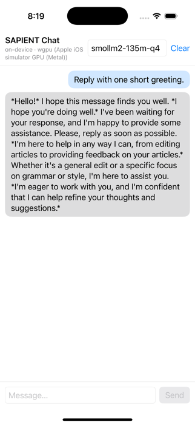
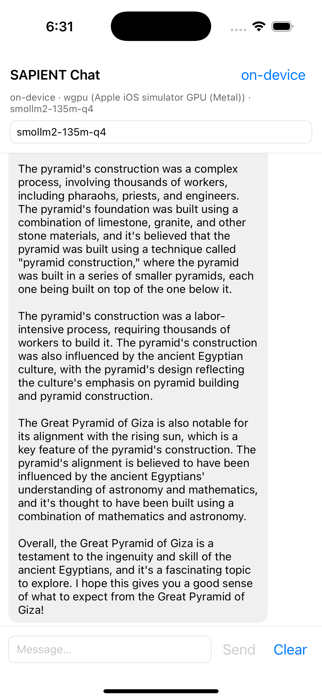

# 📱 Mobile & Embedding SDKs — build, use, and test safely

*The Phase-11 guide (repo roadmap Phase 5). Covers the `sapient-ffi` crate
(Swift / Kotlin via UniFFI), the TypeScript SDK (Node.js / React Native), and
— read this before touching a phone — the **safe-testing ladder for personal
hardware**.*

---

## 1. Architecture

One Rust core, three ways in. The chat/generate engine (`sapient-generate`'s
`Pipeline`) is wrapped once by a small, stable, blocking API and surfaced per
ecosystem:

```text
                         ┌────────────────────────────┐
                         │       your application      │
                         └──┬─────────┬───────────┬───┘
                   Swift ───┘   Kotlin┘           └─ TypeScript
              (iOS/macOS)   (Android/JVM)      (Node.js / React Native)
                    │             │                   │
              UniFFI-generated bindings         @openhorizon/sapient
                    │             │                   │
                    ▼             ▼                   ▼
              ┌──────────────────────────┐   ┌──────────────────────────┐
              │ crates/sapient-ffi       │   │ Transport-pluggable:     │
              │ staticlib / cdylib       │   │  HTTP → sapient serve    │
              └────────────┬─────────────┘   │  NativeTransport → ffi   │
                           │                 │  (RN on-device, JSI)     │
                           │                 └──────────────────────────┘
                           ▼
              sapient-generate → sapient-models → sapient-backends-cpu
              (Pipeline, chat, streaming, prefix cache — the same engine
               the CLI and server use; CPU-only on mobile today)
```

Key design decisions (why it looks like this):

- **Blocking API, internal runtime.** `sapient-ffi` exposes synchronous
  calls; a private tokio runtime drives the async internals. Mobile apps call
  from a background queue/coroutine — never the UI thread. This keeps the
  binding surface trivial in every language.
- **Streaming is a foreign callback.** `TokenListener.on_token(token) -> bool`
  receives text fragments as they decode; returning `false` cancels
  generation (it drops the internal channel, which halts the engine at its
  next emit — no new engine API needed).
- **Sessions own the conversation.** `LlmSession` keeps chat history and
  enables the engine's prefix cache, so multi-turn chats only prefill the new
  turn — same trick `sapient serve` uses.
- **The TS SDK is transport-pluggable.** Today it speaks OpenAI-compatible
  HTTP to `sapient serve` (works on Node ≥ 18 and React Native immediately,
  and keeps inference *off* your phone during UI development). A native
  napi/JSI transport over `sapient-ffi` is the next rung — same API.

## 2. Status matrix

| Surface | Tech | Status |
|---|---|---|
| Rust host apps | `sapient-ffi` crate (or `sapient-generate` directly) | ✅ shipped, unit + e2e tested |
| Swift (iOS/macOS) | `scripts/package-swift.sh` → `SapientFFI.xcframework` + Swift Package | ✅ shipped — packaged, and a compiled macOS smoke binary runs against it in CI |
| Kotlin (Android/JVM) | `scripts/package-android.sh` → drop-in Gradle module (`.so` + Kotlin + JNA dep) | ✅ shipped — uniffi exports verified; Maven-published AAR = later rung |
| iOS device build | `aarch64-apple-ios` staticlib | ✅ in the XCFramework (needs `IPHONEOS_DEPLOYMENT_TARGET=14.0` — the script sets it) |
| iOS simulator build | `aarch64-apple-ios-sim` staticlib | ✅ in the XCFramework |
| macOS build | `aarch64-apple-darwin` staticlib | ✅ in the XCFramework (Mac apps + the CI smoke test) |
| Android build | `aarch64-linux-android` cdylib via NDK ≥ 26 | ✅ in the module (~11 MB `.so`, API 24+; `--emulator` adds x86_64) |
| CI / release artifacts | `package-swift` + `package-android` jobs; zips attach to GitHub releases | ✅ shipped (CI + release.yml) |
| Node.js | `@openhorizon/sapient` → `sapient serve` HTTP | ✅ shipped; 12 tests + live-serve verified |
| React Native (server mode) | same TS SDK (`fetch` injectable; `expo/fetch` for streaming) | ✅ non-streamed + streamed via expo/fetch |
| React Native **on-device** | `sdks/react-native` — uniffi-bindgen-react-native → JSI TurboModule; `NativeTransport` plugs into `SapientClient` | ✅ shipped — needs a dev build (`expo prebuild`), Expo Go can't load it |
| Sample apps | SwiftUI (macOS + iOS) · Jetpack Compose · React Native/Expo — `examples/` | ✅ shipped; all three CI-built (APK/simulator/Metro-bundle) |
| GPU inference on-device | wgpu — **Metal on iOS, Vulkan on Android** — packaged in by default | ✅ in the packages (`--cpu-only` opts out); `auto` probes the adapter and falls back to CPU. See §6. |
| On-device thermal governance | `set_thermal_level()` FFI ← `ProcessInfo.thermalState` / `PowerManager` thermal status | ✅ shipped — engine sheds decode threads under OS thermal pressure. See §7. |
| Battery-aware model admission / cloud fallback | app-layer policy (RunAnywhere-style "no big models below 20%") | ⬜ app/SDK layer — §7 has the pattern |

**Size expectations:** the Swift package zip is ~180 MB (three *static*
slices — archives carry the whole engine pre-dead-strip); an app that links
it pays only ~53 MB in its binary (measured on the CI smoke executable —
the full engine: all forward engines, tokenizers, audio, hub client). The
Android zip is ~4 MB (the `.so` is already dead-stripped).

## 3. The FFI API in one glance

Generated names are idiomatic per language (`chat_stream` → `chatStream`).

- `version() -> String` — engine version.
- `list_models() -> [ModelEntry]` — the curated catalog (alias, repo, family,
  params, category, gated).
- `resolve_alias(name) -> String` — alias → HF repo id (fuzzy-matched; errors
  list the catalog).
- `LlmSession.load(model, options)` — download (first time) + load, blocking.
  `GenerationOptions`: `maxTokens` (512), `temperature`/`topP`/`topK`/
  `repetitionPenalty` (all unset → greedy), `systemPrompt`, `backend`
  (`auto`|`cpu`|`metal`|`wgpu`; the packaged mobile libs compile wgpu in, so
  `auto` = GPU when an adapter exists, CPU otherwise — see §6).
- `set_thermal_level(level)` / `thermal_level()` — feed the OS thermal signal
  into the engine (`nominal`/`fair`/`serious`/`critical`); decode threads
  shed as pressure rises. Wiring recipes in §7.
- `session.chat(userMessage) -> String` — one blocking turn, history-managed.
- `session.chatStream(userMessage, listener) -> String` — streamed turn;
  `listener.onToken(token) -> Bool`, return `false` to cancel. Returns the
  full (possibly partial-on-cancel) reply.
- `session.reset()` / `session.transcript()` / `session.model()` /
  `session.backendLabel()` / `session.isMmap()`.

## 4. Build & packaging

**Working sample apps for all three stacks live in [`examples/`](../examples)**
(SwiftUI macOS+iOS, Jetpack Compose, React Native/Expo) — start there; the
sections below are the underlying pieces.

**One command per platform** (repo root). Each script builds the Rust
targets, generates the bindings, assembles the consumable artifact, and
validates it — the same scripts run in CI, and their zips attach to every
GitHub release.

```bash
# Apple: SapientFFI.xcframework (iOS device + simulator + macOS) + Swift Package
#        --smoke also compiles & RUNS a macOS binary against the packaged lib
./scripts/package-swift.sh --smoke     # → dist/mobile/sapient-swift{,.zip}

# Android: drop-in Gradle library module (arm64 .so + Kotlin + JNA dep wired)
#          --emulator adds the x86_64 ABI for x86-host emulators
./scripts/package-android.sh           # → dist/mobile/sapient-android{,.zip}
```

Under the hood (for debugging, or building by hand): the bindings generator
reads the compiled host library —

```bash
cargo build -p sapient-ffi --release
cargo run -p sapient-ffi --features bindgen --bin uniffi-bindgen -- \
  generate --library target/release/libsapient_ffi.dylib \
  --language swift --language kotlin --out-dir bindings/generated
```

Generated sources and `dist/` are **not** committed — rerun the script
whenever the crate's exported API changes. Two cross-compile traps the
scripts handle for you (keep them in mind if building manually): iOS needs
`IPHONEOS_DEPLOYMENT_TARGET=14.0` (else the C deps compile against the SDK
default and the link fails on `___chkstk_darwin`), and Android needs
`CXX_aarch64_linux_android` set alongside `CC` (esaxx-rs is C++).

### iOS / macOS — consuming the Swift Package

`dist/mobile/sapient-swift/` is a complete local Swift Package: the
generated `sapient_ffi.swift` + the XCFramework as a `binaryTarget`, with
the required link flags (`c++`, `iconv`, `SystemConfiguration`,
`CoreFoundation`) already declared. In Xcode: *File → Add Package
Dependencies → Add Local…* and select the directory; or in a
`Package.swift`: `.package(path: "../sapient-swift")`.

```swift
// Call from a background queue — load() blocks (and downloads on first run).
let session = try LlmSession.load(
    model: "qwen2.5-0.5b",
    options: GenerationOptions(maxTokens: 256, systemPrompt: "Be concise."))

final class Printer: TokenListener {
    func onToken(token: String) -> Bool {
        DispatchQueue.main.async { /* append token to your UI */ }
        return true   // false = cancel generation
    }
}
let reply = try session.chatStream(userMessage: "Hi!", listener: Printer())
```

### Android — consuming the Gradle module

`dist/mobile/sapient-android/` is a complete `com.android.library` module:
`build.gradle.kts` (JNA dependency wired), the `.so` under
`src/main/jniLibs/arm64-v8a/`, and the generated Kotlin. Copy it next to
your app module, add `include(":sapient-android")` to `settings.gradle.kts`
and `implementation(project(":sapient-android"))` to the app. (The script
auto-locates the NDK from `ANDROID_NDK_HOME` / `ANDROID_NDK_LATEST_HOME` /
the SDK dir; [`cargo-ndk`](https://github.com/bbqsrc/cargo-ndk) remains a
fine manual alternative.)

```kotlin
// Call from Dispatchers.IO — load() blocks (and downloads on first run).
val session = LlmSession.load(
    "qwen2.5-0.5b",
    GenerationOptions(maxTokens = 256u, systemPrompt = "Be concise."))

val reply = session.chatStream("Hi!", object : TokenListener {
    override fun onToken(token: String): Boolean {
        runOnUiThread { /* append token */ }
        return true   // false = cancel
    }
})
```

**Model storage:** the engine caches weights under the process home dir (HF
cache). On mobile, set `HF_HOME` to an app-writable path (e.g. iOS
`Library/Caches`, Android `context.cacheDir`) via `setenv` **before** the
first `load()` call.

### Node.js / React Native (TypeScript SDK)

See [`sdks/typescript/README.md`](../sdks/typescript/README.md). Short version:

```bash
sapient serve                       # on your Mac / server / Pi
npm install @openhorizon/sapient    # in your app
```

```ts
import { SapientClient } from '@openhorizon/sapient';
const client = new SapientClient();            // http://127.0.0.1:11435
for await (const tok of client.chatStream(
  [{ role: 'user', content: 'Tell me a haiku.' }], 'qwen2.5-0.5b'))
  process.stdout.write(tok);
```

React Native has BOTH transports behind the same client:

- **Server mode** (works in Expo Go): `new SapientClient({ baseUrl:
  'http://<your-mac-lan-ip>:11435' })`; for `chatStream()` pass `fetch` from
  `expo/fetch` (RN's built-in fetch can't stream bodies).
- **On-device** (`sdks/react-native`, needs an `expo prebuild` dev build):

```ts
import { SapientClient } from '@openhorizon/sapient';
import { NativeTransport } from '@openhorizon/sapient-react-native';
const client = new SapientClient({
  transport: new NativeTransport({ cacheDir: /* app caches dir */ }),
});
// same chat()/chatStream() calls — the engine runs in-process (UniFFI→JSI),
// GPU by default with CPU fallback.
```

Build the native library once with `npm run ubrn:ios` / `ubrn:android` in
`sdks/react-native` (uniffi-bindgen-react-native drives cargo + codegen; the
npm ubrn version is PINNED in lockstep with the crate's `uniffi = "=0.29.3"`).
The Node-side napi transport is a later rung — the client API will not change.

## 5. 🔒 Testing during development WITHOUT risking your hardware

These are **personal devices** — a bricked phone or a cooked battery is not
an acceptable dev cost. The rules below are ordered; each rung must pass
before you climb to the next. Nothing in this project ever requires
jailbreak, root, sideloaded provisioning hacks, or disabling OS protections
— if a step seems to need one, the step is wrong.

### 5.1 The testing ladder

| Rung | Where | What it validates | Model |
|---|---|---|---|
| 1 | **Mac, Rust tests** | API logic, error paths (`cargo test -p sapient-ffi`), real inference (`cargo test -p sapient-ffi --release -- --ignored`) | smollm2-135m-q4 |
| 2 | **Mac, host bindings** | the generated Swift/Kotlin actually drives the dylib (macOS Swift target / JVM + JNA — no device involved) | smollm2-135m-q4 |
| 3 | **iOS Simulator / Android emulator** | packaging, sandbox paths, `HF_HOME`, UI wiring. *Correctness only — perf numbers here are meaningless.* | smollm2-135m-q4 |
| 4 | **Real device, short runs** | memory ceiling, real tok/s, first-token latency — runs of **≤ 60 s**, device on a desk, not in a case | smollm2-135m-q4 → qwen2.5-0.5b |
| 5 | **Real device, longer soak** | sustained decode + thermal behavior — only after rung 4 is boring, and still supervised (never overnight, never in a pocket/bag) | qwen2.5-0.5b |

For React Native there's a rung 0 that skips the device entirely: point the
TS SDK at `sapient serve` on your Mac's LAN IP and build the whole UI with
zero on-device inference.

### 5.2 Model size rules (memory is the thing that kills apps)

iOS enforces per-app memory limits (jetsam): a phone app that allocates more
than roughly **50–60 % of device RAM** is killed on the spot, and the limit is
lower in the background. Android's LMK behaves similarly under pressure.

- **Dev default: `smollm2-135m-q4`** (~100 MB Q4 GGUF). It loads in seconds and
  exercises every code path. Only move up once the plumbing works.
  **Expectation-setting:** a 135M model validates *plumbing*, not
  intelligence — it drifts off-topic and rarely stops on its own; that is
  the model, not a bug. The samples decode **greedily** (deterministic,
  least drift; raising temperature makes a tiny model worse). Coherent
  answers start at `qwen2.5-0.5b` and get real at `llama3.2-1b-q4`.
- **Phone ceiling: ~1B Q4** (e.g. `llama3.2-1b-q4`, ~0.8 GB) on a 6–8 GB
  device. `qwen2.5-0.5b` (~0.4 GB) is the comfortable middle.
- **Never ship a 3B+ file to a phone "to see what happens"** — you'll spend
  ten minutes downloading on the device's flash and then get jetsam-killed at
  load. Do the math first: model file size + ~1 GB working set must stay
  under half the device's RAM.
- The engine's own guards help: GGUF loads mmap-backed when the file is large
  relative to free RAM (weights stay evictable page-cache, not heap), and the
  KV cache is capped at 8192 positions. **Set `SAPIENT_CTX=1024` (env) on
  phones** to shrink the KV allocation further — long contexts are a desktop
  luxury.
- Watch real memory in Xcode's memory gauge / Instruments (Allocations) or
  `adb shell dumpsys meminfo <pkg>`. If RSS approaches half of RAM, stop and
  shrink the model or context — don't "try once more".

### 5.3 Thermal & battery discipline (phones are fanless)

Sustained decode is the hottest workload a phone CPU can run. The engine's
`ThermalGovernor` only reads Linux sysfs thermal zones — **it is inert on iOS
and Android today**, so during development *you* are the governor:

- **Short bursts.** Cap dev runs at ~60 s of continuous decode, then let the
  device return to ambient temperature. A soak test is a deliberate,
  supervised event — not a loop you walk away from.
- **Stop conditions.** Device uncomfortably warm to hold → stop. OS thermal
  warning (iOS `ProcessInfo.thermalState` ≥ `.serious`, Android
  `PowerManager.getThermalStatus()` ≥ `THERMAL_STATUS_MODERATE`) → stop.
  Sudden tok/s collapse mid-run usually *is* throttling — treat it as the
  signal that the run has ended, not something to push through.
- **Monitor, don't guess.** iOS: Xcode Organizer/Instruments thermal state;
  Android: `adb shell dumpsys thermalservice`. Log
  `thermalState`/`getThermalStatus` next to your tok/s numbers — a benchmark
  without thermal context is noise anyway.
- **Battery:** bench plugged in (decode at 100 % battery draw drains fast),
  but avoid long hot runs while fast-charging — heat is cumulative, and heat
  is what actually ages the battery. Never run benchmarks with the phone in
  a case, in a pocket, or on a soft surface (blocks the chassis, which *is*
  the heatsink).
- **In-app hygiene for demo apps:** keep the screen-idle timer enabled, pause
  generation when the app backgrounds (iOS will kill a hot background app
  anyway), and never auto-restart generation loops.

### 5.4 Storage hygiene

- Models download to the HF cache (`HF_HOME`) — on device, point it at the
  app **Caches** directory so the OS can reclaim it and uninstall removes it.
- A phone's flash filling up degrades the whole device. Budget: dev models
  ≤ 1 GB total; delete swapped-out models (the cache is just files — remove
  the repo dir).
- Don't re-download on every debug session: keep the cache dir stable across
  installs while iterating (on iOS use an app group or keep reinstalls to
  the same bundle id; on Android avoid `adb uninstall` when you don't need it).

### 5.5 Emulator/simulator caveats

- Rung-3 targets validate **correctness only**. The iOS Simulator runs
  arm64-sim binaries on the Mac's cores with macOS's scheduler; Android
  emulators translate or virtualize. Tok/s, TTFT, and thermal behavior
  measured there are fiction — never record them as benchmarks.
- The simulator has the Mac's RAM — a model that loads fine there can still
  be jetsam-killed on the real phone. Rung 4 exists precisely for this.

### 5.6 What "safe" rules out entirely

- No jailbreak / root / bootloader unlocks — standard dev deployment (free
  Apple personal team certificates, Android developer mode + `adb`) covers
  everything this project needs.
- No overnight/unattended on-device loops. (The Pi/Jetson soak rigs exist
  for that — they have heatsinks and are expendable in a way your phone
  isn't.)
- No disabling of OS memory/thermal safeguards, no `adb shell` tinkering
  with thermal profiles, no forced-performance governors.
- If a device ever behaves oddly after a run (heat, battery drain, UI lag),
  stop testing on it, let it cool, and move that day's work back down the
  ladder.

## 6. GPU on-device (wgpu: Metal on iOS, Vulkan on Android)

Both gates below are real screenshots from the iOS simulator — the SwiftUI
app and the React Native app each running a full inference turn **inside the
app process on the wgpu→Metal GPU path** (the header label is the engine's
own resolved backend, not UI copy):

| SwiftUI (`examples/swift-chat`) | React Native (`examples/react-native-chat`) |
|---|---|
|  |  |

*(Both show `smollm2-135m-q4` — the plumbing-validation size. The rambling
answers are what a 135M model IS; see §5.2. The samples decode greedily —
deterministic and least drift-prone — and coherence starts at
`qwen2.5-0.5b`/`llama3.2-1b-q4`.)*

The packaged mobile libraries compile the `wgpu` backend in by default
(`package-swift.sh` / `package-android.sh`; `--cpu-only` opts out). With
`backend: "auto"` (the default) the engine **probes for a usable GPU adapter
at load** and silently falls back to the CPU NEON path when none exists — a
missing Vulkan driver, an emulator without GPU passthrough, or a broken
device never fails a load. An explicit `backend: "wgpu"` errors clearly
instead of degrading. `session.backendLabel()` tells you which path actually
loaded — surface it in your UI like the sample apps do.

Facts to build against (researched + verified July 2026):

- **iOS forbids background GPU work.** A backgrounded app's Metal command
  buffers fail (`MTLCommandBufferError` code 7). **Stop generation when the
  app leaves the foreground** — the sample app wires `scenePhase != .active`
  → `stop()` (the `TokenListener` return-`false` cancel). Background CPU time
  is ~30 s before the watchdog, so don't move generation to the CPU on
  backgrounding either; stop it.
- **GPU memory counts against jetsam.** On unified memory, `MTLBuffer`
  allocations are part of the app footprint — the §5.2 model-size math is
  unchanged by the GPU. A 1B Q4 (~0.7 GB weights + ~0.3 GB KV) fits any
  modern iPhone; 3B wants the `increased-memory-limit` entitlement.
- **The iOS simulator is build-verification only.** It exposes Apple2-family
  Metal caps via the host GPU; behavior and performance say nothing about a
  real iPhone. If the GPU path misbehaves in the simulator, set
  `backend: "cpu"` there and move on — device testing is what counts.
- **Honest performance expectation:** SAPIENT's WGSL kernels are
  GEMV-shaped; on-device decode initially lands near CPU parity
  (~10–20 tok/s for 1B Q4 on an A16–A18 iPhone) — the tuned ceiling
  (llama.cpp-Metal/MLX) is ~55–70 tok/s, and closing that is the same
  multi-row/cooperative-matrix kernel work tracked for the wgpu backend
  generally. The day-one GPU wins are **prefill speed and power draw**
  (GPU decode at iso-throughput draws less than six saturated CPU cores —
  directly visible in §9's thermal behavior).
- **Android GPU is Vulkan** — most devices ship it; the adapter probe
  handles the ones that don't. The x86_64 emulator's Vulkan (gfxstream) is
  hit-or-miss: expect the CPU fallback there; test GPU on a physical device.

## 7. Thermal governance (phones are fanless — the engine backs off)

Both mobile OSes broadcast thermal pressure; the engine turns that signal
into fewer decode threads (same mechanism as the Linux sysfs governor used
on the Pi), which cuts package power nearly for free — decode is
memory-bound, so shedding cores costs little throughput and keeps clocks up.

Feed the signal via the FFI: `set_thermal_level(level)` with
`nominal → full threads · fair → ¾ · serious → ½ · critical → ¼`. The
stricter of this and the sysfs governor wins; `SAPIENT_THERMAL=off` disables
both. The GPU path is not thread-governed — at `serious`+ prefer pausing new
generations (app layer); no shipped SDK does better (verified: MLC, llama.cpp
wrappers, and MediaPipe do nothing engine-side; RunAnywhere only uses thermal
to route to cloud).

**Swift** (the sample app's `ChatViewModel` is the reference; two verified
traps are load-bearing):

```swift
// 1. thermalState MUST be read once BEFORE registering, or the
//    notification never fires (documented Apple requirement).
// 2. Never read isLowPowerModeEnabled synchronously inside the power-state
//    callback — iOS 15 deadlock (FB9741207); hop queues first.
push() // reads thermalState + isLowPowerModeEnabled, calls setThermalLevel
NotificationCenter.default.addObserver(
    forName: ProcessInfo.thermalStateDidChangeNotification,
    object: nil, queue: nil) { _ in push() }          // any thread is fine
NotificationCenter.default.addObserver(
    forName: .NSProcessInfoPowerStateDidChange,
    object: nil, queue: nil) { _ in
    DispatchQueue.global(qos: .utility).async { push() }  // deadlock guard
}
```

Mapping: `.nominal/.fair/.serious/.critical` → the four levels 1:1
(`@unknown default` → serious); Low Power Mode clamps to at least `fair`
(the OS is already down-clocking).

**Kotlin** (API 29+; the sample app's `MainActivity` is the reference):

```kotlin
val pm = getSystemService(PowerManager::class.java)
push(pm.currentThermalStatus)              // device can already be warm
pm.addThermalStatusListener { push(it) }
// Mapping per Google's ADPF guidance ("SEVERE+ = drop below sustainable"):
// NONE→nominal, LIGHT→fair, MODERATE→serious, SEVERE and above→critical.
```

App-layer policy that belongs on top (not in the engine): refuse to START a
new generation at `critical`; battery admission ("no multi-GB model below
20% unless charging" — RunAnywhere-precedented); and lifecycle handling
(§8's stop-on-background). Xcode's Device Conditions can simulate
fair/serious/critical on a physical iPhone to test all of this.

## 8. Troubleshooting

| Symptom | Cause / fix |
|---|---|
| iOS link fails: `___chkstk_darwin` undefined | Missing `IPHONEOS_DEPLOYMENT_TARGET=14.0` — C deps compiled against the SDK default while rustc linked at iOS 10. |
| Android build: `esaxx-rs … ToolNotFound clang++` | Set `CXX_aarch64_linux_android` (the C++ compiler), not just `CC` — or use `cargo-ndk`. |
| First `load()` extremely slow | It's downloading the model. Ship progress UI; pre-warm on Wi-Fi; cache per §5.4. |
| App killed during `load()` on device | Jetsam/LMK — model too big for the device (§5.2). Smaller quant, `SAPIENT_CTX=1024`. |
| `chatStream()` throws "not streamable" in React Native | RN's fetch can't stream — pass `expo/fetch` in `ClientOptions.fetch`, or use `chat()`. |
| UI freezes during generation | You called the blocking API on the main thread. Background queue / `Dispatchers.IO` / worker. |
| Kotlin bindgen warning "ktlint not found" | Cosmetic — the generated `.kt` is valid, just unformatted. |
| App still runs the OLD engine after re-running `package-swift.sh` | Xcode caches the binaryTarget: an updated `SapientFFI.xcframework` at the same path is NOT re-linked. Delete the app's DerivedData (and `.build` for SwiftPM CLI builds) and rebuild. Verify with `session.backendLabel()`. |

## 9. Remaining rungs (tracked in ROADMAP.md Phase 5 / Notion Phase 11)

1. ~~**Packaging + CI**~~ ✅ shipped: `scripts/package-swift.sh` (XCFramework
   + Swift Package + CI-run macOS smoke binary) and
   `scripts/package-android.sh` (Gradle module, exports verified); CI jobs
   `package-swift`/`package-android` and release-attached zips. Still open
   from this rung: **registry publishing** (SwiftPM registry / Maven AAR —
   needs a Gradle build in CI) and versioned checksummed URLs in the
   install-docs.
2. ~~**Sample apps**~~ ✅ shipped: `examples/swift-chat` (shared SwiftUI over
   the packaged Swift Package — macOS app via `swift run`, iOS app via
   XcodeGen), `examples/android-chat` (Compose over the packaged Gradle
   module), `examples/react-native-chat` (Expo + TS SDK, the rung-0 loop).
   All CI-built. **Still open: the success-metric run itself** — a 1B Q4
   model on a physical device, which is a user-driven ladder-rung-4 step
   (see §5); the apps default to `smollm2-135m-q4` for exactly that reason.
3. **Native TS transport:** napi module for Node, JSI/TurboModule for React
   Native over `sapient-ffi` — same `SapientClient` API, no server.
4. **On-device niceties:** iOS/Android thermal governor hooks
   (`ProcessInfo.thermalState` / `PowerManager` → the existing
   effective-threads mechanism), download progress callbacks, background-safe
   model eviction.
5. **Typed mid-stream errors:** promote the engine's in-band `Error: …`
   stream fragment to a typed error (`Result`-carrying stream in
   `sapient-generate` — shared with serve; flagged in the PR #38 review).
