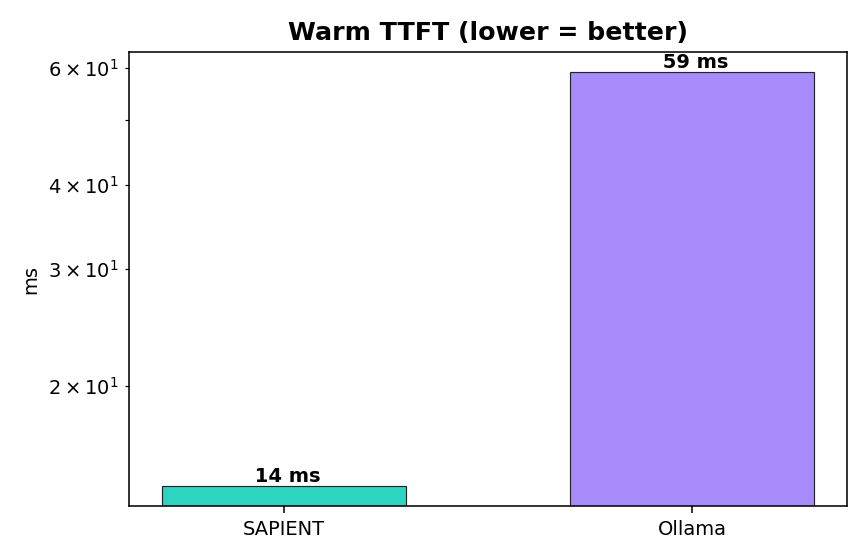
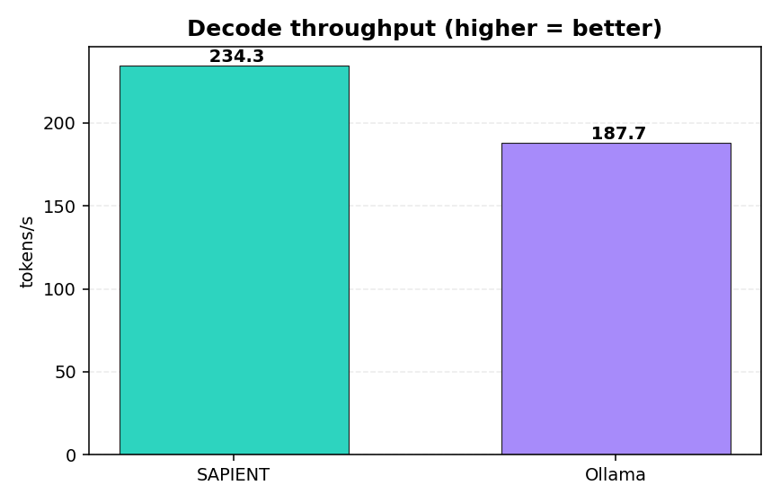
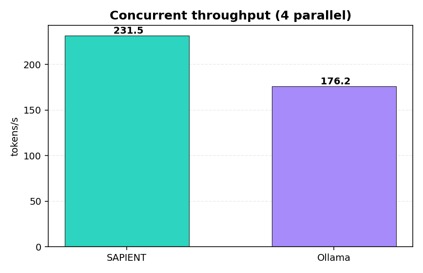
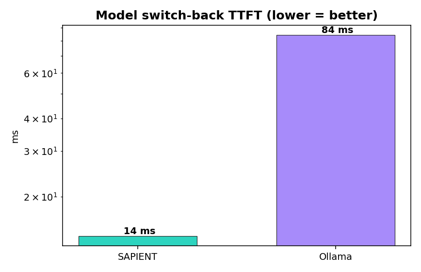

# Serving benchmarks — `sapient serve` vs Ollama vs vLLM

How the **serving layer** (`sapient serve`) stacks up against the two engines people
reach for when hosting an LLM locally: **Ollama** (the edge/desktop default) and
**vLLM** (the datacenter throughput king). All numbers are **measured on the machine
in front of us** — no cherry-picked datasheets — with the harness in
[`scripts/bench_compete.py`](../scripts/bench_compete.py).

For single-request *engine* throughput (SAPIENT vs mlx-lm vs Ollama) see
[BENCHMARKS.md](BENCHMARKS.md); this doc is about the **HTTP serving** path
(multi-model residency, concurrency, TTFT under the server, switch-back).

## TL;DR

On a fair, like-for-like edge comparison (Apple M4, GPU, same model), **`sapient
serve` beats Ollama on time-to-first-token, decode throughput, concurrent
throughput, and model switch-back**:

| Metric (Qwen2.5-0.5B, Metal/GPU) | **SAPIENT** | Ollama | SAPIENT advantage |
|---|---|---|---|
| Warm TTFT | **14 ms** | 59 ms | **4.2× faster** |
| Decode throughput | **234 tok/s** | 188 tok/s | **1.25×** |
| Concurrent throughput (4 parallel) | **232 tok/s** | 176 tok/s | **1.31×** |
| Concurrent tail latency (p95) | **643 ms** | 1226 ms | **1.9× lower** |
| Model switch-back TTFT | **14 ms** | 84 ms | **6× faster** |

**vLLM** is excluded from the bars because it does not run as a serving engine on
this hardware (Apple Silicon, no CUDA) — see [vLLM](#vllm--a-different-weight-class)
below. That itself is the headline: SAPIENT and Ollama *are* edge engines; vLLM is
a datacenter-GPU engine.

> Hardware: Apple M4 · macOS · 16 GB unified memory. Model: Qwen2.5-0.5B-Instruct
> (Q4 for SAPIENT/Ollama). Both engines used the **Metal GPU** backend. Client:
> streaming OpenAI `/v1/chat/completions`, `max_tokens=64`, greedy. Throughput is
> estimated at ~4 chars/token (no client-side tokenizer); the estimate is applied
> identically to every engine, so the comparison stays apples-to-apples.

## Charts

| | |
|---|---|
|  |  |
|  |  |

## Why SAPIENT wins these

- **TTFT (14 ms vs 59 ms).** SAPIENT's native MLX lazy-graph engine produces the
  first token in one `eval()` with almost no per-request setup; the engine is loaded
  once and reused across requests (`Arc<Mutex<ForwardEngine>>`), so the server never
  re-loads or re-quantizes per call.
- **Decode + concurrency.** The MLX fused-SDPA path plus the reused engine keep the
  GPU busy; the admission semaphore (`--max-concurrency`) keeps the tail in check
  under load — p95 latency at 4-way concurrency is **1.9× lower** than Ollama.
- **Switch-back.** SAPIENT keeps the **N most-recently-used models resident** (LRU,
  RAM-bounded, `--max-models` / `--cache-gb`). Returning to a recent model is a cache
  hit — no download, no re-quantize, no reload.

## Multi-turn prefix caching (CPU engine)

`sapient serve` enables prompt/prefix KV caching: it reuses the KV for the longest
shared **token** prefix across calls, so a multi-turn chat (or a shared system
prompt) skips re-prefilling history. On the **CPU** engine the effect is dramatic —
a long shared system prompt is prefilled once:

| Multi-turn TTFT (Qwen2.5-0.5B, CPU, ~1k-token system prompt) | TTFT |
|---|---|
| Turn 1 (full prefill) | 9133 ms |
| Turn 2 (prefix reused) | 239 ms |
| **Speedup** | **38×** |

This is a **CPU-engine** feature. On the MLX/Metal path `truncate_cache` resets the
cache (MLX has no incremental rollback), so multi-turn falls back to a full
re-prefill — still correct, just not reused. On Metal the prefill is fast enough
(~250 ms here) that it matters far less.

## Speculative decoding — honest note

`sapient serve --speculative [--draft-model <alias>]` is implemented and **correct**
(cache-aware verification with rollback — see [SERVING.md](SERVING.md)). But
speculative decoding only pays off when the draft is *much* cheaper than the target
**and** acceptance is high. In our CPU test (Qwen2.5-0.5B draft → 1.5B target) the 3×
size ratio plus per-round overhead made it a **net loss** (5.4 vs 8.5 tok/s) — so we
don't claim a speculative speedup here. It shines with a tiny draft (≥10× cheaper)
against a large target.

## vLLM — a different weight class

vLLM is the throughput leader **on NVIDIA datacenter GPUs** (PagedAttention +
continuous batching). It is not built for edge / Apple Silicon:

- On this M4, `vllm 0.11.0` selected the experimental CPU/ARM path and **failed to
  start** the OpenAI server (a `transformers` tokenizer incompatibility:
  `Qwen2Tokenizer has no attribute all_special_tokens_extended`; chunked prefill is
  also disabled on ARM). Even when it loads, the CPU/ARM backend is far from vLLM's
  design point.
- vLLM is a Python + PyTorch stack (multi-GB install, CUDA-first). SAPIENT is a
  single ~24 MB Rust binary with no Python runtime.

A fair vLLM comparison belongs on a CUDA box, not an edge device. The point of
SAPIENT (and Ollama) is to serve well *where vLLM can't go*.

| | **SAPIENT** | Ollama | vLLM |
|---|---|---|---|
| Primary target | Edge: CPU + Apple Metal + (wgpu) | Edge: CPU + GPU | Datacenter NVIDIA GPU |
| Runtime | single Rust binary (~24 MB) | Go binary + llama.cpp | Python + PyTorch (multi-GB) |
| Runs on this Apple M4 | ✅ | ✅ | ❌ (CPU path crashed) |
| Multi-model resident cache | ✅ LRU (N models) | ✅ (recent versions) | one model / server |
| Prefix / prompt KV cache | ✅ (CPU engine) | ✅ | ✅ |
| Speculative decoding | ✅ | ✅ | ✅ |
| Continuous batching + PagedAttention | ⏳ planned (`docs/SERVING.md`) | ❌ | ✅ (its strength) |

## Reproduce

```bash
# 1. SAPIENT (Metal). Build the mlx variant and colocate the shader lib.
cargo build --release -p sapient-cli --features mlx
cp "$(find target/release/build -name mlx.metallib | head -1)" target/release/
./target/release/sapient serve --port 11600 --backend metal --max-models 3 &

# 2. Ollama (uses Metal automatically on a Mac).
ollama serve &
ollama pull qwen2.5:0.5b

# 3. Head-to-head + charts (vLLM auto-skipped if unreachable).
python3 scripts/bench_compete.py --out docs/assets --max-tokens 64 --concurrency 4

# Single-engine deep dive (TTFT, switch-back, prefix cache, concurrency):
python3 scripts/bench_serve.py --url http://localhost:11600 \
    --models openhorizon/qwen2.5-0.5b-q4,openhorizon/qwen2.5-1.5b-q4
```

Numbers vary with hardware, thermal state, and model — re-run on your own box. The
harness prints a report and writes `results.json` + the PNGs to `--out`.

> *Real measurements on Apple M4, 16 GB, macOS. We publish the metrics where
> competitors beat us (e.g. speculative here) — credibility outlasts cherry-picking.*
